**[Vocabulary]{.underline}**

**1. Look and write the numbers. There is one example.   (one point
each)**

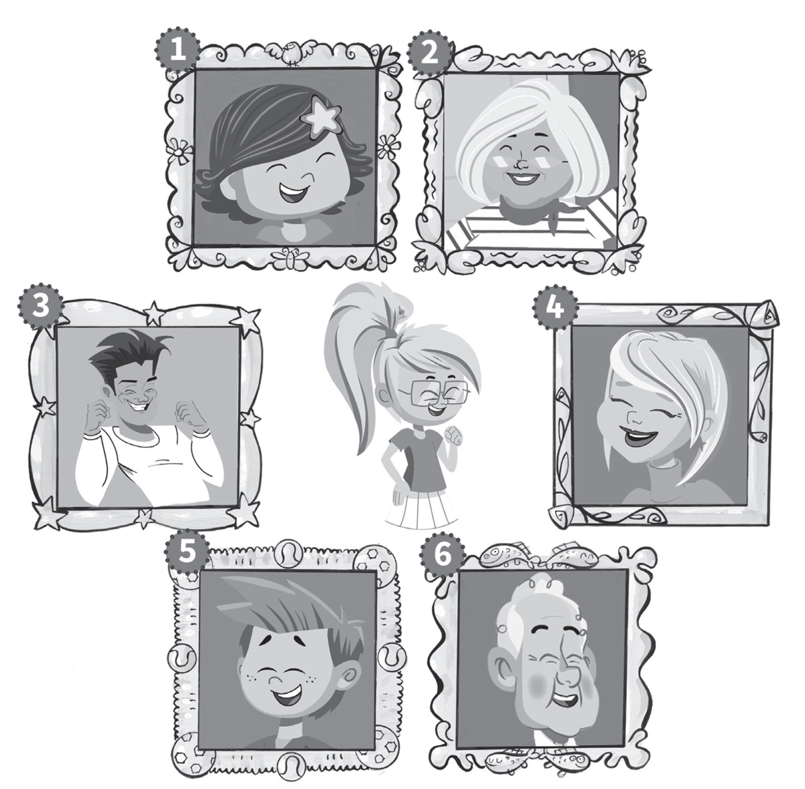

1\. \_\_\_\_\_\_\_\_ This is my father.

2\. \_\_\_\_\_\_\_\_ This is my grandfather.

3\. \_\_\_\_\_\_\_\_ This is my grandmother.

4\. \_\_\_\_\_\_\_\_ This is my mother.

5\. \_\_\_\_\_\_\_\_ This is my brother.

6\. \_\_\_\_\_\_\_\_ This is my sister.

**2. Read and write the numbers. There is one example.   (one point
each)**

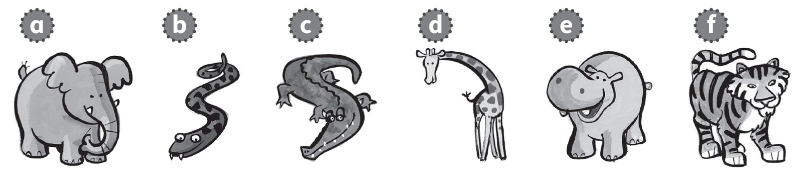

1\. They're dirty and grey. They haven't got hair.

2\. They're black and orange. They've got big teeth.

3\. They're brown and yellow. They've got small heads.

4\. They're big and grey. They've got long noses.

5\. They're long and green. They haven't got legs.

6\. They're green. They've got big teeth and short legs.

**[Grammar]{.underline}**

**3. Look and write. There is one example.   (one point each)**

under \| ~~next to~~ \| on \| in \| next to \| on

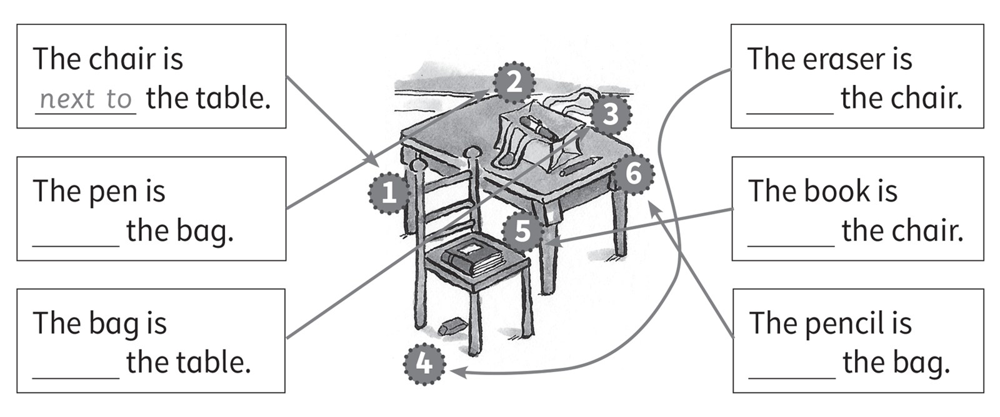

**4. Read and circle *Yes* or *No*. There is one example.   (one point
each)**

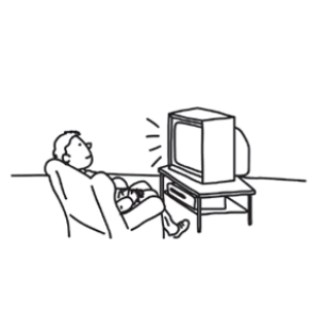

1\. He's watching TV.

Yes No

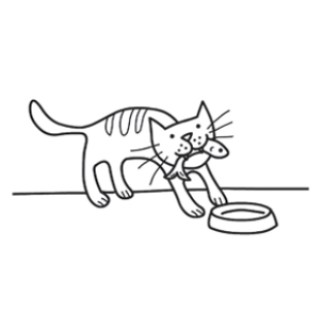

2\. The cat's eating an apple.

Yes No

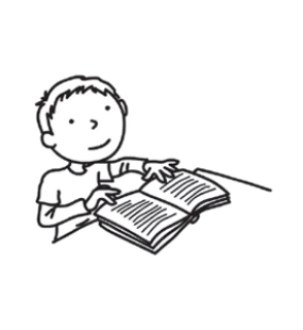

3\. He's reading a book.

Yes No

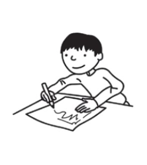

4\. He's drawing a picture.

Yes No

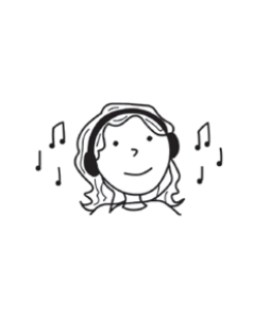

5\. She's listening to music.

Yes No

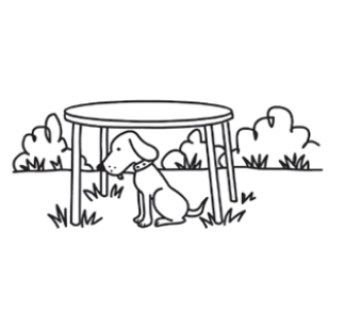

6\. The dog's sitting on the table.

Yes No

**5. Read and circle.   (one point each)**

1\. Is your dog clean?

    ✓ *[Yes, it is.]{.underline}* / No, it isn't

2\. Have you got an eraser?

    ✗ Yes, I have. / No, I haven't.

3\. Has your grandfather got a bike?

    ✓ Yes, he has. / No, he hasn't.

4\. Can you swim?

    ✓ Yes, I can. / No, I can't.

5\. Is your sister playing basketball?

    ✗ Yes, she is. / No, she isn't.

6\. Do you like fish?

    ✓ Yes, I do. / No, I don't.

**[Listening]{.underline}**

**6. Listen and tick or cross. There is one example.   (one point
each)**

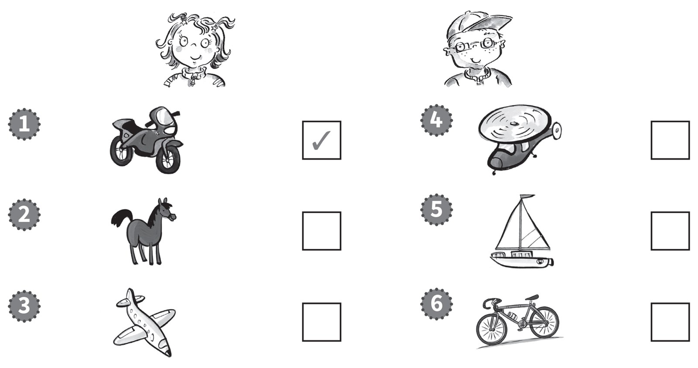

**7. Listen and draw lines. There is one example.   (one point each)**

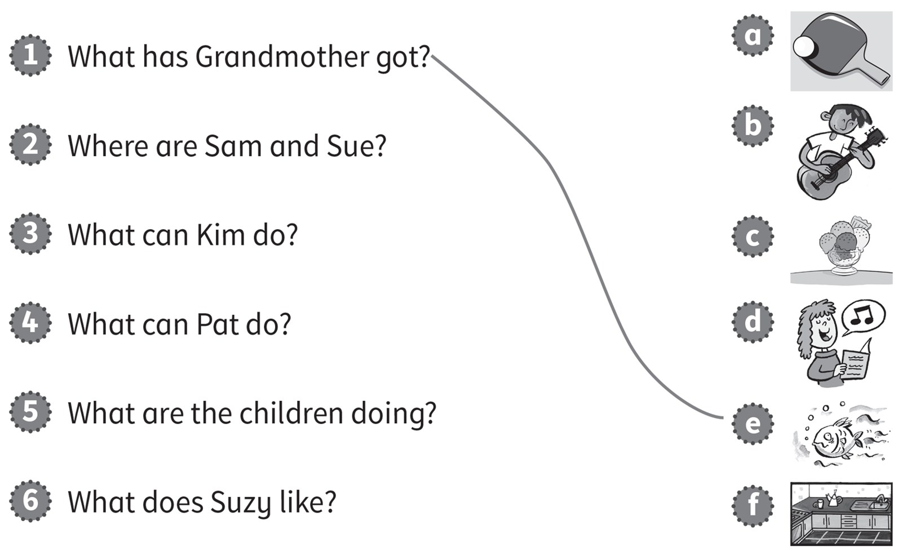

**[Reading]{.underline}**

**8. Look and read. Circle the answer. There is one example.   (one
point each)**

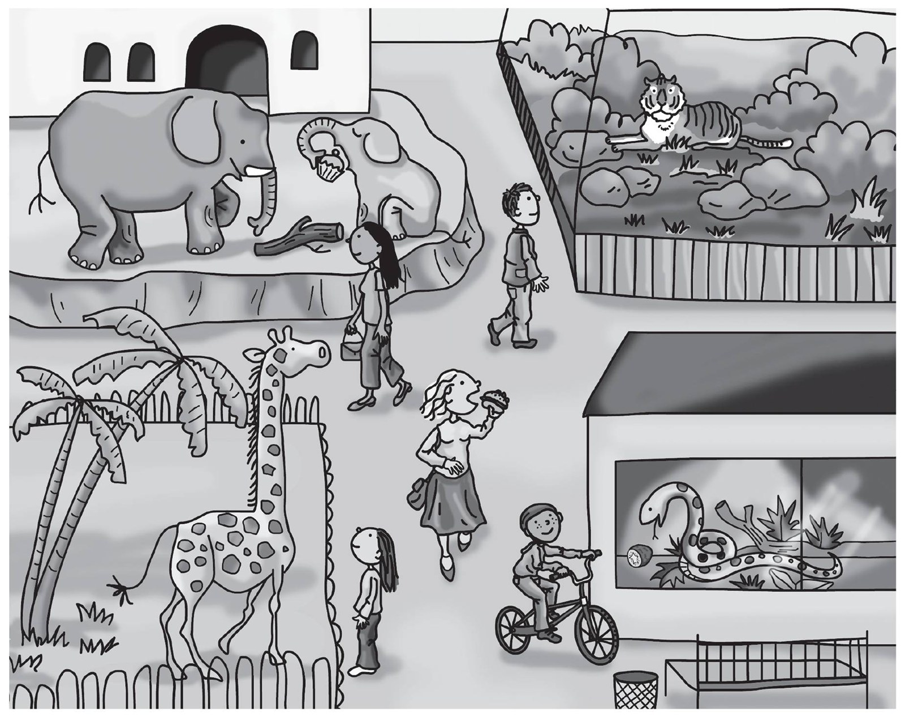

1\. What is the woman eating?

    *an apple* / *[a burger]{.underline}*

2\. What is the snake eating?

    *a kiwi* / *a banana*

3\. How many snakes are there?

    *one* / *two*

4\. What animal is the girl watching?

    *the snake* / *the giraffe*

5\. What can the boy do?

    *ride a bike* / *ride a horse*

6\. What is the small elephant doing?

    *swimming* / *sitting*

