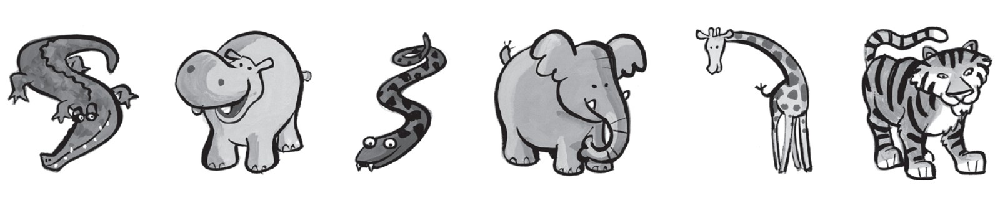
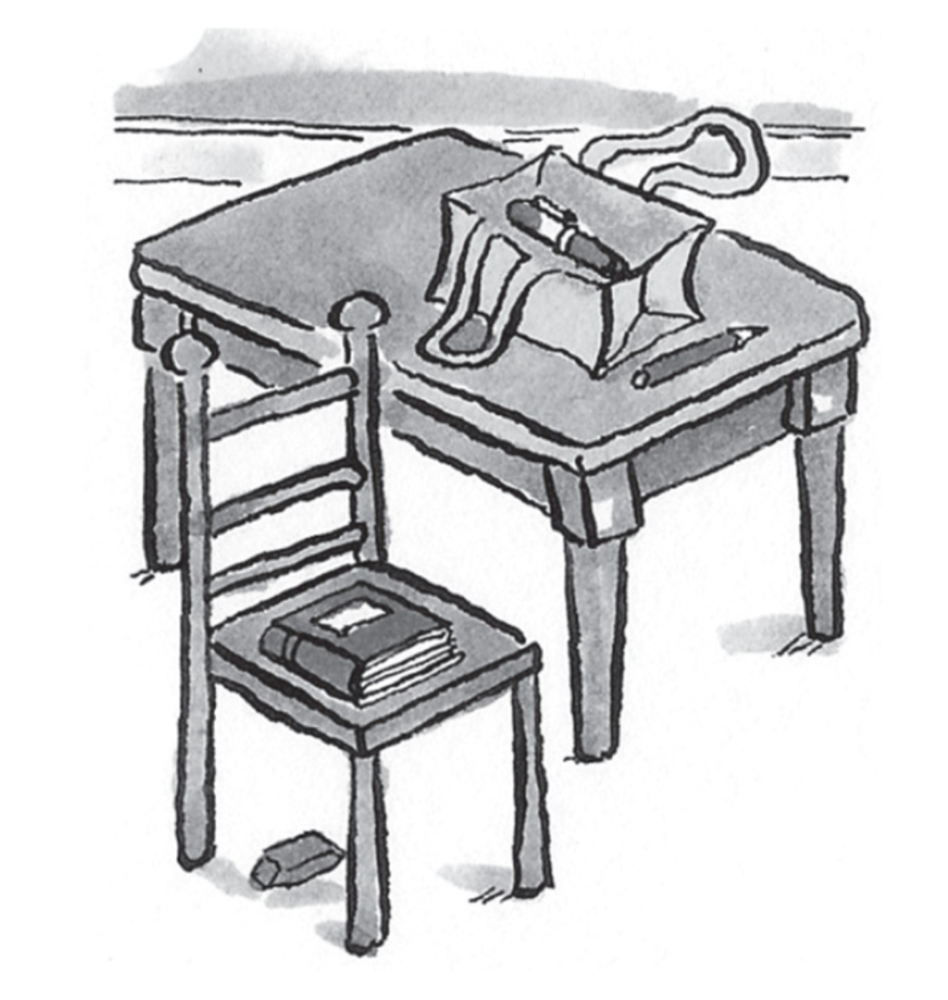
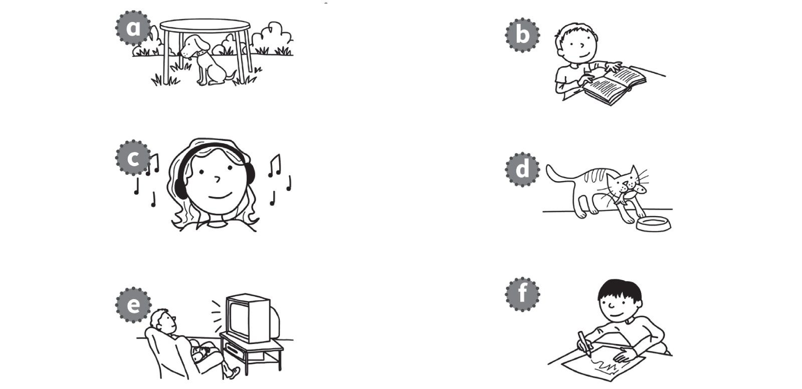
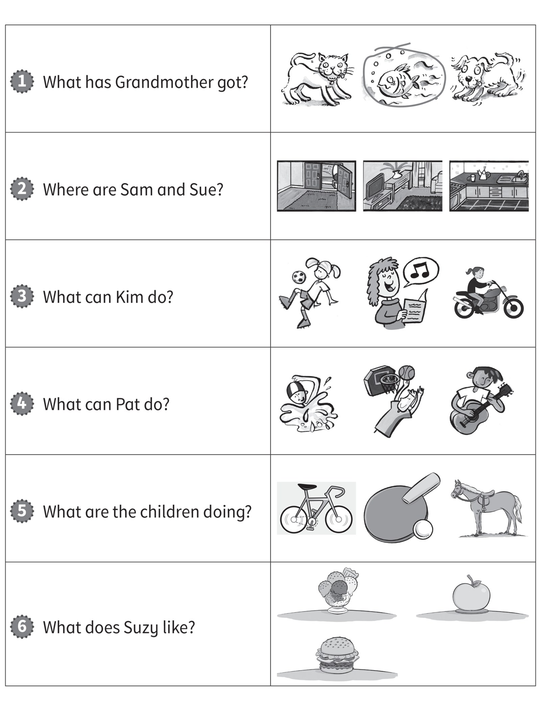

**[Vocabulary]{.underline}**

**1. Look and write the words. There is one example.   (one point
each)**

1\. This is my *[sister]{.underline}*.

2\. This is my \_\_\_\_\_\_\_\_\_\_\_\_\_\_\_.

*grandmother*

3\. This is my \_\_\_\_\_\_\_\_\_\_\_\_\_\_\_.

*father*

4\. This is my \_\_\_\_\_\_\_\_\_\_\_\_\_\_\_.

*mother*

5\. This is my \_\_\_\_\_\_\_\_\_\_\_\_\_\_\_.

*brother*

6\. This is my \_\_\_\_\_\_\_\_\_\_\_\_\_\_\_.

*grandfather*

**2. Read and write the words. There is one example.   (one point
each)**

  ------------------------------- --- -----------------------------------
  1\. They're dirty and grey.         *[hippos]{.underline}*
  They've got a short tail. They      
  haven't got hair.                   
  *[hippos]{.underline}*              

  ------------------------------- --- -----------------------------------

  ------------------------------- --- -----------------------------------
  2\. They're black and orange.       *tigers*
  They've got big teeth and a         
  long tail.                          

  ------------------------------- --- -----------------------------------

  ------------------------------- --- -----------------------------------
  3\. They're brown and yellow.       *giraffes*
  They've got small heads and         
  long legs.                          

  ------------------------------- --- -----------------------------------

  ------------------------------- --- -----------------------------------
  4\. They're big and grey.           *elephants*
  They've got long noses and big      
  ears.                               

  ------------------------------- --- -----------------------------------

  ------------------------------- --- -----------------------------------
  5\. They're long and green.         *snakes*
  They haven't got arms or legs.      

  ------------------------------- --- -----------------------------------

  ------------------------------- --- -----------------------------------
  6\. They're green. They've got      *crocodiles*
  big teeth and a big mouth.          
  They've got short legs.             

  ------------------------------- --- -----------------------------------

**[Grammar]{.underline}**

**3. Look and write the words. There is one example.   (one point
each)**

1\. The chair is *[next to]{.underline}* the table.

2\. The pen is \_\_\_\_\_\_\_\_\_\_\_\_\_\_\_ the bag.

*in*

3\. The bag is \_\_\_\_\_\_\_\_\_\_\_\_\_\_\_ the table.

*on*

4\. The eraser is \_\_\_\_\_\_\_\_\_\_\_\_\_\_\_ the chair.

*under*

5\. The book is \_\_\_\_\_\_\_\_\_\_\_\_\_\_\_ the chair.

*on*

6\. The pencil is \_\_\_\_\_\_\_\_\_\_\_\_\_\_\_ the bag.

*next to*

**4. Put the words in order. Write the letters. There is one
example.   (one point each)**

1\. book He's a reading.   *[b]{.underline}*

    *[He's reading a book.]{.underline}*

2\. eating a The cat's fish.   \_\_\_\_\_

    \_\_\_\_\_\_\_\_\_\_\_\_\_\_\_\_\_\_\_\_\_\_\_\_\_\_\_\_\_\_

*d     The cat's eating a fish.*

3\. TV He's watching.   \_\_\_\_\_

    \_\_\_\_\_\_\_\_\_\_\_\_\_\_\_\_\_\_\_\_\_\_\_\_\_\_\_\_\_\_

*e     He's watching TV.*

4\. He's a picture drawing.   \_\_\_\_\_

    \_\_\_\_\_\_\_\_\_\_\_\_\_\_\_\_\_\_\_\_\_\_\_\_\_\_\_\_\_\_

*f     He's drawing a picture.*

5\. music to listening She's.   \_\_\_\_\_

    \_\_\_\_\_\_\_\_\_\_\_\_\_\_\_\_\_\_\_\_\_\_\_\_\_\_\_\_\_\_

*c     She's listening to music.*

6\. under sitting The the table dog's.   \_\_\_\_\_

    \_\_\_\_\_\_\_\_\_\_\_\_\_\_\_\_\_\_\_\_\_\_\_\_\_\_\_\_\_\_

*a     The dog's sitting under the table.*

**5. Read and write the words. There is one example.   (one point
each)**

I can \| I do \| I haven't \| he has \| ~~it is~~ \| she isn't

1\. Is your dog clean?

    Yes, *[it is]{.underline}*.

2\. Have you got an eraser?

    No, \_\_\_\_\_\_\_\_\_\_\_\_\_\_\_.

*I haven't*

3\. Has your grandfather got a bike?

    Yes, \_\_\_\_\_\_\_\_\_\_\_\_\_\_\_.

*he has*

4\. Can you swim?

    Yes, \_\_\_\_\_\_\_\_\_\_\_\_\_\_\_.

*I can*

5\. Is your sister playing basketball?

    No, \_\_\_\_\_\_\_\_\_\_\_\_\_\_\_.

*she isn't*

6\. Do you like fish?

    Yes, \_\_\_\_\_\_\_\_\_\_\_\_\_\_\_.

*I do*

**[Listening]{.underline}**

**6. Listen and tick or cross. There are two extra pictures. Write.
There is one example.   (one point each)**

She can't \_\_\_\_\_\_\_\_\_\_\_\_\_\_\_\_\_\_\_\_\_\_\_\_\_\_\_.

He can't \_\_\_\_\_\_\_\_\_\_\_\_\_\_\_\_\_\_\_\_\_\_\_\_\_\_\_.

***Girl:** 2 ride a horse ✗, 4 fly a plane ✓*

***Boy:** 5 fly a helicopter ✗, 7 sail a boat ✓, 8 ride a bike ✓*

*She can't ride a horse.*

*He can't fly a helicopter.*

**Audio script**

**Boy:** She can ride a motorbike. She can't ride a horse. She can fly a
plane.

**Girl:** He can't fly a helicopter. He can sail a boat. He can ride a
bike.

**7. Listen and circle the picture. There is one example.   (one point
each)**

*2. kitchen*

*3. sing*

*4. guitar*

*5. table tennis*

*6. ice cream*

**Audio script**

**1**

**Woman:** What has Grandmother got?

**Boy:** She's got an ugly fish!

**2**

**Woman:** Where are Sam and Sue?

**Girl:** They're eating in the kitchen.

**3**

**Woman:** What can Kim do?

**Boy:** She can sing. She's very good!

**4**

**Woman:** What can Pat do?

**Girl:** He can play the guitar.

**5**

**Woman:** What are the children doing?

**Boy:** They're playing table tennis.

**6**

**Woman:** What does Suzy like?

**Girl:** She likes ice cream!

**[Reading]{.underline}**

**8. Look, read and write. There are two extra words. There is one
example.   (one point each)**

~~burger~~ \| bike \| cake \| giraffe \| kiwi \| one \| sitting \|
swimming

1\. What is the woman eating?

    a *[burger]{.underline}*

2\. What is the snake eating?

    a *kiwi*

3\. How many snakes are there?

     *one*

4\. What animal is the girl watching?

    a *giraffe*

5\. What can the boy do?

    ride a *bike*

6\. What is the small elephant doing?

     *sitting*

