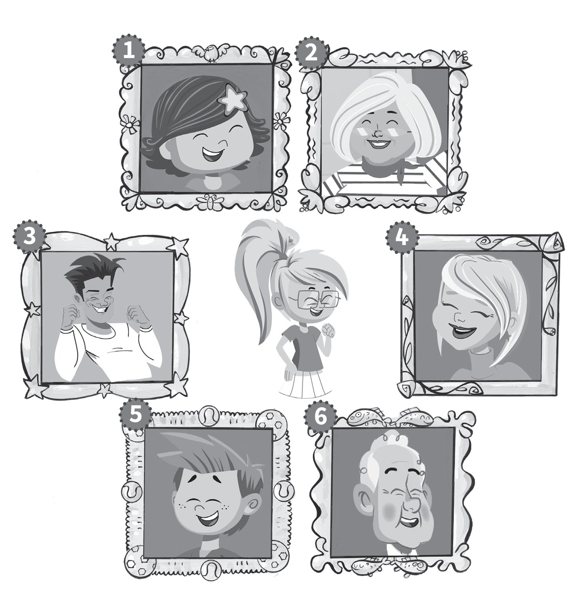
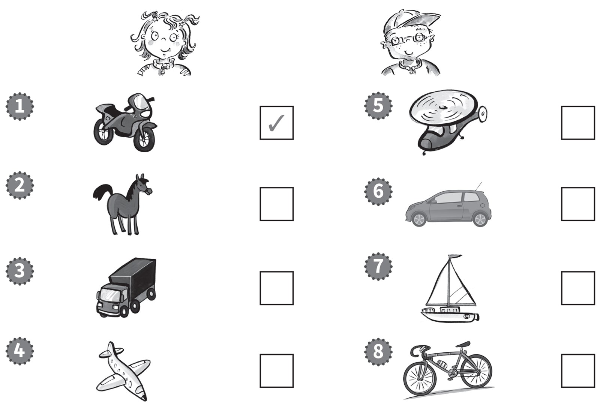
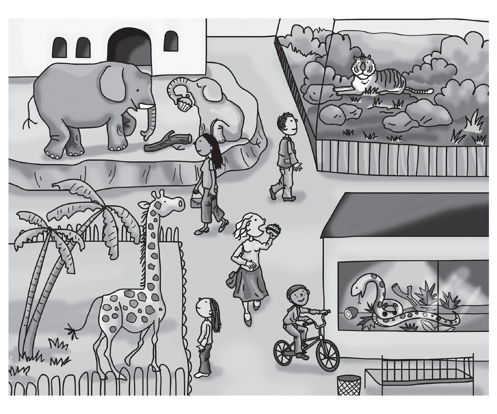

**[Vocabulary]{.underline}**

**1. Look and write the words. There is one example.   (one point
each)**

1\. This is my *[sister]{.underline}*.

2\. This is my \_\_\_\_\_\_\_\_\_\_\_\_\_\_\_.

3\. This is my \_\_\_\_\_\_\_\_\_\_\_\_\_\_\_.

4\. This is my \_\_\_\_\_\_\_\_\_\_\_\_\_\_\_.

5\. This is my \_\_\_\_\_\_\_\_\_\_\_\_\_\_\_.

6\. This is my \_\_\_\_\_\_\_\_\_\_\_\_\_\_\_.

**2. Read and write the words. There is one example.   (one point
each)**

  ------------------------------- --- -----------------------------------
  1\. They're dirty and grey.         *[hippos]{.underline}*
  They've got a short tail. They      
  haven't got hair.                   
  *[hippos]{.underline}*              

  ------------------------------- --- -----------------------------------

  ------------------------------- --- -----------------------------------
  2\. They're black and orange.       \_\_\_\_\_\_\_\_\_\_\_\_\_\_\_
  They've got big teeth and a         
  long tail.                          

  ------------------------------- --- -----------------------------------

  ------------------------------- --- -----------------------------------
  3\. They're brown and yellow.       \_\_\_\_\_\_\_\_\_\_\_\_\_\_\_
  They've got small heads and         
  long legs.                          

  ------------------------------- --- -----------------------------------

  ------------------------------- --- -----------------------------------
  4\. They're big and grey.           \_\_\_\_\_\_\_\_\_\_\_\_\_\_\_
  They've got long noses and big      
  ears.                               

  ------------------------------- --- -----------------------------------

  ------------------------------- --- -----------------------------------
  5\. They're long and green.         \_\_\_\_\_\_\_\_\_\_\_\_\_\_\_
  They haven't got arms or legs.      

  ------------------------------- --- -----------------------------------

  ------------------------------- --- -----------------------------------
  6\. They're green. They've got      \_\_\_\_\_\_\_\_\_\_\_\_\_\_\_
  big teeth and a big mouth.          
  They've got short legs.             

  ------------------------------- --- -----------------------------------

**[Grammar]{.underline}**

**3. Look and write the words. There is one example.   (one point
each)**

1\. The chair is *[next to]{.underline}* the table.

2\. The pen is \_\_\_\_\_\_\_\_\_\_\_\_\_\_\_ the bag.

3\. The bag is \_\_\_\_\_\_\_\_\_\_\_\_\_\_\_ the table.

4\. The eraser is \_\_\_\_\_\_\_\_\_\_\_\_\_\_\_ the chair.

5\. The book is \_\_\_\_\_\_\_\_\_\_\_\_\_\_\_ the chair.

6\. The pencil is \_\_\_\_\_\_\_\_\_\_\_\_\_\_\_ the bag.

**4. Put the words in order. Write the letters. There is one
example.   (one point each)**

1\. book He's a reading.   *[b]{.underline}*

    *[He's reading a book.]{.underline}*

2\. eating a The cat's fish.   \_\_\_\_\_

    \_\_\_\_\_\_\_\_\_\_\_\_\_\_\_\_\_\_\_\_\_\_\_\_\_\_\_\_\_\_

3\. TV He's watching.   \_\_\_\_\_

    \_\_\_\_\_\_\_\_\_\_\_\_\_\_\_\_\_\_\_\_\_\_\_\_\_\_\_\_\_\_

4\. He's a picture drawing.   \_\_\_\_\_

    \_\_\_\_\_\_\_\_\_\_\_\_\_\_\_\_\_\_\_\_\_\_\_\_\_\_\_\_\_\_

5\. music to listening She's.   \_\_\_\_\_

    \_\_\_\_\_\_\_\_\_\_\_\_\_\_\_\_\_\_\_\_\_\_\_\_\_\_\_\_\_\_

6\. under sitting The the table dog's.   \_\_\_\_\_

    \_\_\_\_\_\_\_\_\_\_\_\_\_\_\_\_\_\_\_\_\_\_\_\_\_\_\_\_\_\_

**5. Read and write the words. There is one example.   (one point
each)**

I can \| I do \| I haven't \| he has \| ~~it is~~ \| she isn't

1\. Is your dog clean?

    Yes, *[it is]{.underline}*.

2\. Have you got an eraser?

    No, \_\_\_\_\_\_\_\_\_\_\_\_\_\_\_.

3\. Has your grandfather got a bike?

    Yes, \_\_\_\_\_\_\_\_\_\_\_\_\_\_\_.

4\. Can you swim?

    Yes, \_\_\_\_\_\_\_\_\_\_\_\_\_\_\_.

5\. Is your sister playing basketball?

    No, \_\_\_\_\_\_\_\_\_\_\_\_\_\_\_.

6\. Do you like fish?

    Yes, \_\_\_\_\_\_\_\_\_\_\_\_\_\_\_.

**[Listening]{.underline}**

**6. Listen and tick or cross. There are two extra pictures. Write.
There is one example.   (one point each)**

She can't \_\_\_\_\_\_\_\_\_\_\_\_\_\_\_\_\_\_\_\_\_\_\_\_\_\_\_.

He can't \_\_\_\_\_\_\_\_\_\_\_\_\_\_\_\_\_\_\_\_\_\_\_\_\_\_\_.

**7. Listen and circle the picture. There is one example.   (one point
each)**

**[Reading]{.underline}**

**8. Look, read and write. There are two extra words. There is one
example.   (one point each)**

~~burger~~ \| bike \| cake \| giraffe \| kiwi \| one \| sitting \|
swimming

1\. What is the woman eating?

    a *[burger]{.underline}*

2\. What is the snake eating?

    a \_\_\_\_\_\_\_\_\_\_\_\_\_\_

3\. How many snakes are there?

     \_\_\_\_\_\_\_\_\_\_\_\_\_\_

4\. What animal is the girl watching?

    a \_\_\_\_\_\_\_\_\_\_\_\_\_\_

5\. What can the boy do?

    ride a \_\_\_\_\_\_\_\_\_\_\_\_\_\_

6\. What is the small elephant doing?

     \_\_\_\_\_\_\_\_\_\_\_\_\_\_

