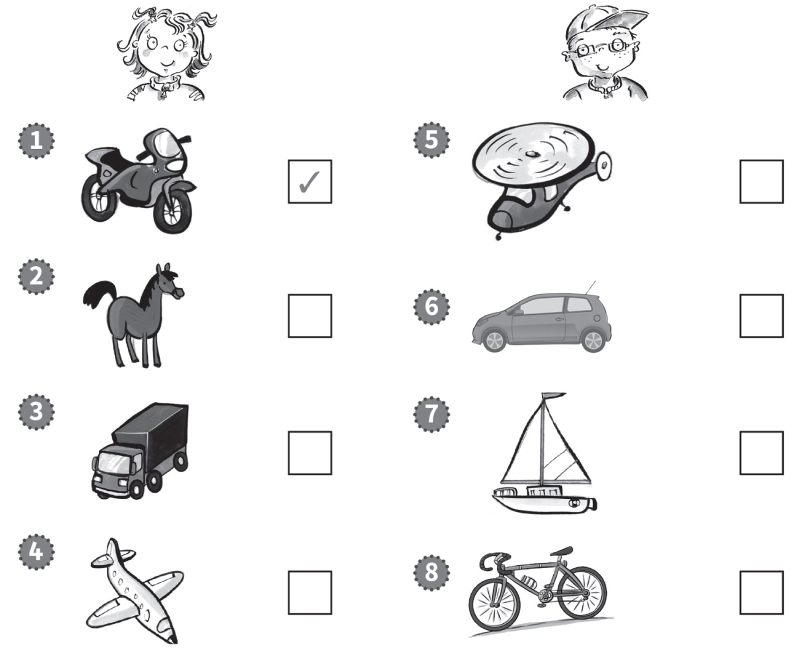
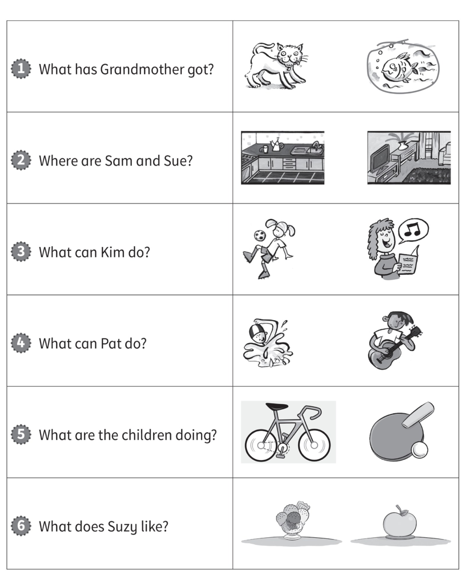

**[Vocabulary]{.underline}**

**1. Look and write the words. There is one example.   (one point
each)**

brother \| father \| grandfather \| grandmother \| mother \| ~~sister~~

1\. This is my *[sister]{.underline}*.

2\. This is my \_\_\_\_\_\_\_\_\_\_\_\_\_\_\_.

*grandmother*

3\. This is my \_\_\_\_\_\_\_\_\_\_\_\_\_\_\_.

*father*

4\. This is my \_\_\_\_\_\_\_\_\_\_\_\_\_\_\_.

*mother*

5\. This is my \_\_\_\_\_\_\_\_\_\_\_\_\_\_\_.

*brother*

6\. This is my \_\_\_\_\_\_\_\_\_\_\_\_\_\_\_.

*grandfather*

**2. Read and write the words. There is one example.   (one point
each)**

elephants \| snakes \| crocodiles \| giraffes \| ~~hippos~~ \| tigers

1\. They're dirty and grey. They haven't got hair.
*[hippos]{.underline}*

2\. They're black and orange. They've got big teeth.
\_\_\_\_\_\_\_\_\_\_\_\_\_\_\_\_\_\_\_\_

*tigers*

3\. They're brown and yellow. They've got small heads.
\_\_\_\_\_\_\_\_\_\_\_\_\_\_\_\_\_\_\_\_

*giraffes*

4\. They're big and grey. They've got long noses.
\_\_\_\_\_\_\_\_\_\_\_\_\_\_\_\_\_\_\_\_

*elephants*

5\. They're long and green. They haven't got legs.
\_\_\_\_\_\_\_\_\_\_\_\_\_\_\_\_\_\_\_\_

*snakes*

6\. They're green. They've got big teeth and short legs.
\_\_\_\_\_\_\_\_\_\_\_\_\_\_\_\_\_\_\_\_

*crocodiles*

**[Grammar]{.underline}**

**3. Look and write the words. There is one example.   (one point
each)**

~~next to~~ \| under \| on \| in \| next to \| on

1\. The chair is *[next to]{.underline}* the table.

2\. The pen is \_\_\_\_\_\_\_\_\_\_\_\_\_\_\_ the bag.

*in*

3\. The bag is \_\_\_\_\_\_\_\_\_\_\_\_\_\_\_ the table.

*on*

4\. The eraser is \_\_\_\_\_\_\_\_\_\_\_\_\_\_\_ the chair.

*under*

5\. The book is \_\_\_\_\_\_\_\_\_\_\_\_\_\_\_ the chair.

*on*

6\. The pencil is \_\_\_\_\_\_\_\_\_\_\_\_\_\_\_ the bag.

*next to*

**4. Read and draw lines. There is one example.   (one point each)**

*2. d*

*3. e*

*4. f*

*5. c*

*6. a*

**5. Read and circle the words. There is one example.   (one point
each)**

1\. Is your dog clean?

    *Yes, it [is]{.underline}* / *isn't*.

2\. Have you got an eraser?

    *No, I have* / *haven't*.

*haven't*

3\. Has your grandfather got a bike?

    *Yes, he has* / *hasn't*.

*has*

4\. Can you swim?

    *Yes, I can* / *can't*.

*can*

5\. Is your sister playing basketball?

    *No, she is* / *isn't*.

*isn't*

6\. Do you like fish?

    *Yes, I do* / *don't*.

*do*

**[Listening]{.underline}**

**6. Listen and tick or cross. There are two extra pictures. There is
one example.   (one point each)**

*Girl: ride a horse ✗, fly a plane ✓*

*Boy: -- fly a helicopter ✗, sail a boat ✓, ride a bike ✓*

**Audio script**

**Boy:** She can ride a motorbike. She can't ride a horse. She can fly a
plane.

**Girl:** He can't fly a helicopter. He can sail a boat. He can ride a
bike.

**7. Listen and circle the picture. There is one example.   (one point
each)**

*2. kitchen*

*3. sing*

*4. guitar*

*5. table tennis*

*6. ice cream*

**Audio script**

**1**

**Woman:** What has Grandmother got?

**Boy:** She's got an ugly fish!

**2**

**Woman:** Where are Sam and Sue?

**Girl:** They're eating in the kitchen.

**3**

**Woman:** What can Kim do?

**Boy:** She can sing. She's very good!

**4**

**Woman:** What can Pat do?

**Girl:** He can play the guitar.

**5**

**Woman:** What are the children doing?

**Boy:** They're playing table tennis.

**6**

**Woman:** What does Suzy like?

**Girl:** She likes ice cream!

**[Reading]{.underline}**

**8. Look and read. Write the number. There is one example.   (one point
each)**

1\. What is the woman eating?    *a burger*

2\. What is the snake eating?    *a kiwi*

3\. How many snakes are there?    *one*

4\. What animal is the girl watching?    *the giraffe*

5\. What can the boy do?    *ride a bike*

6\. What is the small elephant doing?    *sitting*

