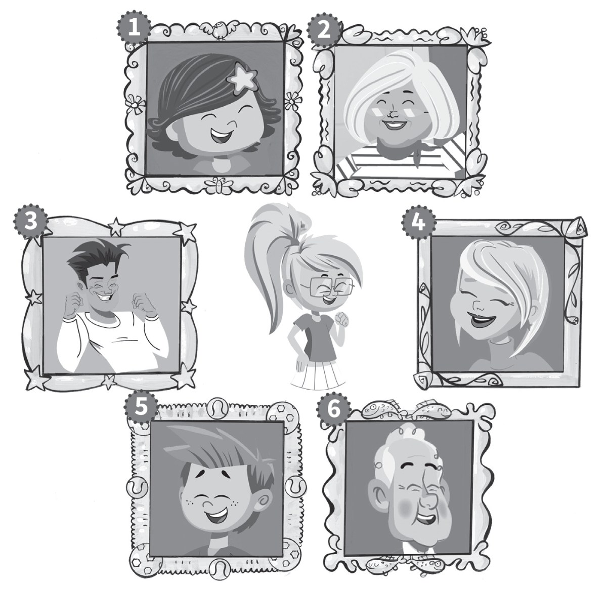
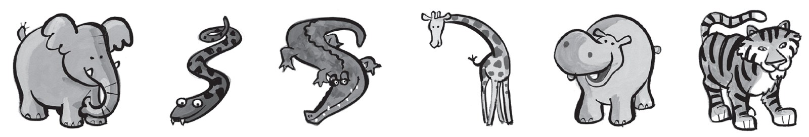
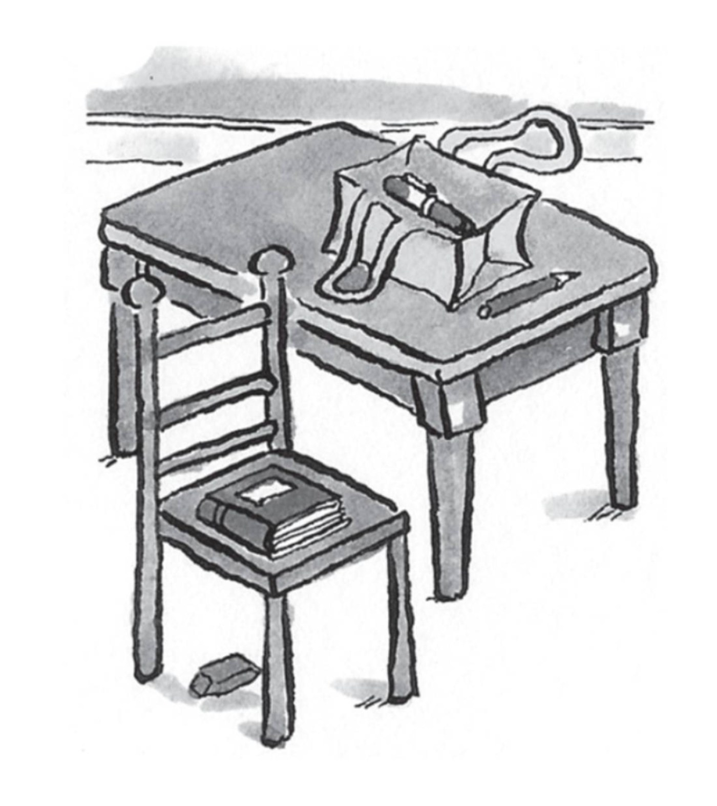
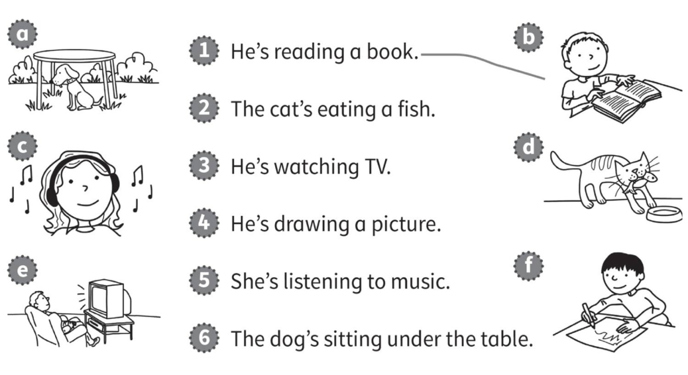

**[Vocabulary]{.underline}**

**1. Look and write the words. There is one example.   (one point
each)**

brother \| father \| grandfather \| grandmother \| mother \| ~~sister~~

1\. This is my *[sister]{.underline}*.

2\. This is my \_\_\_\_\_\_\_\_\_\_\_\_\_\_\_.

3\. This is my \_\_\_\_\_\_\_\_\_\_\_\_\_\_\_.

4\. This is my \_\_\_\_\_\_\_\_\_\_\_\_\_\_\_.

5\. This is my \_\_\_\_\_\_\_\_\_\_\_\_\_\_\_.

6\. This is my \_\_\_\_\_\_\_\_\_\_\_\_\_\_\_.

**2. Read and write the words. There is one example.   (one point
each)**

elephants \| snakes \| crocodiles \| giraffes \| ~~hippos~~ \| tigers

1\. They're dirty and grey. They haven't got hair.
*[hippos]{.underline}*

2\. They're black and orange. They've got big teeth.
\_\_\_\_\_\_\_\_\_\_\_\_\_\_\_\_\_\_\_\_

3\. They're brown and yellow. They've got small heads.
\_\_\_\_\_\_\_\_\_\_\_\_\_\_\_\_\_\_\_\_

4\. They're big and grey. They've got long noses.
\_\_\_\_\_\_\_\_\_\_\_\_\_\_\_\_\_\_\_\_

5\. They're long and green. They haven't got legs.
\_\_\_\_\_\_\_\_\_\_\_\_\_\_\_\_\_\_\_\_

6\. They're green. They've got big teeth and short legs.
\_\_\_\_\_\_\_\_\_\_\_\_\_\_\_\_\_\_\_\_

**[Grammar]{.underline}**

**3. Look and write the words. There is one example.   (one point
each)**

~~next to~~ \| under \| on \| in \| next to \| on

1\. The chair is *[next to]{.underline}* the table.

2\. The pen is \_\_\_\_\_\_\_\_\_\_\_\_\_\_\_ the bag.

3\. The bag is \_\_\_\_\_\_\_\_\_\_\_\_\_\_\_ the table.

4\. The eraser is \_\_\_\_\_\_\_\_\_\_\_\_\_\_\_ the chair.

5\. The book is \_\_\_\_\_\_\_\_\_\_\_\_\_\_\_ the chair.

6\. The pencil is \_\_\_\_\_\_\_\_\_\_\_\_\_\_\_ the bag.

**4. Read and draw lines. There is one example.   (one point each)**

**5. Read and circle the words. There is one example.   (one point
each)**

1\. Is your dog clean?

    *Yes, it [is]{.underline}* / *isn't*.

2\. Have you got an eraser?

    *No, I have* / *haven't*.

3\. Has your grandfather got a bike?

    *Yes, he has* / *hasn't*.

4\. Can you swim?

    *Yes, I can* / *can't*.

5\. Is your sister playing basketball?

    *No, she is* / *isn't*.

6\. Do you like fish?

    *Yes, I do* / *don't*.

**[Listening]{.underline}**

**6. Listen and tick or cross. There are two extra pictures. There is
one example.   (one point each)**

**7. Listen and circle the picture. There is one example.   (one point
each)**

**[Reading]{.underline}**

**8. Look and read. Write the number. There is one example.   (one point
each)**

1\. What is the woman eating?    \_\_\_\_\_\_\_\_\_\_\_\_\_\_\_\_\_\_

2\. What is the snake eating?    \_\_\_\_\_\_\_\_\_\_\_\_\_\_\_\_\_\_

3\. How many snakes are there?    \_\_\_\_\_\_\_\_\_\_\_\_\_\_\_\_\_\_

4\. What animal is the girl
watching?    \_\_\_\_\_\_\_\_\_\_\_\_\_\_\_\_\_\_

5\. What can the boy do?    \_\_\_\_\_\_\_\_\_\_\_\_\_\_\_\_\_\_

6\. What is the small elephant
doing?    \_\_\_\_\_\_\_\_\_\_\_\_\_\_\_\_\_\_

