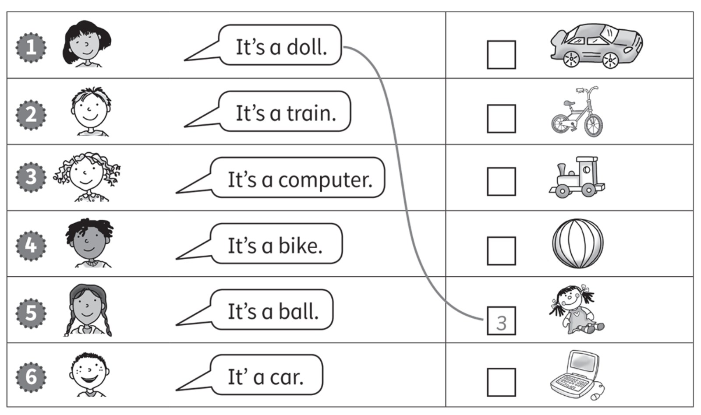
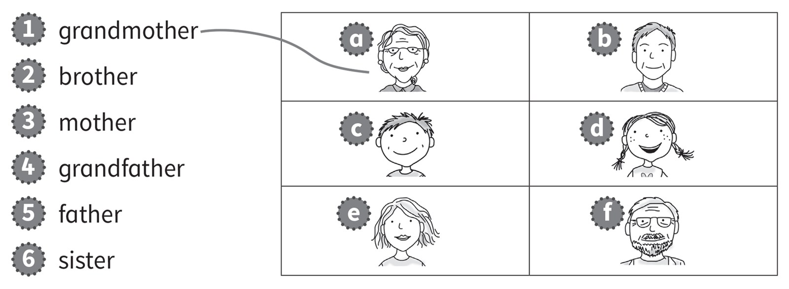
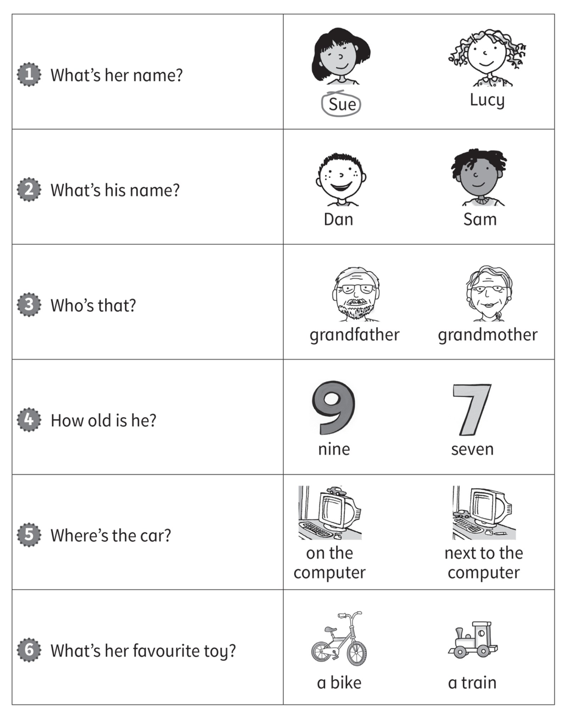
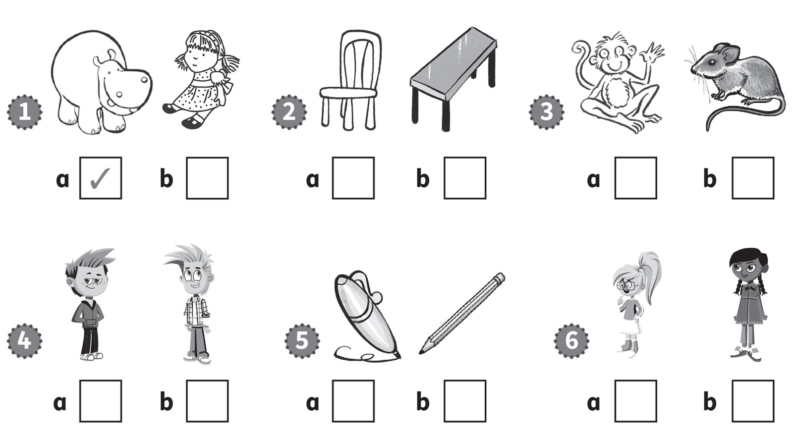
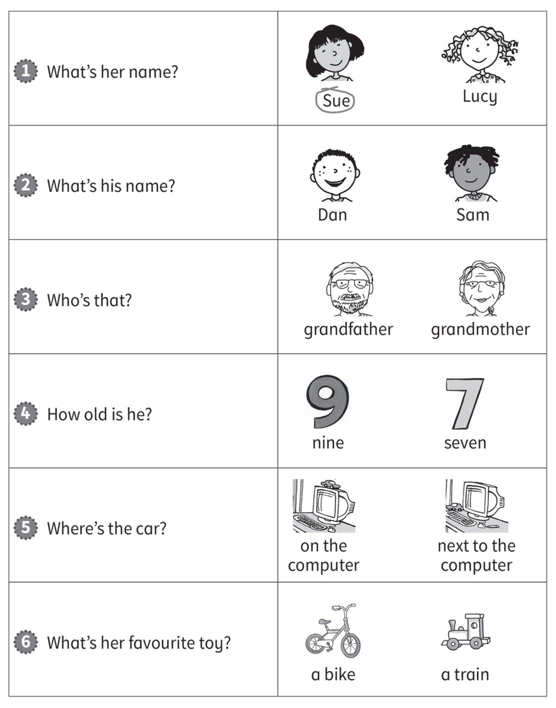

**[Vocabulary]{.underline}**

**1. Read and colour. Draw lines. There is one example.   (two points
each)**

*1. one -- blue*

*2. two -- red*

*4. four -- pink*

*6. six-orange*

*10. ten -- green*

**2. Read and draw lines. Write the number. There is one example.   (one
point each)**

*2. train*

*3. computer*

*4. bike*

*5. ball*

*6. car*

**3. Look and draw lines. There is one example.   (one point each)**

*2. c brother*

*3. e mother*

*4. f grandfather*

*5. b father*

*6. d sister*

**[Grammar]{.underline}**

**4. Read and circle. There is one example.   (one point each)**

*2. in*

*3. next to*

*4. on*

*5. under*

*6. next to*

**5. Look and draw lines. There is one example.   (one point each)**

*2. f*

*3. e*

*4. a*

*5. b*

*6. c*

**[Listening]{.underline}**

**6. Listen and tick the correct picture. There is one example.   (one
point each)**

*2. b*

*3. a*

*4. b*

*5. a*

*6. b*

**Audio script**

1\. It's a hippo.

2\. It's a table.

3\. It's a monkey.

4\. He's Alex.

5\. It's a pen.

6\. She's Meera.

**7. Listen and circle. There is one example.   (one point each)**

*2. Sam*

*3. grandmother*

*4. nine*

*5. next to*

*6. a train*

**Audio script**

1

**Boy:** What's her name?

**Girl:** It's Sue.

2

**Boy:** What's his name?

**Girl:** It's Sam.

3

**Boy:** Who's that?

**Girl:** It's my grandmother.

4

**Boy:** How old is he?

**Girl:** He's nine.

5

**Boy:** Where's the car?

**Girl:** It's next to the computer.

6

**Boy:** What's your favourite toy?

**Girl:** It's a train.

**[Reading]{.underline}**

**8. Look and read. Write *yes* or *no*. There is one example.   (one
point each)**

  ------------------------------- --- -----------------------------------
  1\. The cat is ugly.                *[yes]{.underline}*

  ------------------------------- --- -----------------------------------

  ------------------------------- --- -----------------------------------
  2\. My brother is happy.            *no*

  ------------------------------- --- -----------------------------------

  ------------------------------- --- -----------------------------------
  3\. My grandmother is               *no*
  beautiful.                          

  ------------------------------- --- -----------------------------------

  ------------------------------- --- -----------------------------------
  4\. My grandfather is old.          *yes*

  ------------------------------- --- -----------------------------------

  ------------------------------- --- -----------------------------------
  5\. My sister is young.             *yes*

  ------------------------------- --- -----------------------------------

  ------------------------------- --- -----------------------------------
  6\. The cat is white.               *no*

  ------------------------------- --- -----------------------------------

