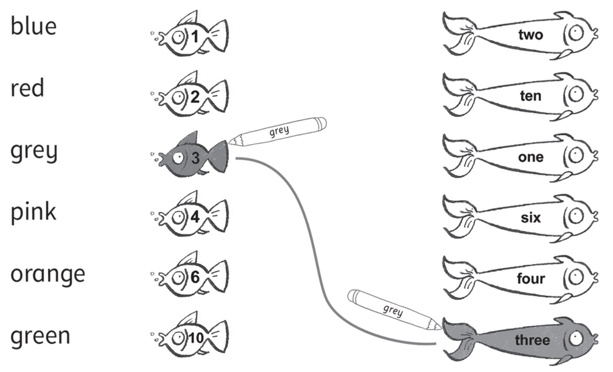
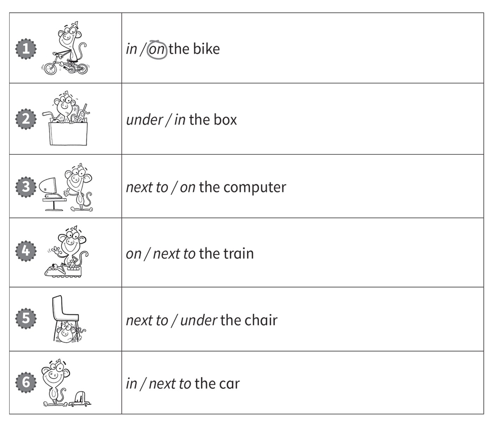
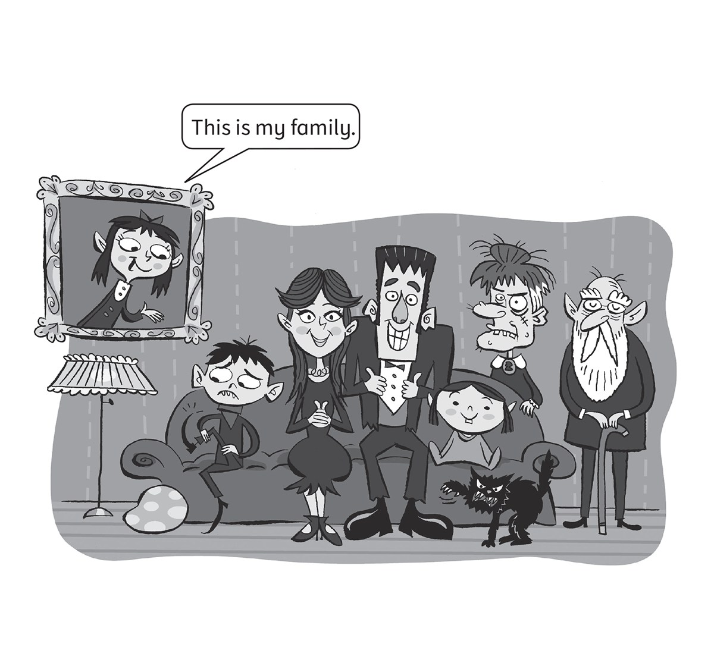

**[Vocabulary]{.underline}**

**1. Read and colour. Draw lines. There is one example.   (two points
each)**

**2. Read and draw lines. Write the number. There is one example.   (one
point each)**

**3. Look and draw lines. There is one example.   (one point each)**

**[Grammar]{.underline}**

**4. Read and circle. There is one example.   (one point each)**

**5. Look and draw lines. There is one example.   (one point each)**

**[Listening]{.underline}**

**6. Listen and tick the correct picture. There is one example.   (one
point each)**

**7. Listen and circle. There is one example.   (one point each)**

**[Reading]{.underline}**

**8. Look and read. Write *yes* or *no*. There is one example.   (one
point each)**

  ------------------------------- --- -----------------------------------
  1\. The cat is ugly.                *[yes]{.underline}*

  ------------------------------- --- -----------------------------------

  ------------------------------- --- -----------------------------------
  2\. My brother is happy.            \_\_\_\_\_

  ------------------------------- --- -----------------------------------

  ------------------------------- --- -----------------------------------
  3\. My grandmother is               \_\_\_\_\_
  beautiful.                          

  ------------------------------- --- -----------------------------------

  ------------------------------- --- -----------------------------------
  4\. My grandfather is old.          \_\_\_\_\_

  ------------------------------- --- -----------------------------------

  ------------------------------- --- -----------------------------------
  5\. My sister is young.             \_\_\_\_\_

  ------------------------------- --- -----------------------------------

  ------------------------------- --- -----------------------------------
  6\. The cat is white.               \_\_\_\_\_

  ------------------------------- --- -----------------------------------

