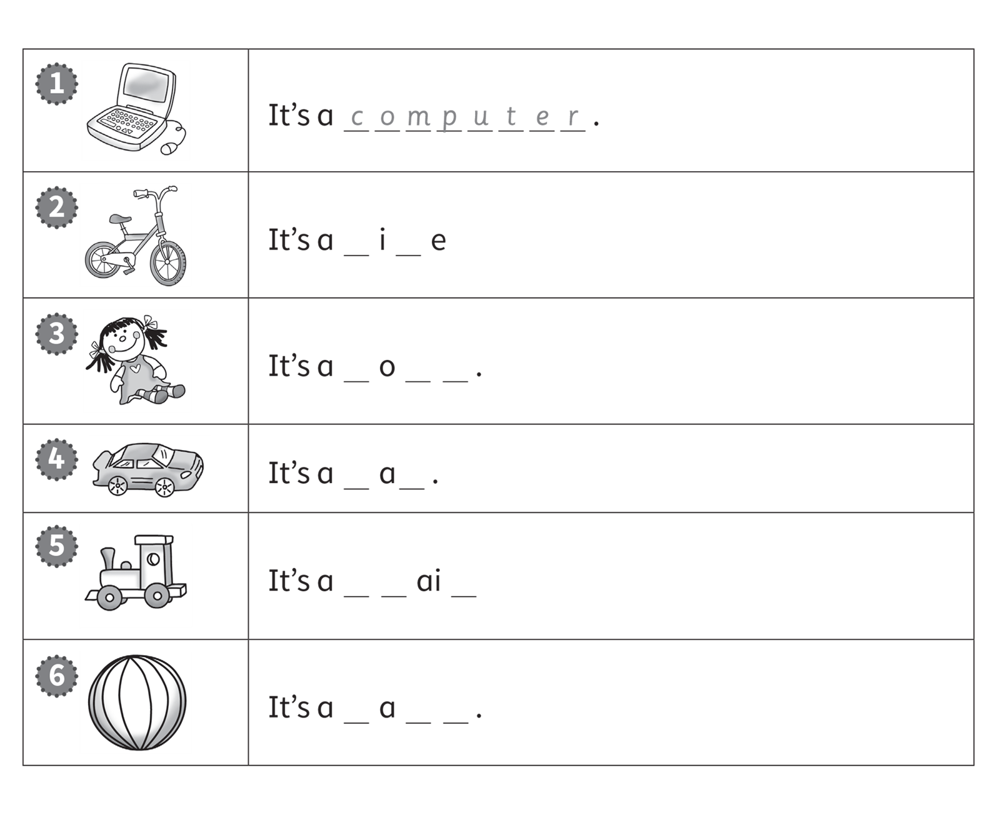
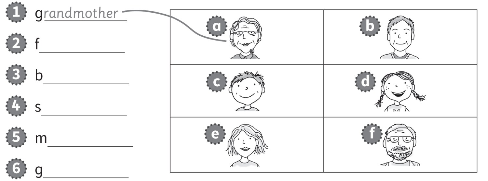
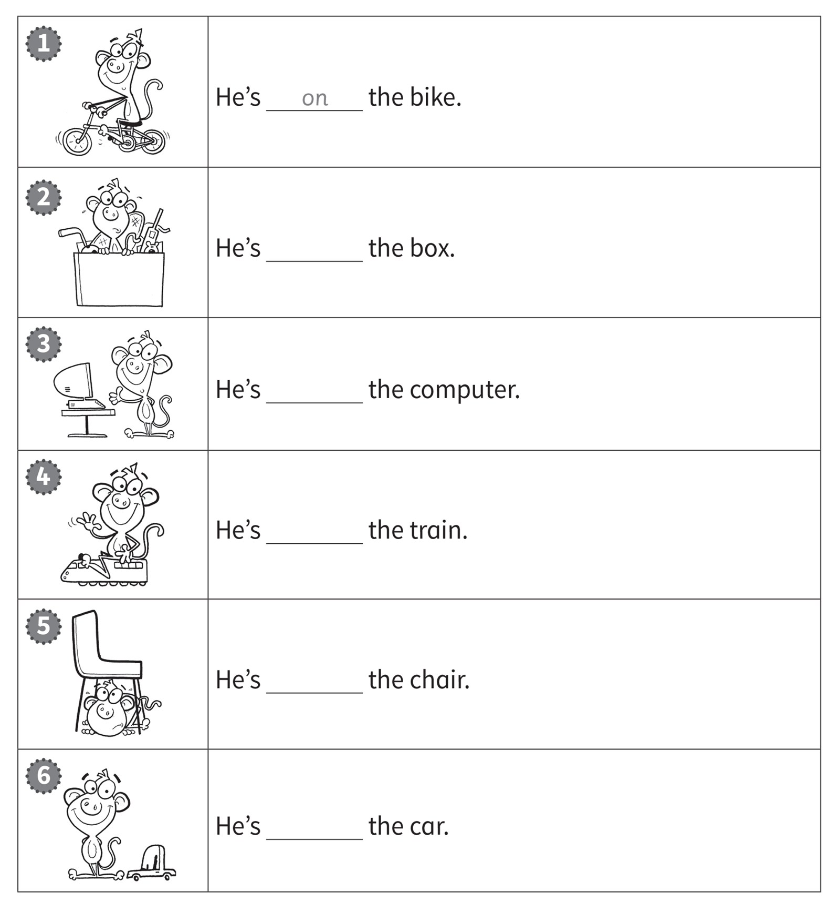
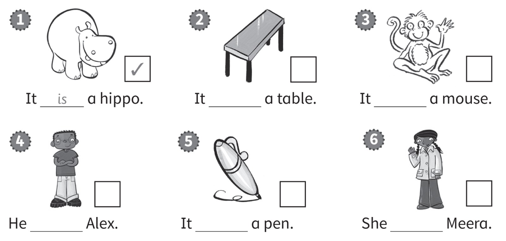
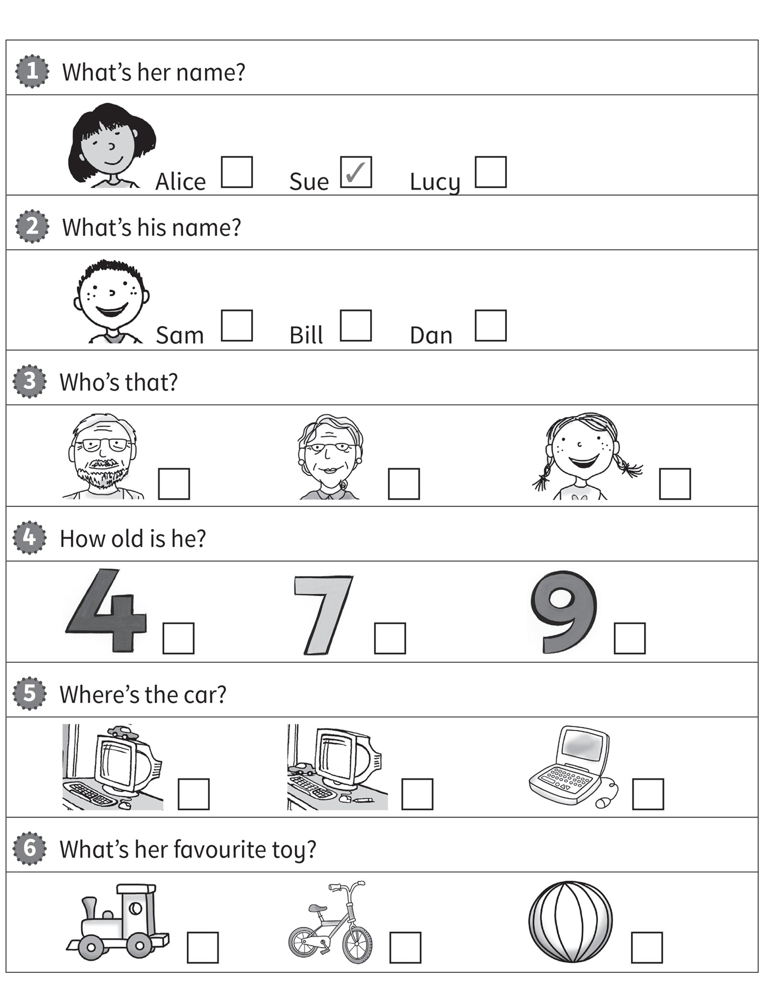
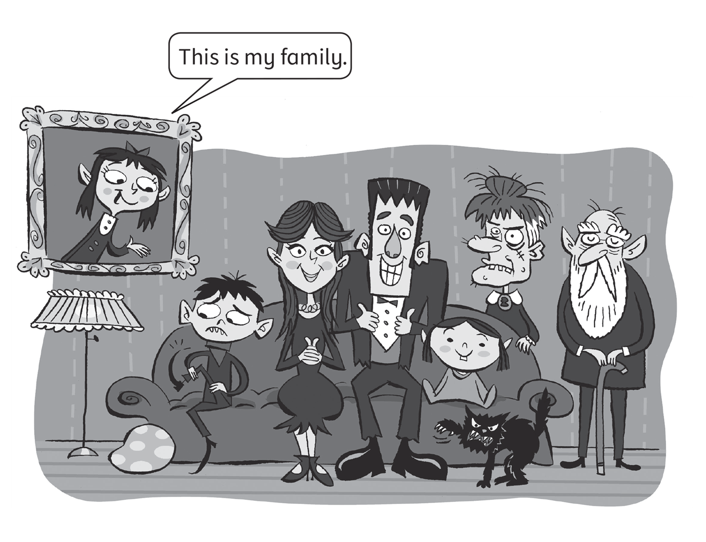

**[Vocabulary]{.underline}**

**1. Draw lines. Write the words and colour.   (one point each)**

1\. yreg *[grey]{.underline}*

2\. kipn \_\_\_\_\_\_\_\_

*four -- pink*

3\. ranoge \_\_\_\_\_\_\_\_

*six -- orange*

4\. lueb \_\_\_\_\_\_\_\_

*seven -- blue*

5\. dre \_\_\_\_\_\_\_\_

*nine -- red*

6\. eregn \_\_\_\_\_\_\_\_

*ten -- green*

**2. Look, read and write.   (one point each)**

*2. bike*

*3. doll*

*4. car*

*5. train*

*6. ball*

**3. Look and write. Then draw lines.   (one point each)**

*2. b father*

*3. c brother*

*4. d sister*

*5. e mother*

*6. f grandfather*

**[Grammar]{.underline}**

**4. Read and write the words.   (one point each)**

in \| next to \| next to \| ~~on~~ \| on \| under

*2. in*

*3. next to*

*4. on*

*5. under*

*6. next to*

**5. Look and write.   (one point each)**

*2. He's*

*3. It's*

*4. We're*

*5. She's*

*6. He's*

**[Listening]{.underline}**

**6. Listen and tick or cross. Then write *is* or *isn't*.   (one point
each)**

*✓ -- It is a table.*

*✗ -- It isn't a mouse.*

*✗ -- He isn't Alex.*

*✓ -- It is a pen.*

*✓ -- She is Meera.*

**Audio script**

1\. It's a hippo.

2\. It's a table.

3\. It's a monkey.

4\. He's Alex.

5\. It's a pen.

6\. She's Meera.

**7. Listen and tick.   (one point each)**

*2. Sam*

*3. grandmother*

*4. 9*

*5. pen next to computer*

*6. train*

**Audio script**

1

**Boy:** What's her name?

**Girl:** It's Sue.

2

**Boy:** What's his name?

**Girl:** It's Sam.

3

**Boy:** Who's that?

**Girl:** It's my grandmother.

4

**Boy:** How old is he?

**Girl:** He's nine.

5

**Boy:** Where's the car?

**Girl:** It's next to the computer.

6

**Boy:** What's your favourite toy?

**Girl:** It's a train.

**[Reading]{.underline}**

**8. Look and read. Circle.   (one point each)**

1\. Is the cat is ugly?      *[Yes, it is.]{.underline}*      No, it
isn't.

2\. Is my brother happy?      Yes, he is.      No, he isn't.

*No, he isn't.*

3\. Is my grandmother beautiful?      Yes, she is.      No, she isn't.

*No, she isn't.*

4\. Is my grandfather old?      Yes, he is.      No, he isn't.

*Yes, he is.*

5\. Is my sister young?      Yes, she is.      No, she isn't.

*Yes, she is.*

6\. Is the cat white?      Yes, it is.      No, it isn't.

*No, it isn't.*

