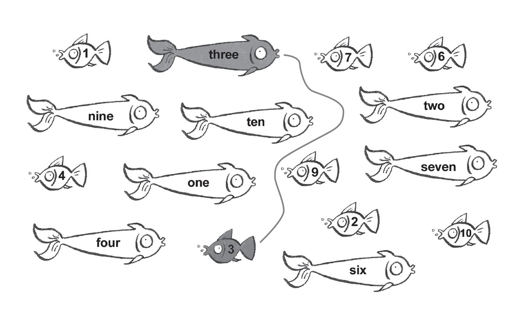
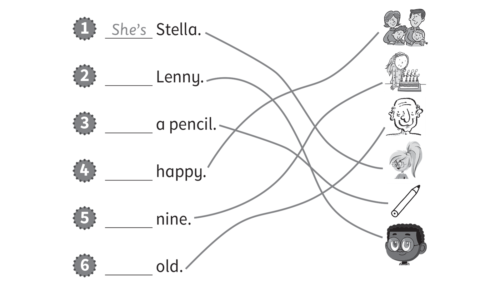

**[Vocabulary]{.underline}**

**1. Draw lines. Write the words and colour.   (one point each)**

1\. yreg *[grey]{.underline}*

2\. kipn \_\_\_\_\_\_\_\_

3\. ranoge \_\_\_\_\_\_\_\_

4\. lueb \_\_\_\_\_\_\_\_

5\. dre \_\_\_\_\_\_\_\_

6\. eregn \_\_\_\_\_\_\_\_

**2. Look, read and write.   (one point each)**

**3. Look and write. Then draw lines.   (one point each)**

**[Grammar]{.underline}**

**4. Read and write the words.   (one point each)**

in \| next to \| next to \| ~~on~~ \| on \| under

**5. Look and write.   (one point each)**

**[Listening]{.underline}**

**6. Listen and tick or cross. Then write *is* or *isn't*.   (one point
each)**

**7. Listen and tick.   (one point each)**

**[Reading]{.underline}**

**8. Look and read. Circle.   (one point each)**

1\. Is the cat is ugly?      *[Yes, it is.]{.underline}*      No, it
isn't.

2\. Is my brother happy?      Yes, he is.      No, he isn't.

3\. Is my grandmother beautiful?      Yes, she is.      No, she isn't.

4\. Is my grandfather old?      Yes, he is.      No, he isn't.

5\. Is my sister young?      Yes, she is.      No, she isn't.

6\. Is the cat white?      Yes, it is.      No, it isn't.

