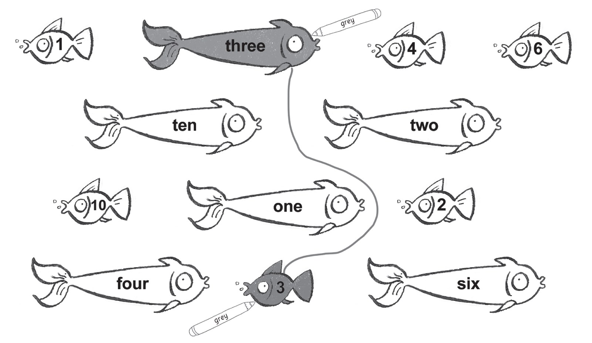
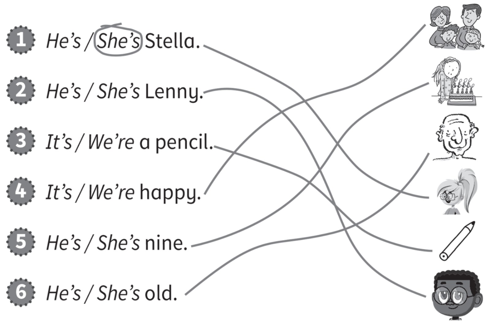
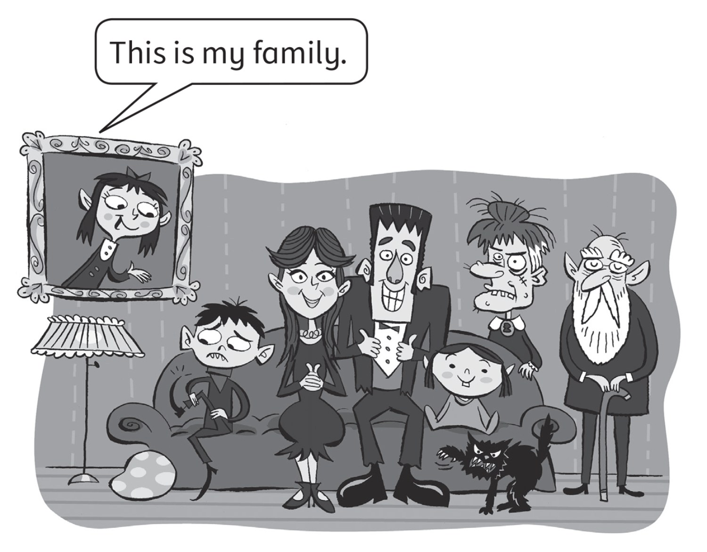

**[Vocabulary]{.underline}**

**1. Draw lines and colour. Use the code.   (one point each)**

1 -- blue \| 2 -- red \| 3 -- grey \| 4 -- pink \| 6 -- orange \| 10 --
green

*1. one -- blue*

*2. two -- red*

*4. four -- pink*

*6. six -- orange*

*10. ten -- green*

**2. Look and put the letters in order. Write.   (one point each)**

*2. bike*

*3. doll*

*4. car*

*5. train*

*6. ball*

**3. Look, circle and write. Then match.   (one point each)**

*2. c brother*

*3. b father*

*4. f grandfather*

*5. e mother*

*6. d sister*

**[Grammar]{.underline}**

**4. Read and circle.    (one point each)**

*2. in*

*3. next to*

*4. on*

*5. under*

*6. next to*

**5. Look, read and circle.   (one point each)**

*2. He's*

*3. It's*

*4. We're*

*5. She's*

*6. He's*

**[Listening]{.underline}**

**6. Listen and tick or cross. There is one example.   (one point
each)**

*2. ✓*

*3. ✗*

*4. ✗*

*5. ✗*

*6. ✓*

**Audio script**

1\. It's a hippo.

2\. It's a table.

3\. It's a monkey.

4\. He's Alex.

5\. It's a pen.

6\. She's Meera.

**7. Listen and tick.    (one point each)**

*2. Sam*

*3. grandmother*

*4. 9*

*5. car next to computer*

*6. train*

**Audio script**

1

**Boy:** What's her name?

**Girl:** It's Sue.

2

**Boy:** What's his name?

**Girl:** It's Sam.

3

**Boy:** Who's that?

**Girl:** It's my grandmother.

4

**Boy:** How old is he?

**Girl:** He's nine.

5

**Boy:** Where's the car?

**Girl:** It's next to the computer.

6

**Boy:** What's your favourite toy?

**Girl:** It's a train.

**[Reading]{.underline}**

**8. Look and read. Put the words in order. Write *yes* or *no*.   (one
point each)**

1\. cat The ugly is

*[The]{.underline}* *[cat]{.underline}* *[is]{.underline}*
*[ugly]{.underline}*. *[yes]{.underline}*

2\. brother My happy is.

\_\_\_\_\_\_\_\_\_\_\_\_\_\_\_\_\_\_\_\_\_\_\_\_\_\_\_\_\_\_\_\_\_\_\_\_\_\_\_\_\_\_\_\_\_\_\_\_\_\_\_\_\_\_\_\_\_\_\_\_

*My brother is happy. -- no*

3\. is beautiful grandmother My.

\_\_\_\_\_\_\_\_\_\_\_\_\_\_\_\_\_\_\_\_\_\_\_\_\_\_\_\_\_\_\_\_\_\_\_\_\_\_\_\_\_\_\_\_\_\_\_\_\_\_\_\_\_\_\_\_\_\_\_\_

*My grandmother is beautiful. -- no*

4\. grandfather is My old.

\_\_\_\_\_\_\_\_\_\_\_\_\_\_\_\_\_\_\_\_\_\_\_\_\_\_\_\_\_\_\_\_\_\_\_\_\_\_\_\_\_\_\_\_\_\_\_\_\_\_\_\_\_\_\_\_\_\_\_\_

*My grandfather is old. -- yes*

5\. young is My sister.

\_\_\_\_\_\_\_\_\_\_\_\_\_\_\_\_\_\_\_\_\_\_\_\_\_\_\_\_\_\_\_\_\_\_\_\_\_\_\_\_\_\_\_\_\_\_\_\_\_\_\_\_\_\_\_\_\_\_\_\_

*My sister is young. -- yes*

6\. is cat The white.

\_\_\_\_\_\_\_\_\_\_\_\_\_\_\_\_\_\_\_\_\_\_\_\_\_\_\_\_\_\_\_\_\_\_\_\_\_\_\_\_\_\_\_\_\_\_\_\_\_\_\_\_\_\_\_\_\_\_\_\_

*The cat is white. -- no*

