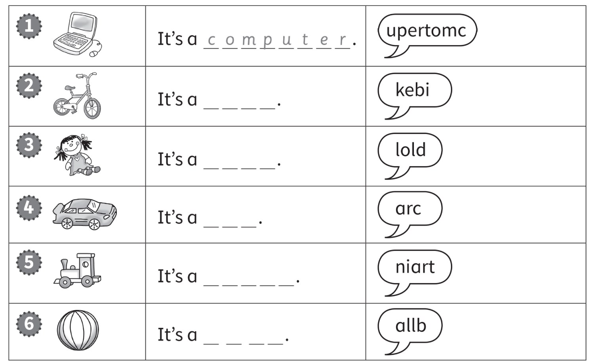
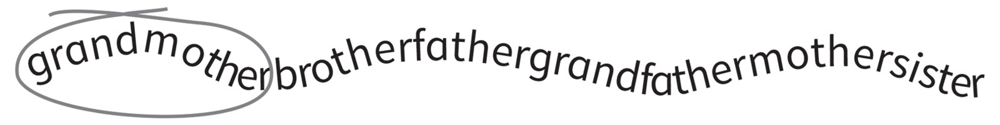
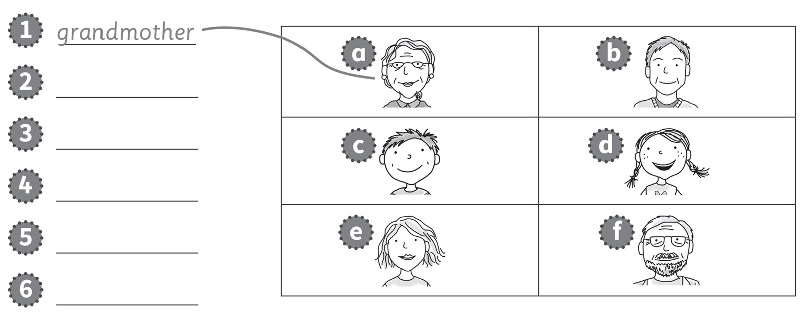
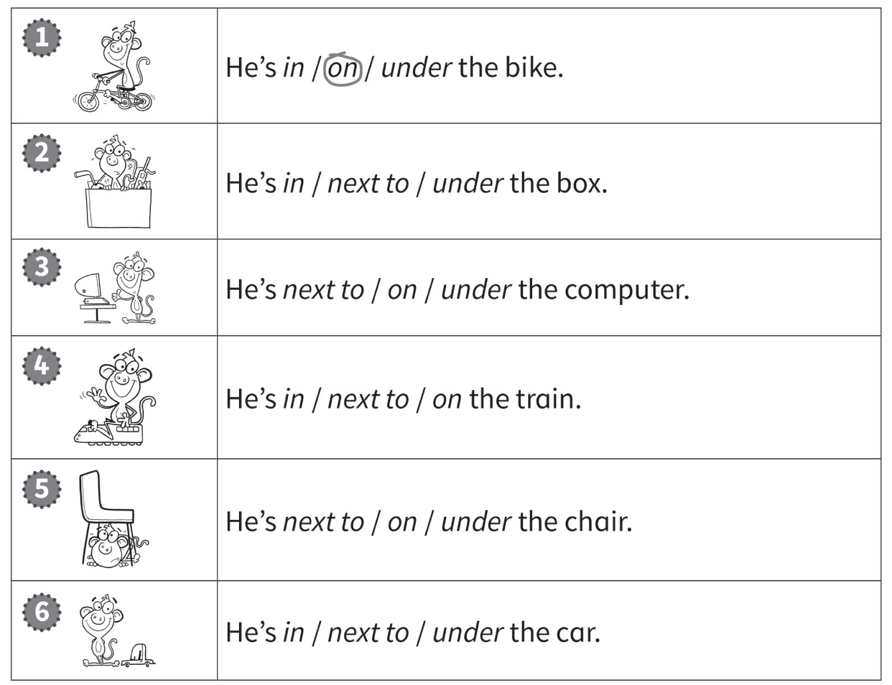
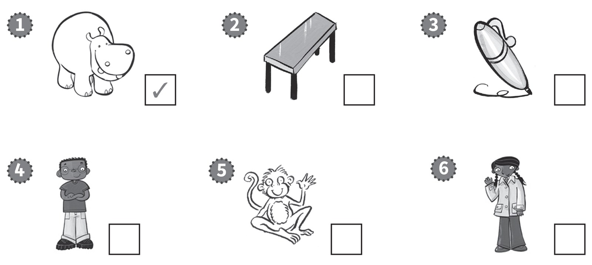
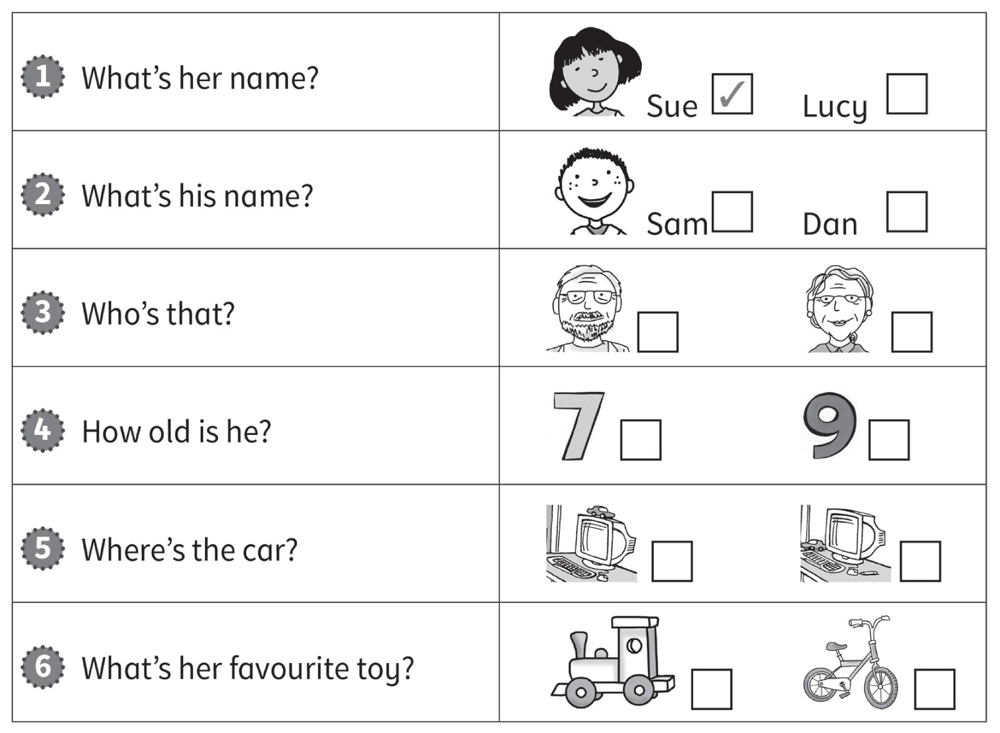

**[Vocabulary]{.underline}**

**1. Draw lines and colour. Use the code.   (one point each)**

1 -- blue \| 2 -- red \| 3 -- grey \| 4 -- pink \| 6 -- orange \| 10 --
green

**2. Look and put the letters in order. Write.   (one point each)**

**3. Look, circle and write. Then match.   (one point each)**

**[Grammar]{.underline}**

**4. Read and circle.    (one point each)**

**5. Look, read and circle.   (one point each)**

**[Listening]{.underline}**

**6. Listen and tick or cross. There is one example.   (one point
each)**

**7. Listen and tick.    (one point each)**

**[Reading]{.underline}**

**8. Look and read. Put the words in order. Write *yes* or *no*.   (one
point each)**

1\. cat The ugly is

*[The]{.underline}* *[cat]{.underline}* *[is]{.underline}*
*[ugly]{.underline}*. *[yes]{.underline}*

2\. brother My happy is.

\_\_\_\_\_\_\_\_\_\_\_\_\_\_\_\_\_\_\_\_\_\_\_\_\_\_\_\_\_\_\_\_\_\_\_\_\_\_\_\_\_\_\_\_\_\_\_\_\_\_\_\_\_\_\_\_\_\_\_\_

3\. is beautiful grandmother My.

\_\_\_\_\_\_\_\_\_\_\_\_\_\_\_\_\_\_\_\_\_\_\_\_\_\_\_\_\_\_\_\_\_\_\_\_\_\_\_\_\_\_\_\_\_\_\_\_\_\_\_\_\_\_\_\_\_\_\_\_

4\. grandfather is My old.

\_\_\_\_\_\_\_\_\_\_\_\_\_\_\_\_\_\_\_\_\_\_\_\_\_\_\_\_\_\_\_\_\_\_\_\_\_\_\_\_\_\_\_\_\_\_\_\_\_\_\_\_\_\_\_\_\_\_\_\_

5\. young is My sister.

\_\_\_\_\_\_\_\_\_\_\_\_\_\_\_\_\_\_\_\_\_\_\_\_\_\_\_\_\_\_\_\_\_\_\_\_\_\_\_\_\_\_\_\_\_\_\_\_\_\_\_\_\_\_\_\_\_\_\_\_

6\. is cat The white.

\_\_\_\_\_\_\_\_\_\_\_\_\_\_\_\_\_\_\_\_\_\_\_\_\_\_\_\_\_\_\_\_\_\_\_\_\_\_\_\_\_\_\_\_\_\_\_\_\_\_\_\_\_\_\_\_\_\_\_\_

