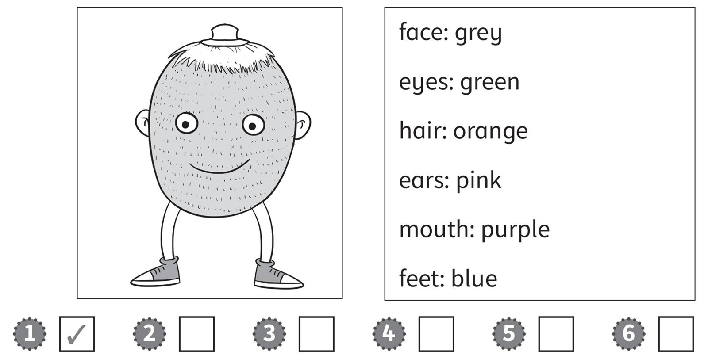
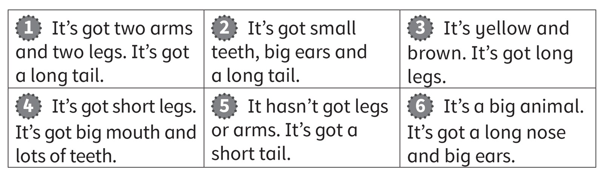
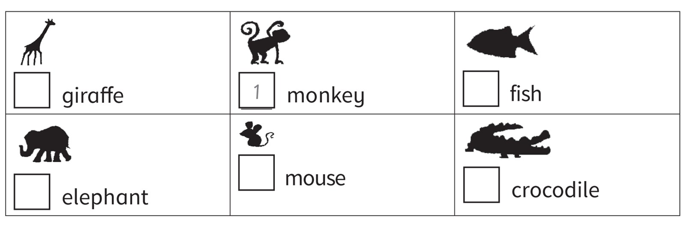

**[Vocabulary]{.underline}**

**1. Read and write.   (one point each)**

~~cat~~ \| ~~T-shirt~~ \| ~~teeth~~ \| ~~elephant~~ \| tiger \| horse \|
socks \| giraffe \| jacket \| hippo \| nose \| hair \| dog \| skirt

**2. Look and read. Write the number.   (one point each)**

**3. Look, read and tick.   (one point each)**

**[Grammar]{.underline}**

**4. Look and put the words in order. Write.   (one point each)**

**5. Look and circle.   (one point each)**

**[Listening]{.underline}**

**6. Read and colour. Listen and tick or cross.   (two points each)**

**7. Listen and number.   (one point each)**

**[Reading]{.underline}**

**8. Read and write the number.   (one point each)**

