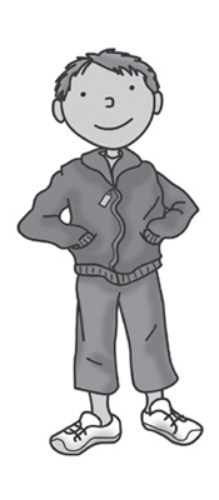
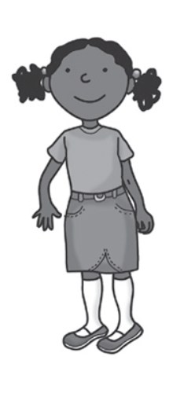
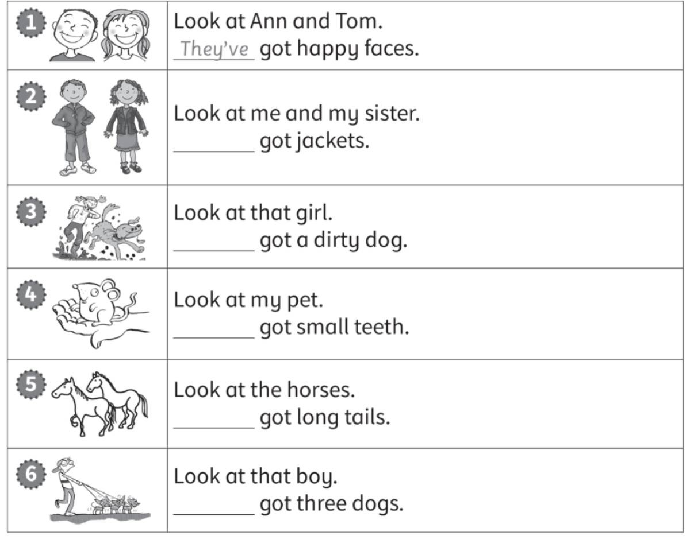
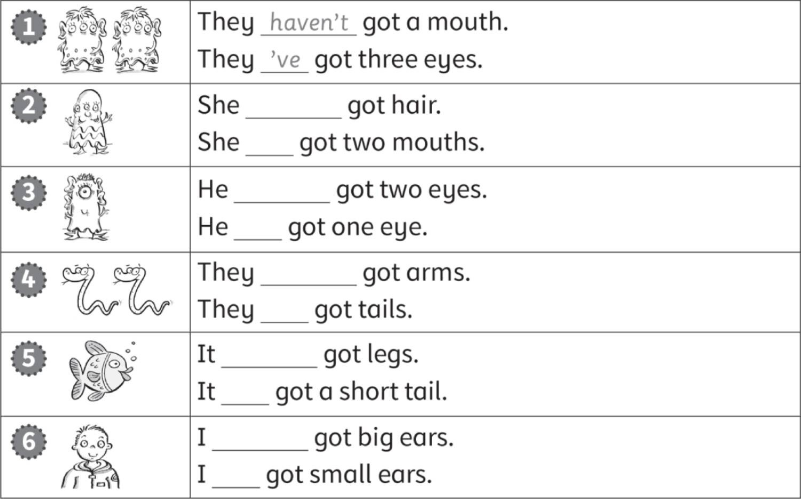
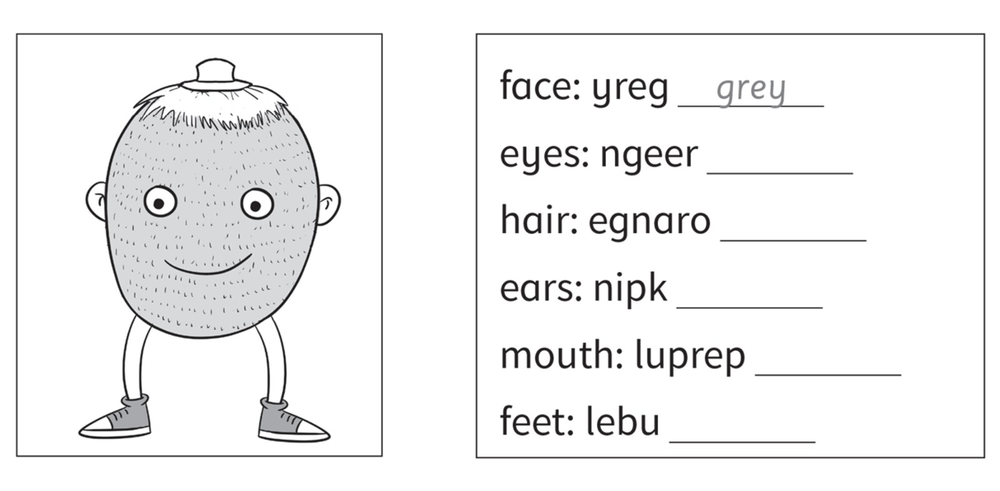
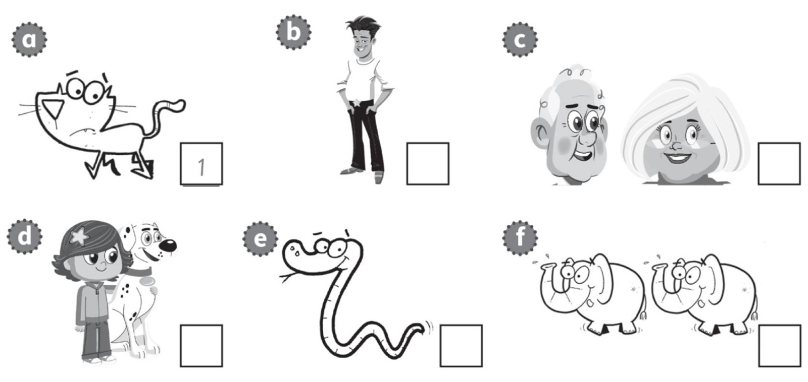
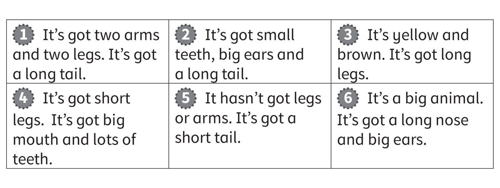
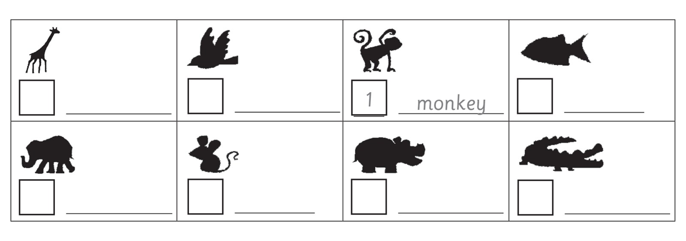

**[Vocabulary]{.underline}**

**1. Match and write. There are four extra words. There is one
example.   (one point each)**

arms \| ~~cat~~ \| jacket \| tiger \| ~~elephant~~ \| feet \| horse \|
socks \| tail \| giraffe \| ~~T-shirt~~ \| hippo \| legs \| ~~teeth~~ \|
hair \| dog \| skirt \| nose

*Pets: horse, dog*

*Face: hair, nose*

*Wild animals: tiger, giraffe, hippo*

*Clothes: jacket, socks, skirt*

**2. Look and read. Write. There is one example.   (one point each)**

big \| clean \| dirty \| long \| short \| ~~small~~

1\. It's got big feet.

    No, it's got *[small]{.underline}* feet.

2\. They are small teeth.

    No, they're \_\_\_\_\_\_\_\_\_\_ teeth.

*big*

3\. It's a long tail.

    No, it's a \_\_\_\_\_\_\_\_\_\_ tail.

*short*

4\. They're short legs.

    No, they're \_\_\_\_\_\_\_\_\_\_ legs.

*long*

5\. It's a clean dog.

    No, it's a \_\_\_\_\_\_\_\_\_\_ dog.

*dirty*

6\. It's a dirty cat.

    No, it's a \_\_\_\_\_\_\_\_\_\_ cat.

*clean*

**3. Look and read. Write. There is one example.   (one point each)**

1\. He's got s *[h]{.underline}* *[o]{.underline}* *[e]{.underline}*
*[s]{.underline}*, tr\_ \_ s\_ \_ \_ and a j_ck\_ \_.

*Boy: trousers, jacket*

2\. She's got a T-sh\_ \_ \_, a sk\_ \_ \_, s\_ \_ \_s and shoes.

*Girl: T-shirt, skirt, socks*

**[Grammar]{.underline}**

**4. Look and read. Write. There is one example.   (one point each)**

*2. We've*

*3. She's*

*4. It's*

*5. They've*

*6. He's*

**5. Look and write *'ve*, *'s*, *haven't* or *hasn't*. There is one
example.   (one point each)**

*2. hasn't, 's*

*3. hasn't, 's*

*4. haven't, 've*

*5. hasn't, 's*

*6. haven't, 've*

**[Listening]{.underline}**

**6. Put the letters in order. Read and colour. Listen and tick or
cross. There is one example.   (one point each)**

*green*

*hair -- orange*

*ears -- pink*

*mouth -- purple*

*feet -- blue*

*2. ✓*

*3. ✗*

*4. ✓*

*5. ✗*

*6. ✓*

**Audio script**

1

**Man:** Mr Kiwi has got a grey face.

2

**Woman:** But he's got a happy purple mouth.

3

**Man:** He's got short, yellow hair.

4

**Woman:** And he's got small, blue feet.

5

**Man:** He's got big, brown ears ...

6

**Woman:** ... and green eyes.

**7. Listen and number. There is one example.   (one point each)**

*b. 4*

*c. 3*

*d. 6*

*e. 5*

*f. 2*

**Audio script**

1

**Woman:** It hasn't got arms.

2

**Man:** They haven't got hair.

3

**Woman:** They've got white hair.

4

**Man:** He's got a white T-shirt.

5

**Woman:** It hasn't got arms or legs.

6

**Man:** She's got a big black and white dog.

**[Reading]{.underline}**

**8. Read and write the number and name. There are two extra pictures.
There is one example.   (one point each)**

*2. mouse*

*3. giraffe*

*4. crocodile*

*5. fish*

*6. elephant*

