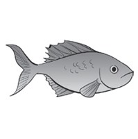
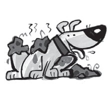

**[Vocabulary]{.underline}**

**1. Match and write. There are four extra words. There is one
example.   (one point each)**

arms \| ~~cat~~ \| jacket \| tiger \| ~~elephant~~ \| feet \| horse \|
socks \| tail \| giraffe \| ~~T-shirt~~ \| hippo \| legs \| ~~teeth~~ \|
hair \| dog \| skirt \| nose

**2. Look and read. Write. There is one example.   (one point each)**

big \| clean \| dirty \| long \| short \| ~~small~~

1\. It's got big feet.

    No, it's got *[small]{.underline}* feet.

2\. They are small teeth.

    No, they're \_\_\_\_\_\_\_\_\_\_ teeth.

3\. It's a long tail.

    No, it's a \_\_\_\_\_\_\_\_\_\_ tail.

4\. They're short legs.

    No, they're \_\_\_\_\_\_\_\_\_\_ legs.

5\. It's a clean dog.

    No, it's a \_\_\_\_\_\_\_\_\_\_ dog.

6\. It's a dirty cat.

    No, it's a \_\_\_\_\_\_\_\_\_\_ cat.

**3. Look and read. Write. There is one example.   (one point each)**

1\. He's got s *[h]{.underline}* *[o]{.underline}* *[e]{.underline}*
*[s]{.underline}*, tr\_ \_ s\_ \_ \_ and a j_ck\_ \_.

2\. She's got a T-sh\_ \_ \_, a sk\_ \_ \_, s\_ \_ \_s and shoes.

**[Grammar]{.underline}**

**4. Look and read. Write. There is one example.   (one point each)**

**5. Look and write *'ve*, *'s*, *haven't* or *hasn't*. There is one
example.   (one point each)**

**[Listening]{.underline}**

**6. Put the letters in order. Read and colour. Listen and tick or
cross. There is one example.   (one point each)**

**7. Listen and number. There is one example.   (one point each)**

**[Reading]{.underline}**

**8. Read and write the number and name. There are two extra pictures.
There is one example.   (one point each)**

