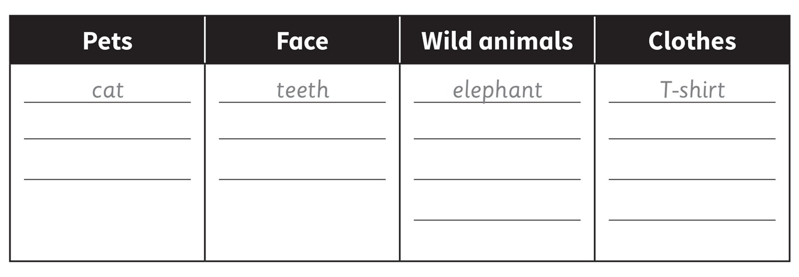
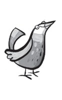
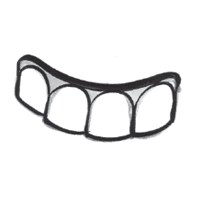
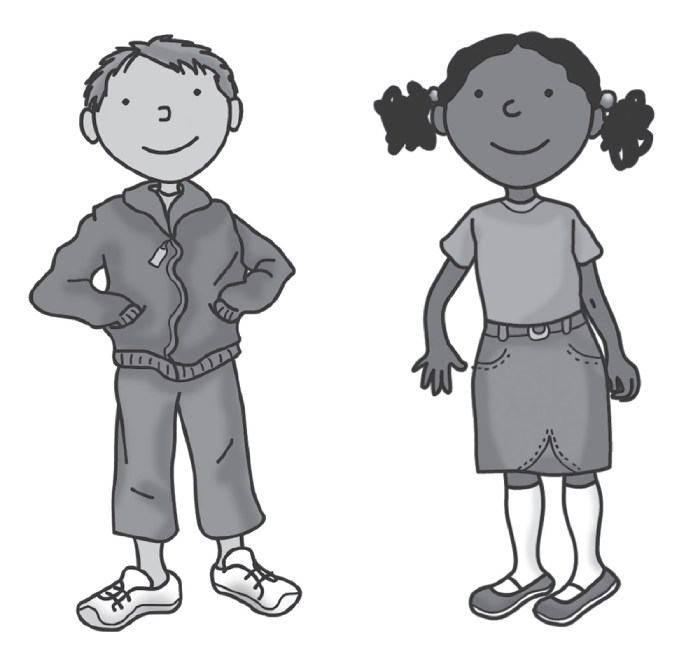
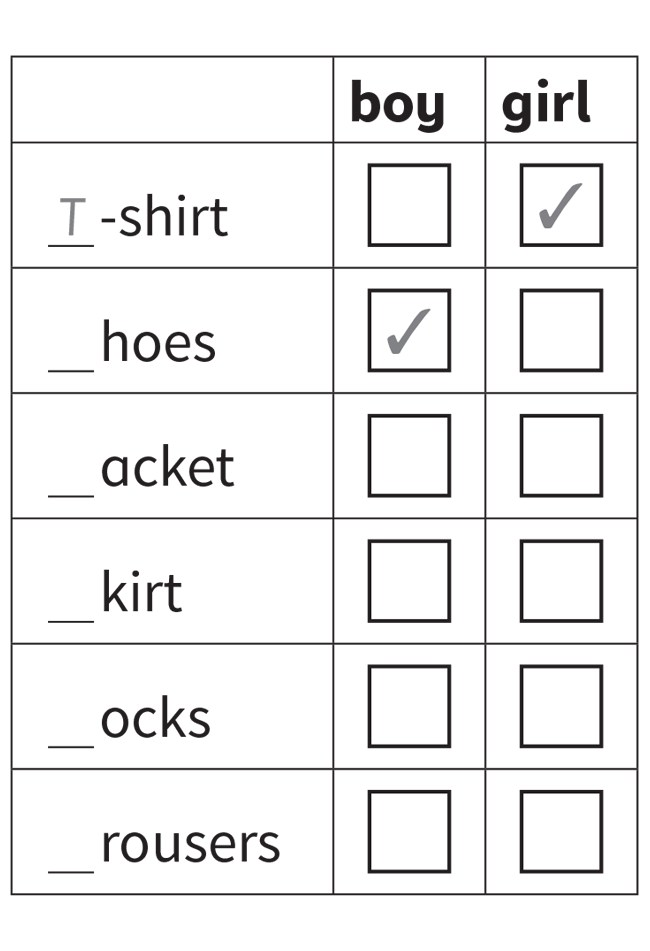
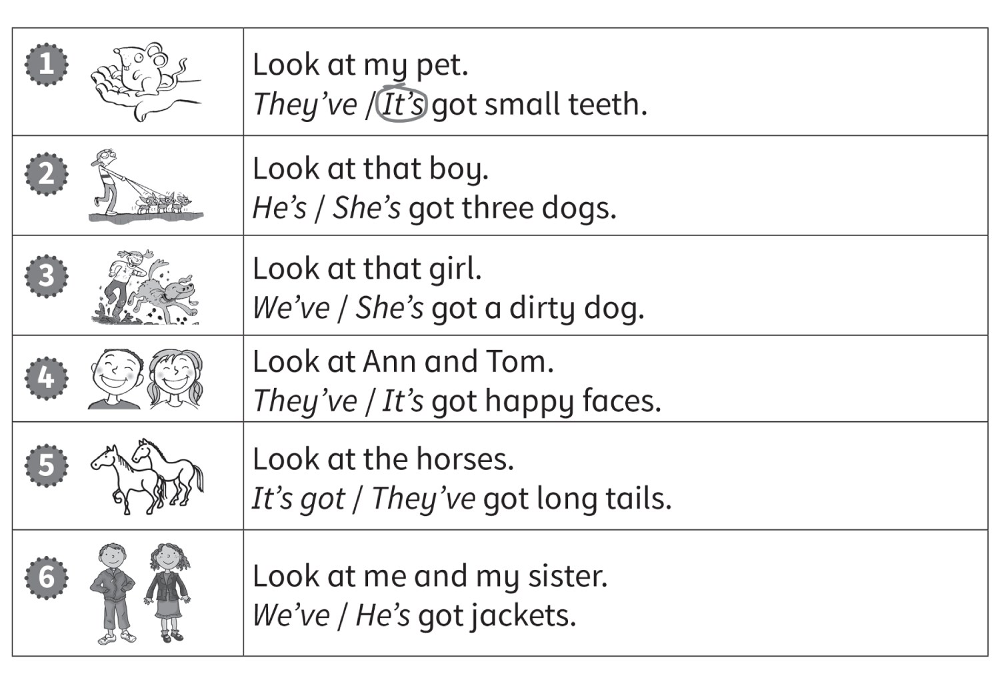
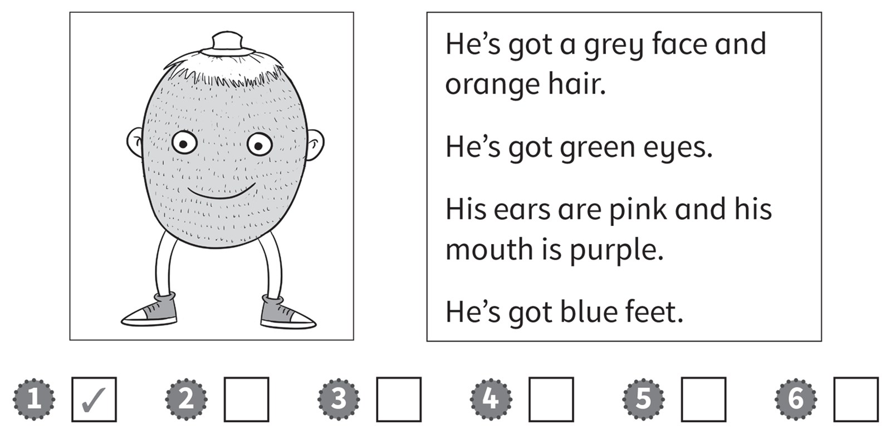
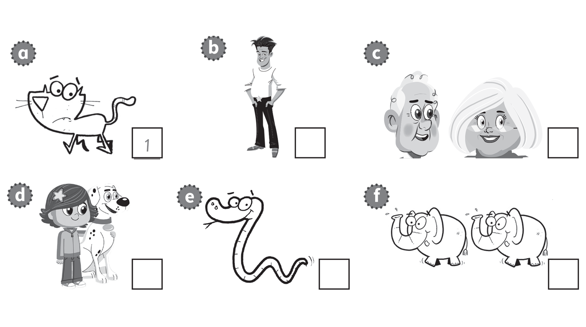

**[Vocabulary]{.underline}**

**1. Read and write. There is one example.   (one point each)**

~~cat~~ \| jacket \| nose \| tiger \| ~~elephant~~ \| horse \| socks \|
giraffe \| ~~T shirt~~ \| hippo \| ~~teeth~~ \| hair \| dog \| skirt

*Pets: horse, dog*

*Face: nose, hair*

*Wild animals: tiger, giraffe, hippo*

*Clothes: jacket, socks, skirt*

**2. Look and read. Write. There is one example.   (one point each)**

big \| clean \| dirty \| long \| short \| ~~small~~

1\. two *[small]{.underline}* feet

2\. \_\_\_\_\_ teeth

*big*

3\. a \_\_\_\_\_ tail

*short*

4\. four \_\_\_\_\_ legs

*long*

5\. a \_\_\_\_\_ dog

*dirty*

6\. a \_\_\_\_\_ cat

*clean*

**3. Look and complete the words. Tick. There is one example.   (one
point each)**

*Boy: jacket, trousers*

*Girl: shoes, skirt, socks*

**[Grammar]{.underline}**

**4. Look, read and circle. There is one example.   (one point each)**

*2. He's*

*3. She's*

*4. They've*

*5. They've*

*6. We've*

**5. Look and write *haven't* or *hasn't*. There is one example.   (one
point each)**

*2. hasn't*

*3. has*

*4. haven't*

*5. hasn't*

*6. have*

**[Listening]{.underline}**

**6. Read and colour. Listen and tick or cross. There is one
example.   (two points each)**

*eyes -- green*

*hair -- orange*

*ears -- pink*

*mouth -- purple*

*feet -- blue*

*2. ✓*

*3. ✗*

*4. ✓*

*5. ✗*

*6. ✓*

**Audio script**

1

**Man:** Mr Kiwi has got a grey face.

2

**Woman:** But he's got a happy purple mouth.

3

**Man:** He's got short, yellow hair.

4

**Woman:** And he's got small, blue feet.

5

**Man:** He's got big, brown ears ...

6

**Woman:** ... and green eyes.

**7. Listen and number. There is one example.   (one point each)**

*b. 4*

*c. 3*

*d. 6*

*e. 5*

*f. 2*

**Audio script**

1

**Woman:** It hasn't got arms.

2

**Man:** They haven't got hair.

3

**Woman:** They've got white hair.

4

**Man:** He's got a white T-shirt.

5

**Woman:** It hasn't got arms or legs.

6

**Man:** She's got a big black and white dog.

**[Reading]{.underline}**

**8. Read and write the number and name. There is one example.   (one
point each)**

*2. mouse*

*3. giraffe*

*4. crocodile*

*5. fish*

*6. elephant*

