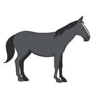
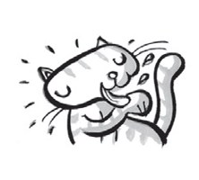
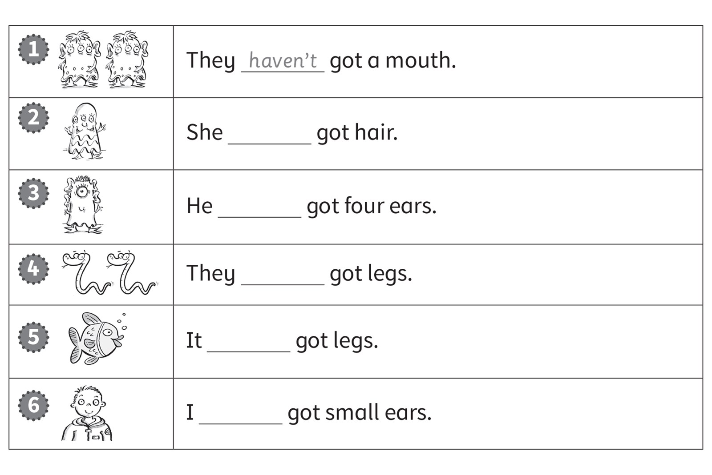
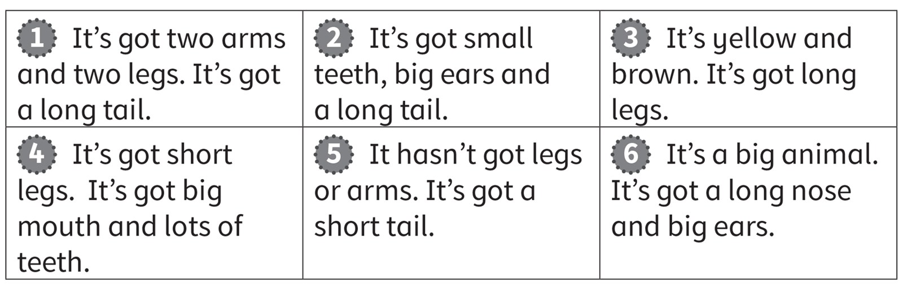
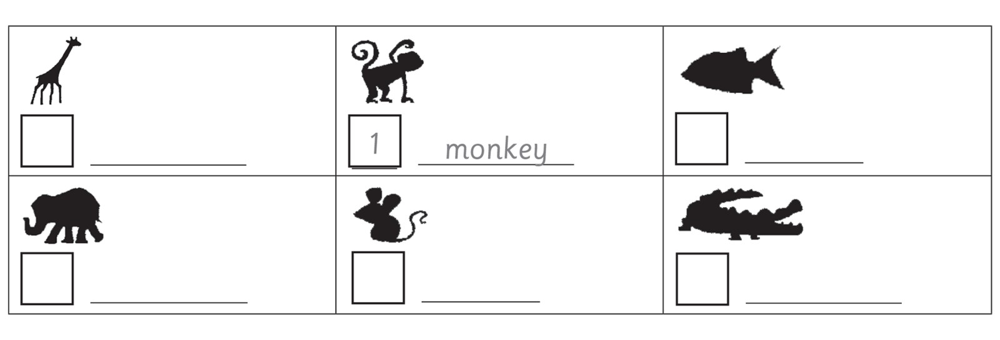

**[Vocabulary]{.underline}**

**1. Read and write. There is one example.   (one point each)**

~~cat~~ \| jacket \| nose \| tiger \| ~~elephant~~ \| horse \| socks \|
giraffe \| ~~T shirt~~ \| hippo \| ~~teeth~~ \| hair \| dog \| skirt

**2. Look and read. Write. There is one example.   (one point each)**

big \| clean \| dirty \| long \| short \| ~~small~~

1\. two *[small]{.underline}* feet

2\. \_\_\_\_\_ teeth

3\. a \_\_\_\_\_ tail

4\. four \_\_\_\_\_ legs

5\. a \_\_\_\_\_ dog

6\. a \_\_\_\_\_ cat

**3. Look and complete the words. Tick. There is one example.   (one
point each)**

**[Grammar]{.underline}**

**4. Look, read and circle. There is one example.   (one point each)**

**5. Look and write *haven't* or *hasn't*. There is one example.   (one
point each)**

**[Listening]{.underline}**

**6. Read and colour. Listen and tick or cross. There is one
example.   (two points each)**

**7. Listen and number. There is one example.   (one point each)**

**[Reading]{.underline}**

**8. Read and write the number and name. There is one example.   (one
point each)**

