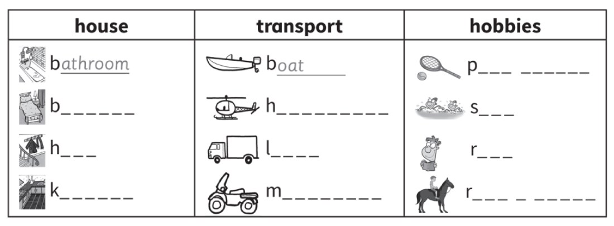
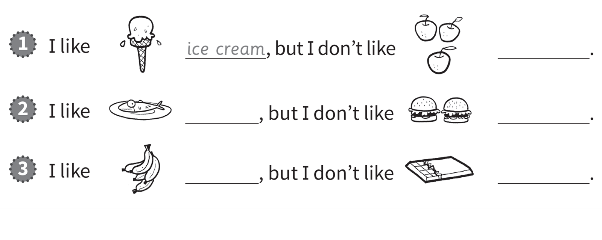
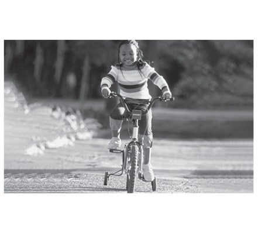
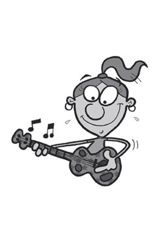
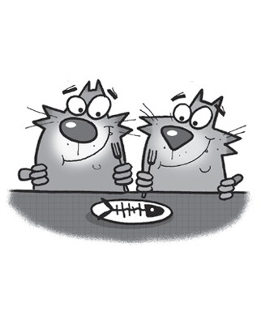
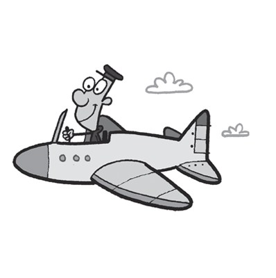
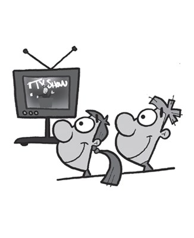
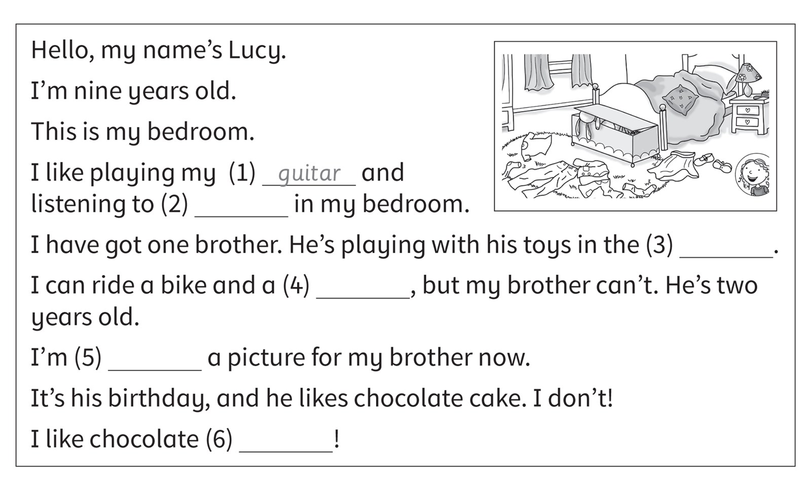

**[Vocabulary]{.underline}**

**1. Look and write the words. There are three examples.   (one point
each)**

~~bathroom~~ \| bedroom \| ~~boat~~ \| play tennis \| hall \| helicopter
\| kitchen \| lorry \| motorbike \| read \| ride \| swim

*house: bedroom, hall, kitchen*

*transport: helicopter, lorry, motorbike*

*hobbies: play tennis, swim, read, ride a horse*

**2. Look, read, and circle. There is one example.   (one point each)**

1\. The giraff e is in the *living room* / *[dining room]{.underline}*.

2\. The elephant is in the *hall* / *bathroom*.

*hall*

3\. The hippo is in the *kitchen* / *bedroom*.

*bedroom*

4\. The lion is in the *bedroom* / *living room*.

*living room*

5\. The crocodile is in the *bathroom* / *hall*.

*bathroom*

6\. The tiger is in the *dining room* / *kitchen*.

*kitchen*

**[Grammar]{.underline}**

**3. Look, read and write. There is one example.    (one point each)**

*1. apples*

*2. fish, burgers*

*3. bananas, chocolate*

**4. Look, read and circle. There is one example.   (one point each)**

1\. My uncle can *[fly]{.underline}* / *drive* a helicopter.

2\. He can *swim* / *sing*.

*swim*

3\. She can *walk* / *play football*.

*play football*

4\. He can *play tennis* / *read a book*.

*play tennis*

5\. She can *fly a plane* / *play the guitar*.

*play the guitar*

6\. She can *drive a car* / *ride a bike*.

*ride a bike*

**5. Look and complete the words. There is one example.   (one point
each)**

driving \| flying \| ~~playing~~ \| swimming \| watching \| eating

1\. She's p*[l]{.underline}*a*[y]{.underline}*i*[n]{.underline}*g the
guitar.

2\. They're e_t_n\_ fish.

*eating*

3\. They're s_i_m_n\_.

*swimming*

4\. He's f_y_n\_ a plane.

*flying*

5\. They're w_t_h_n\_ TV.

*watching*

6\. She's d_i_i_g a lorry.

*driving*

**[Listening]{.underline}**

**6. Listen. Tick or cross. There is one example.   (one point each)**

*2. ✓*

*3. ✓*

*4. ✗*

*5. ✓*

*6. ✗*

**Audio script**

1

**Man:** Monster one, can you drive a bus?

**Monster 1:** No, I can't.

2

**Man:** Monster two, can you ride a bike?

**Monster 2:** Yes, I can.

3

**Man:** Monster three, can you fly a plane?

**Monster 3:** Yes, I can.

4

**Man:** Monster four, can you ride a motorbike?

**Monster 4:** No, I can't.

5

**Man:** Monster five, can you sail a boat?

**Monster 5:** Yes, I can!

6

**Man:** Monster six, can you ride a horse?

**Monster 6:** No, I can't!

**7. Listen and write the number. There is one example.   (one point
each)**

*2. Eva: drawing -- f*

*3. Hugo: listening to music -- a*

*4. May: eating -- b*

*5. Ben: watching TV -- e*

*6. Grace: reading -- c*

**Audio script**

1

**Woman:** What are you doing, Nick?

**Nick:** I'm playing with my brother.

**Woman:** Where?

**Nick:** In the hall.

2

**Woman:** What are you doing, Eva?

**Eva:** I'm drawing.

**Woman:** Where?

**Eva:** In the bathroom!

3

**Woman:** What's Hugo doing?

**Boy:** He's listening to music with his sister.

**Woman:** Where?

**Boy:** In the living room.

4

**Woman:** What's May doing?

**Girl:** She's eating.

**Woman:** Where?

**Girl:** In the dining room.

5

**Woman:** What's Ben doing?

**Boy:** He's watching TV.

**Woman:** Where?

**Boy:** In his bedroom.

6

**Woman:** Is Grace reading?

**Girl:** Yes, she is.

**Woman:** Where?

**Girl:** In the kitchen.

**[Reading]{.underline}**

**8. Read and write the word. There is one example.   (one point each)**

*2. music*

*3. living room*

*4. horse*

*5. drawing*

*6. ice cream*

