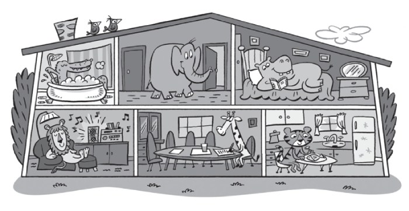
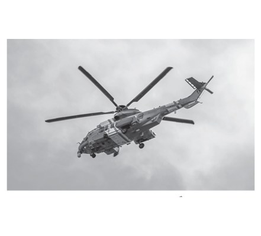
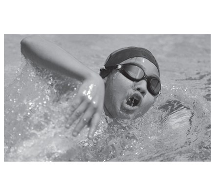
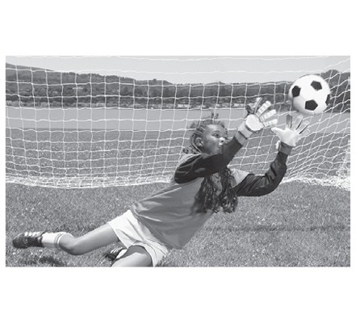
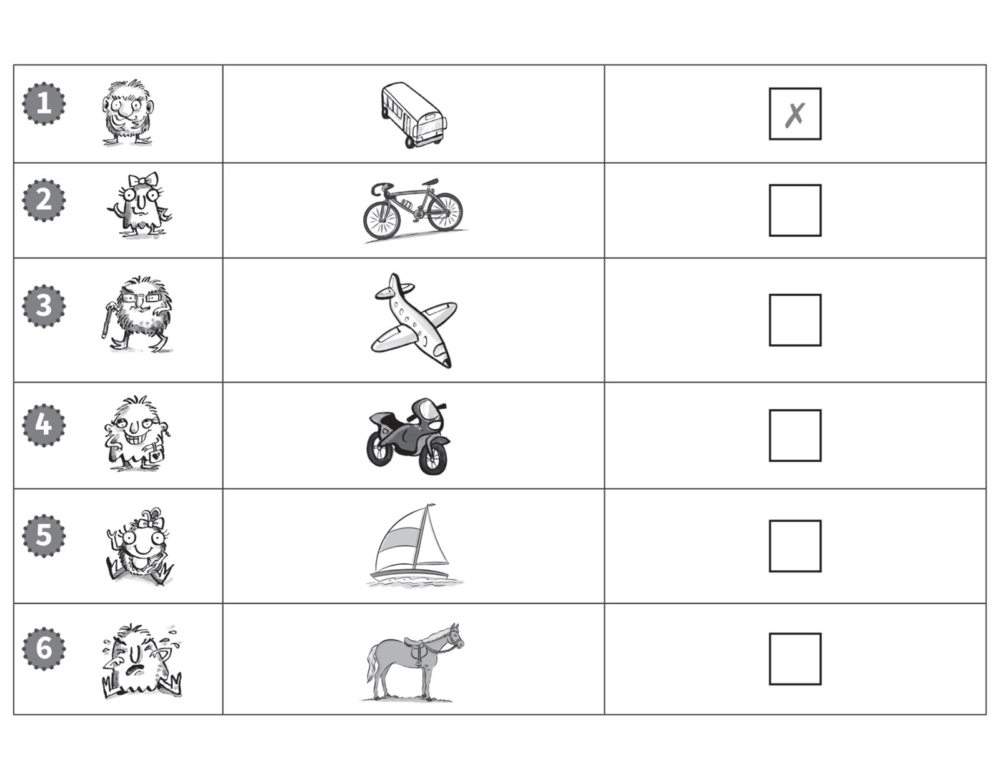
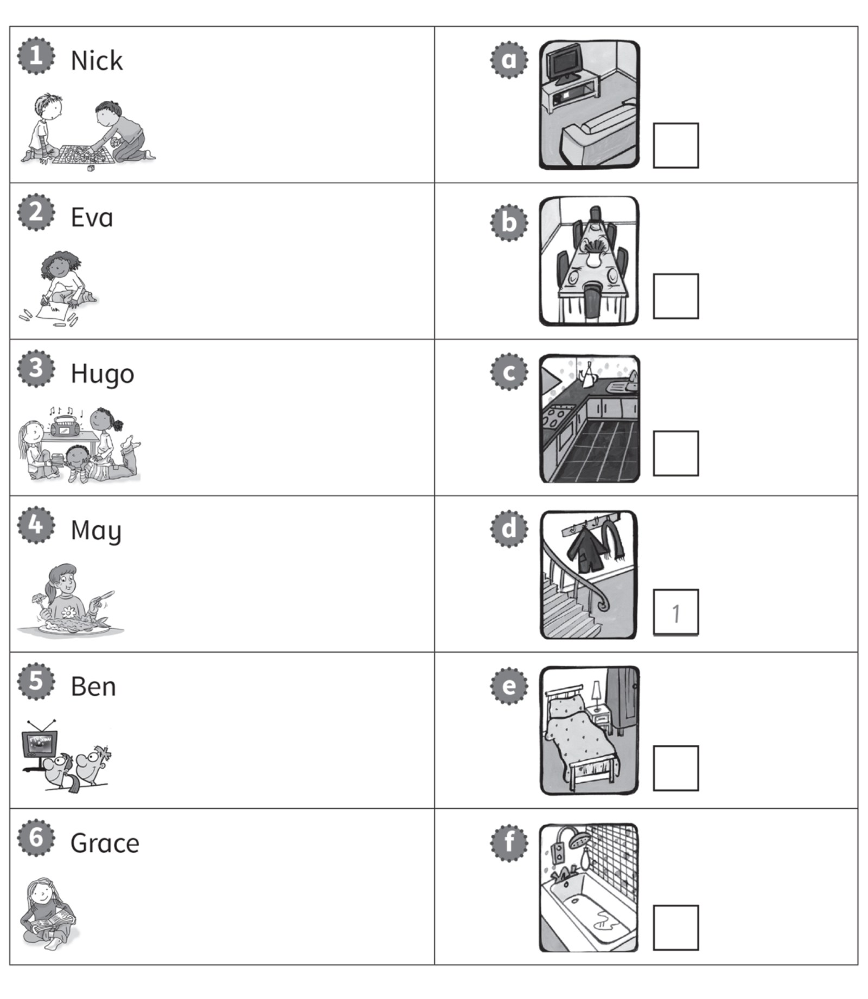
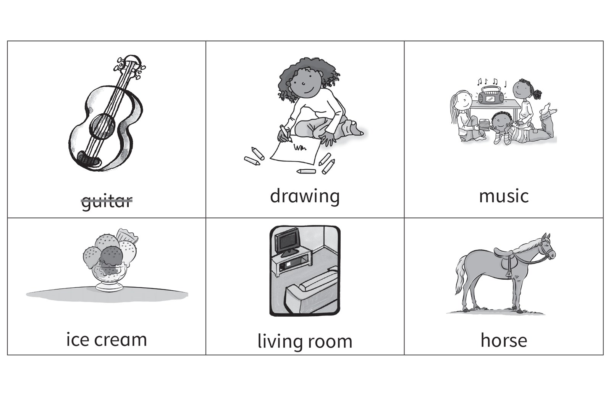

**[Vocabulary]{.underline}**

**1. Look and write the words. There are three examples.   (one point
each)**

~~bathroom~~ \| bedroom \| ~~boat~~ \| play tennis \| hall \| helicopter
\| kitchen \| lorry \| motorbike \| read \| ride \| swim

**2. Look, read, and circle. There is one example.   (one point each)**

1\. The giraff e is in the *living room* / *[dining room]{.underline}*.

2\. The elephant is in the *hall* / *bathroom*.

3\. The hippo is in the *kitchen* / *bedroom*.

4\. The lion is in the *bedroom* / *living room*.

5\. The crocodile is in the *bathroom* / *hall*.

6\. The tiger is in the *dining room* / *kitchen*.

**[Grammar]{.underline}**

**3. Look, read and write. There is one example.    (one point each)**

**4. Look, read and circle. There is one example.   (one point each)**

1\. My uncle can *[fly]{.underline}* / *drive* a helicopter.

2\. He can *swim* / *sing*.

3\. She can *walk* / *play football*.

4\. He can *play tennis* / *read a book*.

5\. She can *fly a plane* / *play the guitar*.

6\. She can *drive a car* / *ride a bike*.

**5. Look and complete the words. There is one example.   (one point
each)**

driving \| flying \| ~~playing~~ \| swimming \| watching \| eating

1\. She's p*[l]{.underline}*a*[y]{.underline}*i*[n]{.underline}*g the
guitar.

2\. They're e_t_n\_ fish.

3\. They're s_i_m_n\_.

4\. He's f_y_n\_ a plane.

5\. They're w_t_h_n\_ TV.

6\. She's d_i_i_g a lorry.

**[Listening]{.underline}**

**6. Listen. Tick or cross. There is one example.   (one point each)**

**7. Listen and write the number. There is one example.   (one point
each)**

**[Reading]{.underline}**

**8. Read and write the word. There is one example.   (one point each)**

