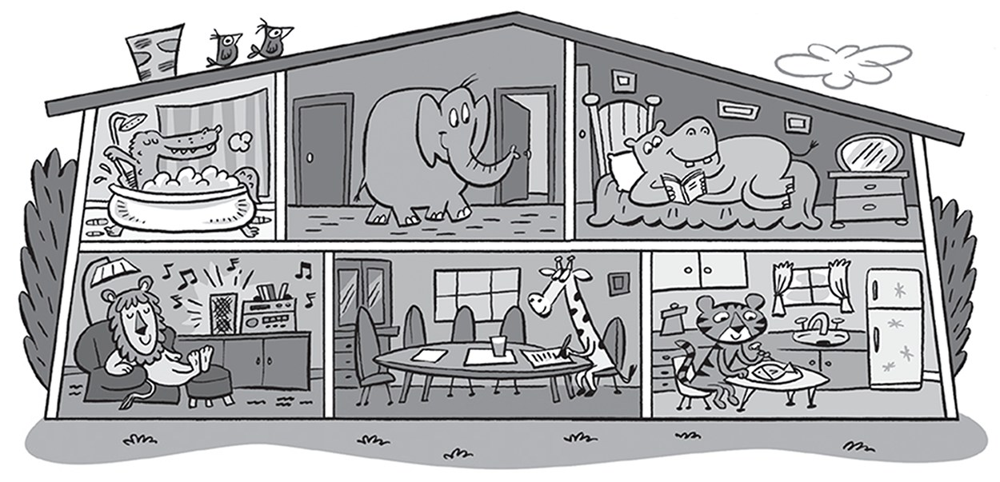
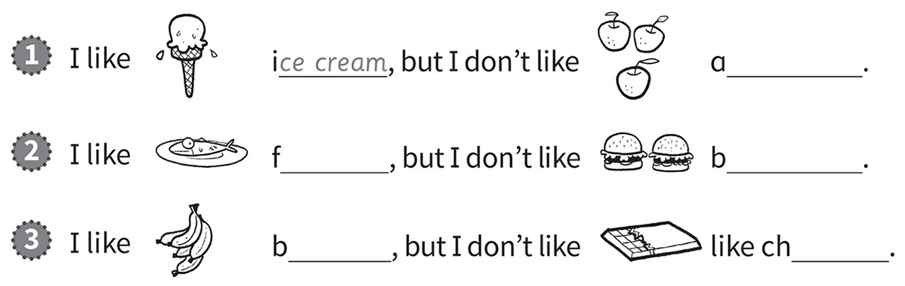
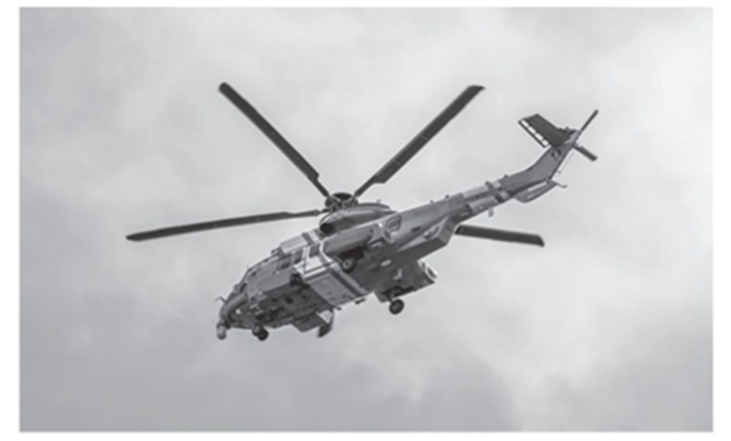
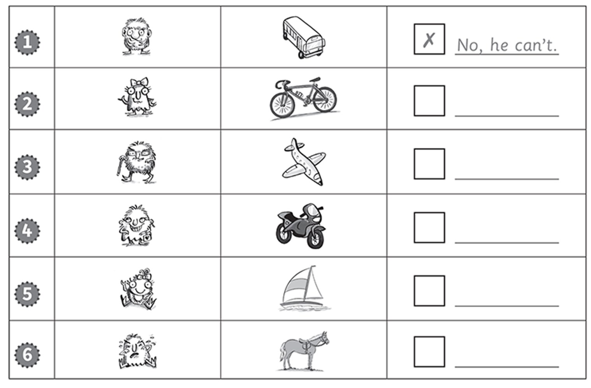
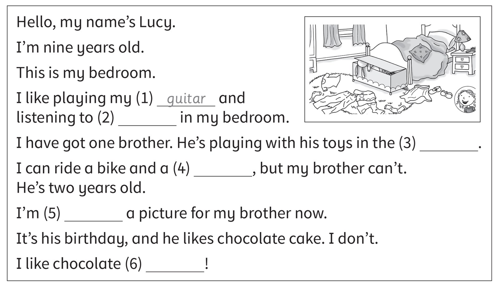

**[Vocabulary]{.underline}**

**1. Look and write the words. There are two examples.   (one point
each)**

~~bathroom~~ \| bedroom \| boat \| play tennis \| hall \| helicopter \|
kitchen \| lorry \| motorbike \| read \| ride a bike \| swim

*house: bedroom, hall, kitchen*

*transport: helicopter, lorry, motorbike*

*hobbies: play tennis, read, ride a bike, swim*

**2. Look and read. Write. There is one example.   (one point each)**

1\. The giraffe is in the *[dining]{.underline}* *room*.

2\. The elephant is in the *hall*.

3\. The hippo is in the *bedroom*.

4\. The lion is in the *living room*.

5\. The crocodile is in the *bathroom*.

6\. The tiger is in the *kitchen*.

**[Grammar]{.underline}**

**3. Look, read and write. There is one example.   (one point each)**

*1. apples*

*2. fish, burgers*

*3. bananas, chocolate*

**4. Look and write.   (one point each)**

  ----------------------------------------------------------------------------------------------------------------------------------------------------------------------------------------------------------------------------- -- --------------------------------------------------------------------------------------------------------------------------------------------------------------------------------------------------------------------------
   1.      
  My uncle can *[fly]{.underline}* a helicopter.                                                                                                                                                                                   2. He can *swim* in the pool.

  ----------------------------------------------------------------------------------------------------------------------------------------------------------------------------------------------------------------------------- -- --------------------------------------------------------------------------------------------------------------------------------------------------------------------------------------------------------------------------

  -------------------------------------------------------------------------------------------------------------------------------------------------------------------------------------------------------------------------- -- --------------------------------------------------------------------------------------------------------------------------------------------------------------------------------------------------------------------------
        
  3. She can *play football* football.                                                                                                                                                                                          4. He can *play* tennis.

  -------------------------------------------------------------------------------------------------------------------------------------------------------------------------------------------------------------------------- -- --------------------------------------------------------------------------------------------------------------------------------------------------------------------------------------------------------------------------

  -------------------------------------------------------------------------------------------------------------------------------------------------------------------------------------------------------------------------- -- --------------------------------------------------------------------------------------------------------------------------------------------------------------------------------------------------------------------------
        
  5. She can *play* the guitar.                                                                                                                                                                                                 6. She can *ride* a bike.

  -------------------------------------------------------------------------------------------------------------------------------------------------------------------------------------------------------------------------- -- --------------------------------------------------------------------------------------------------------------------------------------------------------------------------------------------------------------------------

**5. Correct the sentences. Match to the pictures.   (one point each)**

*2. They're eating fish. -- b*

*3. They're swimming in the sea. -- c*

*4. He's flying a plane. -- a*

*5. They're watching TV. -- d*

*6. She's driving a lorry. -- f*

**[Listening]{.underline}**

**6. Listen and tick or cross. Then write Yes, *he* / *she can* / *No,
he* / *she* can't.   (one point each)**

*2. ✓ Yes, she can*

*3. ✓ Yes, he can*

*4. ✗ No, she can't*

*5. ✓ Yes, she can*

*6. ✗ No, he can't*

**Audio script**

1

**Man:** Monster one, can you drive a bus?

**Monster 1:** No, I can't.

2

**Man:** Monster two, can you ride a bike?

**Monster 2:** Yes, I can.

3

**Man:** Monster three, can you fly a plane?

**Monster 3:** Yes, I can.

4

**Man:** Monster four, can you ride a motorbike?

**Monster 4:** No, I can't.

5

**Man:** Monster five, can you sail a boat?

**Monster 5:** Yes, I can!

6

**Man:** Monster six, can you ride a horse?

**Monster 6:** No, I can't!

**7. Listen and write the number. There is one example.   (one point
each)**

*2. Eva: drawing -- bathroom*

*3. Hugo: listening to music -- living room*

*4. May: eating -- dining room*

*5. Ben: watching TV -- bedroom*

*6. Grace: reading -- kitchen*

**Audio script**

1

**Woman:** What are you doing, Nick?

**Nick:** I'm playing with my brother.

**Woman:** Where?

**Nick:** In the hall.

2

**Woman:** What are you doing, Eva?

**Eva:** I'm drawing.

**Woman:** Where?

**Eva:** In the bathroom!

3

**Woman:** What's Hugo doing?

**Boy:** He's listening to music with his sister.

**Woman:** Where?

**Boy:** In the living room.

4

**Woman:** What's May doing?

**Girl:** She's eating.

**Woman:** Where?

**Girl:** In the dining room.

5

**Woman:** What's Ben doing?

**Boy:** He's watching TV.

**Woman:** Where?

**Boy:** In his bedroom.

6

**Woman:** Is Grace reading?

**Girl:** Yes, she is.

**Woman:** Where?

**Girl:** In the kitchen.

**[Reading]{.underline}**

**8. Read and write the word. There are two extra words. There is one
example.   (one point each)**

*2. music*

*3. living room*

*4. horse*

*5. drawing*

*6. ice cream*

*(reading and bike are extras).*

