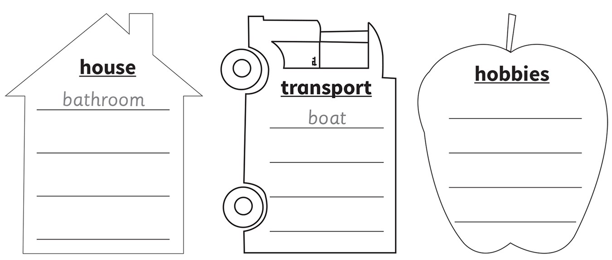
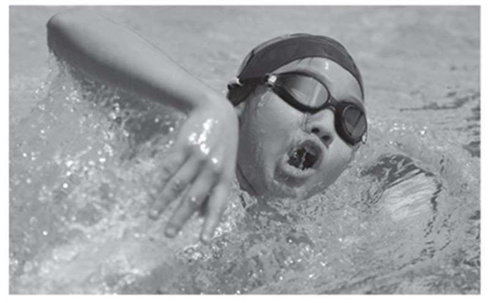
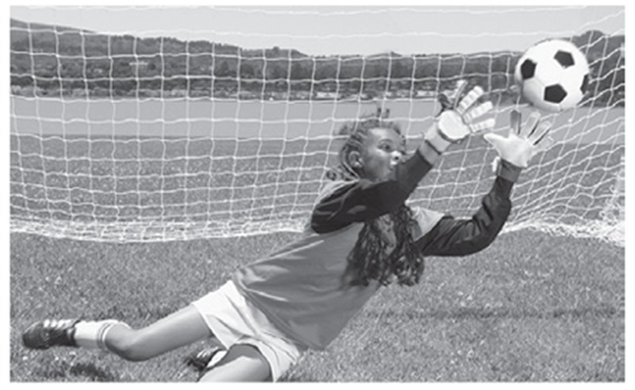
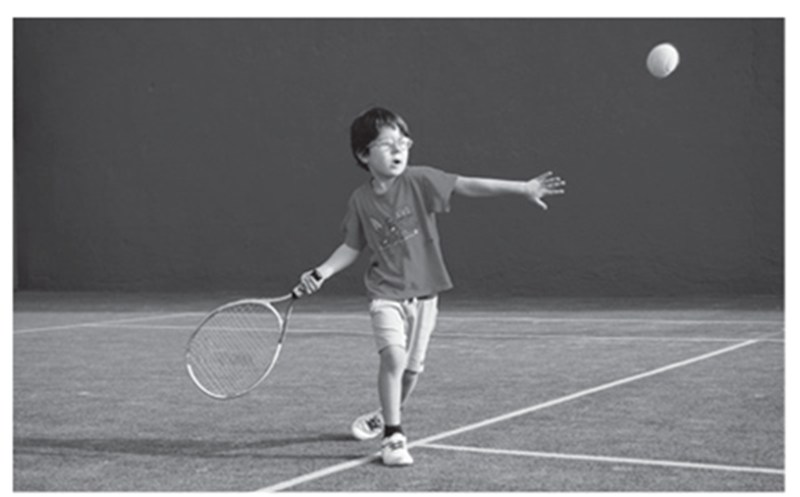
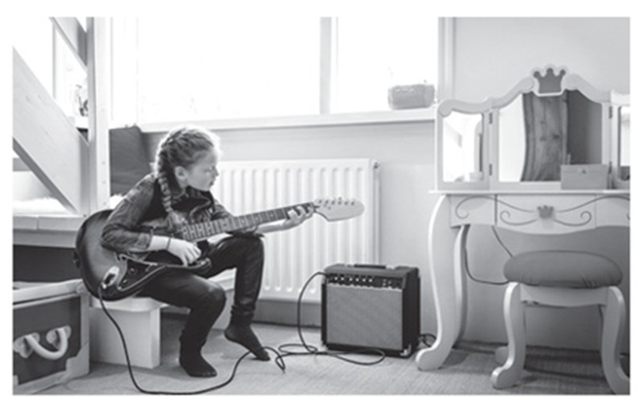
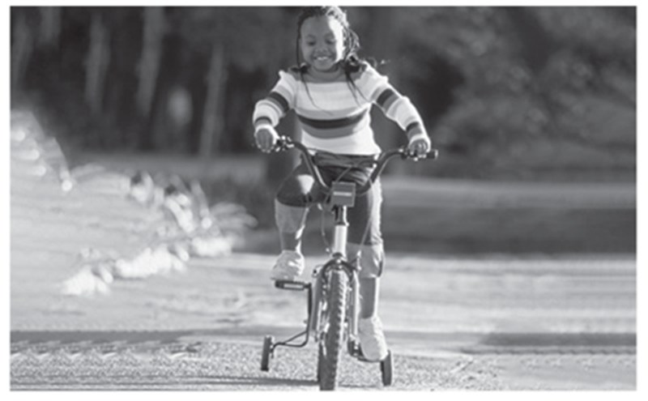
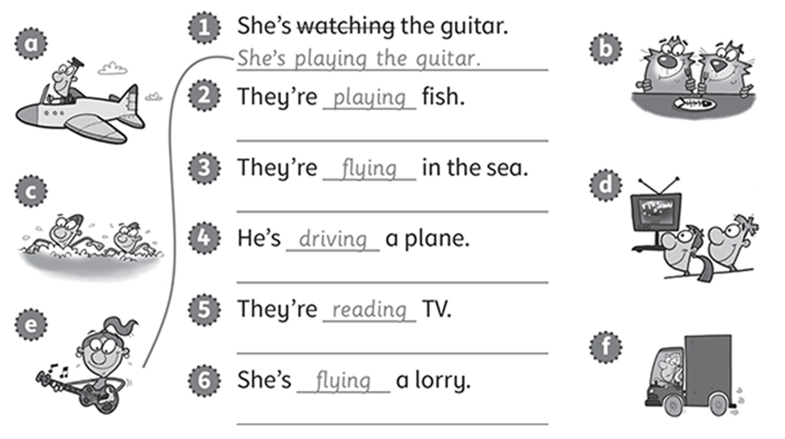
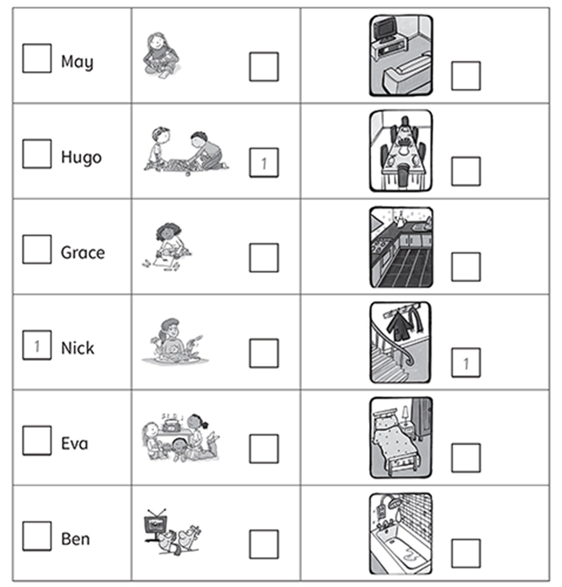
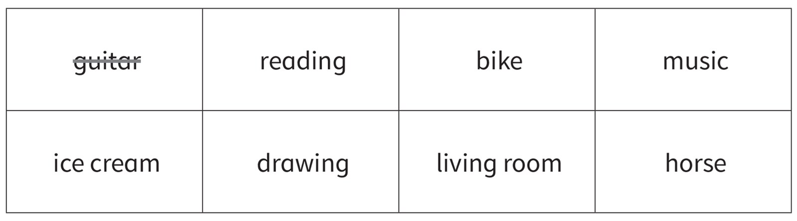

**[Vocabulary]{.underline}**

**1. Look and write the words. There are two examples.   (one point
each)**

~~bathroom~~ \| bedroom \| boat \| play tennis \| hall \| helicopter \|
kitchen \| lorry \| motorbike \| read \| ride a bike \| swim

**2. Look and read. Write. There is one example.   (one point each)**

1\. The giraffe is in the *[dining]{.underline}* *room*.

2\. The elephant is in the \_\_\_\_\_\_\_\_\_\_\_\_\_\_\_\_\_\_.

3\. The hippo is in the \_\_\_\_\_\_\_\_\_\_\_\_\_\_\_\_\_\_.

4\. The lion is in the \_\_\_\_\_\_\_\_\_\_\_\_\_\_\_\_\_\_.

5\. The crocodile is in the \_\_\_\_\_\_\_\_\_\_\_\_\_\_\_\_\_\_.

6\. The tiger is in the \_\_\_\_\_\_\_\_\_\_\_\_\_\_\_\_\_\_.

**[Grammar]{.underline}**

**3. Look, read and write. There is one example.   (one point each)**

**4. Look and write.   (one point each)**

  -------------------------------------------------------------------------------------------------------------------------------------------------------------------------------------------------------------------------------- -- -----------------------------------------------------------------------------------------------------------------------------------------------------------------------------------------------------------------------------
   1.      
  My uncle can *[fly]{.underline}* a helicopter.                                                                                                                                                                                      2. He can \_\_\_\_\_\_\_\_\_\_\_\_\_ in the pool.

  -------------------------------------------------------------------------------------------------------------------------------------------------------------------------------------------------------------------------------- -- -----------------------------------------------------------------------------------------------------------------------------------------------------------------------------------------------------------------------------

  ----------------------------------------------------------------------------------------------------------------------------------------------------------------------------------------------------------------------------- -- -----------------------------------------------------------------------------------------------------------------------------------------------------------------------------------------------------------------------------
        
  3. She can \_\_\_\_\_\_\_\_\_\_\_\_\_ football.                                                                                                                                                                                  4. He can \_\_\_\_\_\_\_\_\_\_\_\_\_ tennis.

  ----------------------------------------------------------------------------------------------------------------------------------------------------------------------------------------------------------------------------- -- -----------------------------------------------------------------------------------------------------------------------------------------------------------------------------------------------------------------------------

  ----------------------------------------------------------------------------------------------------------------------------------------------------------------------------------------------------------------------------- -- -----------------------------------------------------------------------------------------------------------------------------------------------------------------------------------------------------------------------------
        
  5. She can \_\_\_\_\_\_\_\_\_\_\_\_\_ the guitar.                                                                                                                                                                                6. She can \_\_\_\_\_\_\_\_\_\_\_\_\_ a bike.

  ----------------------------------------------------------------------------------------------------------------------------------------------------------------------------------------------------------------------------- -- -----------------------------------------------------------------------------------------------------------------------------------------------------------------------------------------------------------------------------

**5. Correct the sentences. Match to the pictures.   (one point each)**

**[Listening]{.underline}**

**6. Listen and tick or cross. Then write Yes, *he* / *she can* / *No,
he* / *she* can't.   (one point each)**

**7. Listen and write the number. There is one example.   (one point
each)**

**[Reading]{.underline}**

**8. Read and write the word. There are two extra words. There is one
example.   (one point each)**

