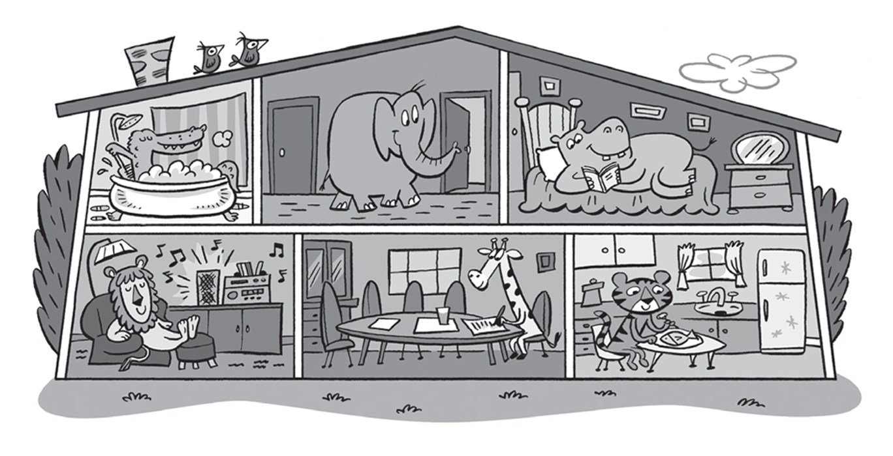
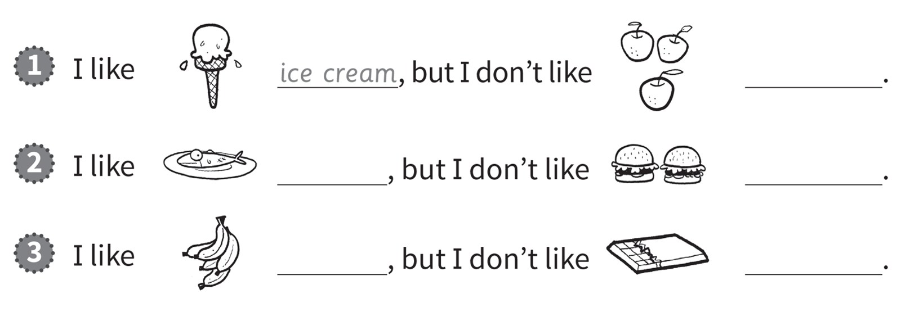
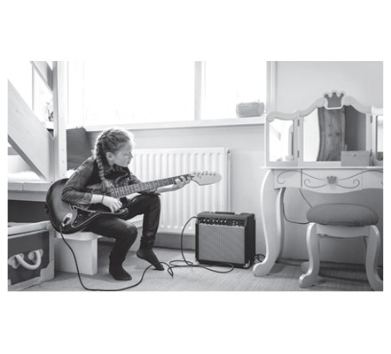
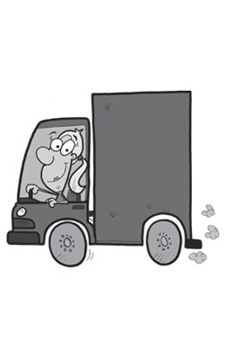
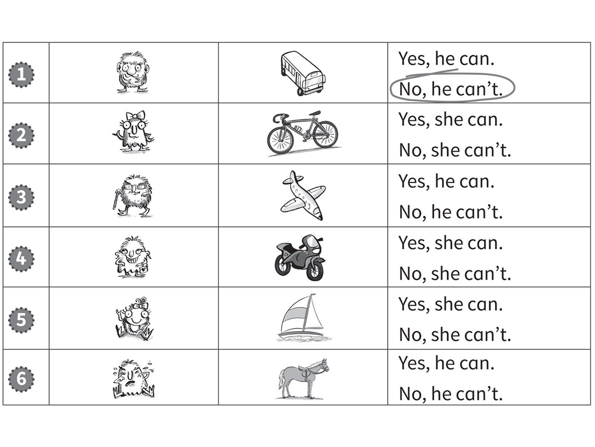
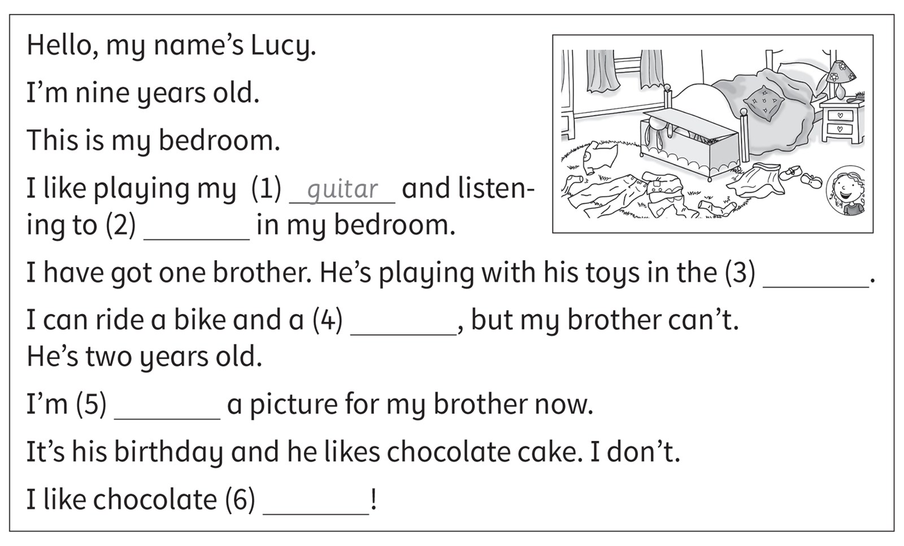
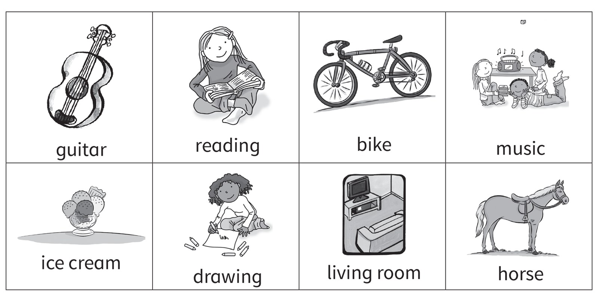

**[Vocabulary]{.underline}**

**1. Look and write the words. There are two examples.   (one point
each)**

~~bathroom~~ \| bedroom \| boat \| play tennis \| hall \| read \|
helicopter \| kitchen \| ride \| lorry \| motorbike \| swim

*house: bedroom, hall, kitchen*

*transport: helicopter, lorry, motorbike*

*hobbies: play tennis, swim, read, ride*

**2. Look and read. Draw lines. There is one example.   (one point
each)**

*2. in the bathroom*

*3. in the living room*

*4. in the bedroom*

*5. in the hall*

*6. in the kitchen*

**[Grammar]{.underline}**

**3. Look, read and write. There are two extra words. There is one
example.   (one point each)**

*1. apples*

*2. fish, burgers*

*3. bananas, chocolate*

*(oranges and cake are extras)*

**4. Read and circle. There is one example.   (one point each)**

1\. My uncle can *[fly]{.underline}* / *drive* a helicopter.

2\. He can *sing* / *swim*.

*swim*

3\. She can *walk* / *play football*.

*play football*

4\. He can *play tennis* / *read a book*.

*play tennis*

5\. She can *fly* / *play* the guitar.

*play*

6\. She can *swim* / *ride a bike*.

*ride a bike*

**5. Look and write the words. There is one example.   (one point
each)**

~~playing~~ \| driving \| flying \| swimming \| watching \| eating

1\. She's *[playing]{.underline}* the guitar.

2\. They're \_\_\_\_\_\_\_\_\_\_\_\_\_\_\_ fish.

*eating*

3\. They're \_\_\_\_\_\_\_\_\_\_\_\_\_\_\_.

*swimming*

4\. He's \_\_\_\_\_\_\_\_\_\_\_\_\_\_\_ a plane.

*flying*

5\. They're \_\_\_\_\_\_\_\_\_\_\_\_\_\_\_ TV.

*watching*

6\. She's \_\_\_\_\_\_\_\_\_\_\_\_\_\_\_ a lorry.

*driving*

**[Listening]{.underline}**

**6. Listen and circle. There is one example.   (one point each)**

*2. Yes, she can*

*3. Yes, he can*

*4. No, she can't*

*5. Yes, she can*

*6. No, he can't*

**Audio script**

1

**Man:** Monster one, can you drive a bus?

**Monster 1:** No, I can't.

2

**Man:** Monster two, can you ride a bike?

**Monster 2:** Yes, I can.

3

**Man:** Monster three, can you fly a plane?

**Monster 3:** Yes, I can.

4

**Man:** Monster four, can you ride a motorbike?

**Monster 4:** No, I can't.

5

**Man:** Monster five, can you sail a boat?

**Monster 5:** Yes, I can!

6

**Man:** Monster six, can you ride a horse?

**Monster 6:** No, I can't!

**7. Listen. Write the numbers. There is one example.   (one point
each)**

*2. Eva: drawing -- bathroom*

*3. Hugo: listening to music -- living room*

*4. May: eating -- dining room*

*5. Ben: watching TV -- bedroom*

*6. Grace: reading -- kitchen*

**Audio script**

1

**Woman:** What are you doing, Nick?

**Nick:** I'm playing with my brother.

**Woman:** Where?

**Nick:** In the hall.

2

**Woman:** What are you doing, Eva?

**Eva:** I'm drawing.

**Woman:** Where?

**Eva:** In the bathroom!

3

**Woman:** What's Hugo doing?

**Boy:** He's listening to music with his sister.

**Woman:** Where?

**Boy:** In the living room.

4

**Woman:** What's May doing?

**Girl:** She's eating.

**Woman:** Where?

**Girl:** In the dining room.

5

**Woman:** What's Ben doing?

**Boy:** He's watching TV.

**Woman:** Where?

**Boy:** In his bedroom.

6

**Woman:** Is Grace reading?

**Girl:** Yes, she is.

**Woman:** Where?

**Girl:** In the kitchen.

**[Reading]{.underline}**

**8. Read and write the word. There are two extra words. There is one
example.   (one point each)**

*2. music*

*3. living room*

*4. horse*

*5. drawing*

*6. ice cream*

*(reading and bike are extras)*

