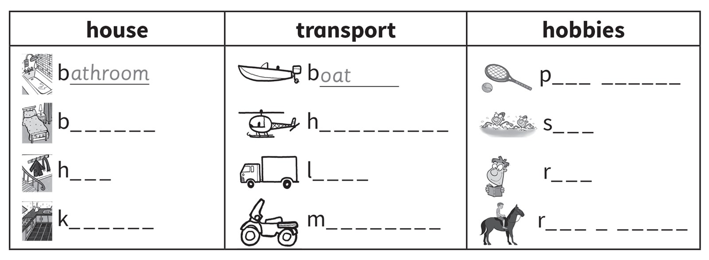
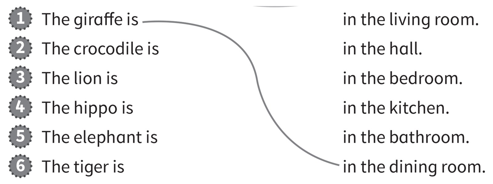
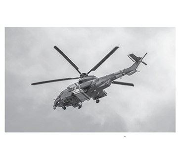
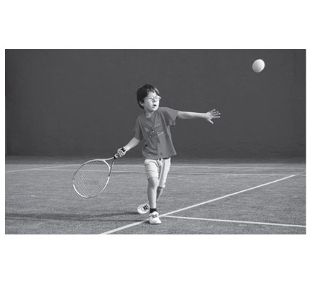
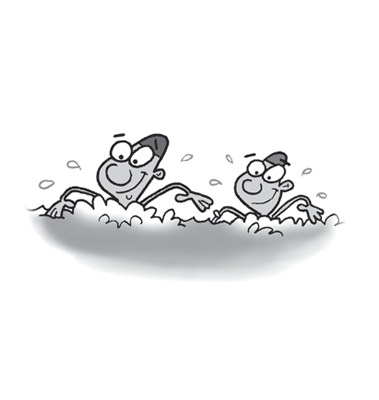
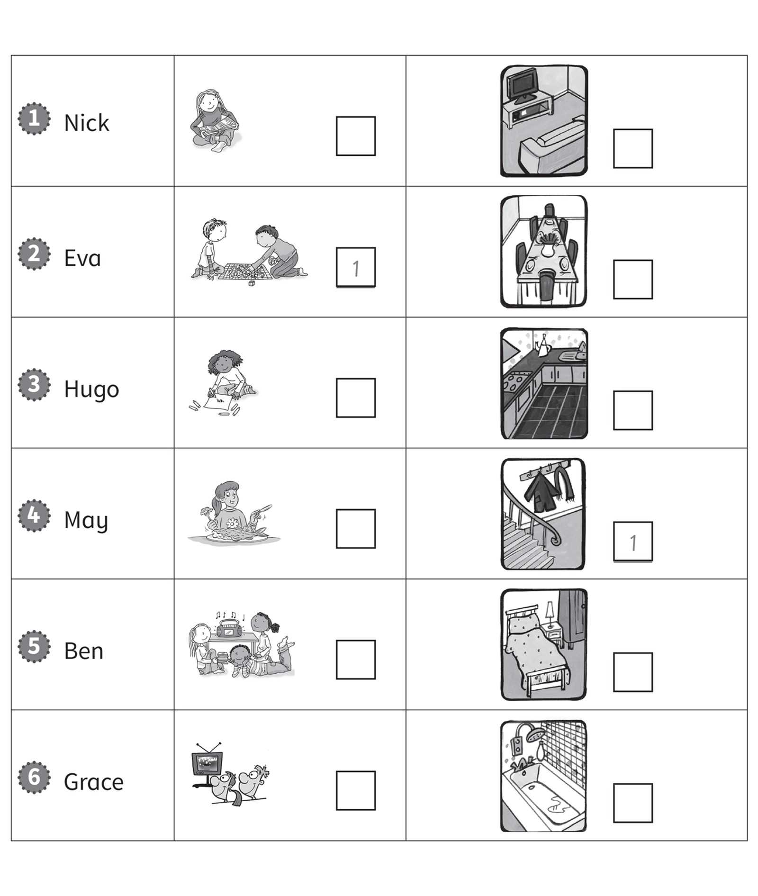

**[Vocabulary]{.underline}**

**1. Look and write the words. There are two examples.   (one point
each)**

~~bathroom~~ \| bedroom \| boat \| play tennis \| hall \| read \|
helicopter \| kitchen \| ride \| lorry \| motorbike \| swim

**2. Look and read. Draw lines. There is one example.   (one point
each)**

**[Grammar]{.underline}**

**3. Look, read and write. There are two extra words. There is one
example.   (one point each)**

**4. Read and circle. There is one example.   (one point each)**

1\. My uncle can *[fly]{.underline}* / *drive* a helicopter.

2\. He can *sing* / *swim*.

3\. She can *walk* / *play football*.

4\. He can *play tennis* / *read a book*.

5\. She can *fly* / *play* the guitar.

6\. She can *swim* / *ride a bike*.

**5. Look and write the words. There is one example.   (one point
each)**

~~playing~~ \| driving \| flying \| swimming \| watching \| eating

1\. She's *[playing]{.underline}* the guitar.

2\. They're \_\_\_\_\_\_\_\_\_\_\_\_\_\_\_ fish.

3\. They're \_\_\_\_\_\_\_\_\_\_\_\_\_\_\_.

4\. He's \_\_\_\_\_\_\_\_\_\_\_\_\_\_\_ a plane.

5\. They're \_\_\_\_\_\_\_\_\_\_\_\_\_\_\_ TV.

6\. She's \_\_\_\_\_\_\_\_\_\_\_\_\_\_\_ a lorry.

**[Listening]{.underline}**

**6. Listen and circle. There is one example.   (one point each)**

**7. Listen. Write the numbers. There is one example.   (one point
each)**

**[Reading]{.underline}**

**8. Read and write the word. There are two extra words. There is one
example.   (one point each)**

