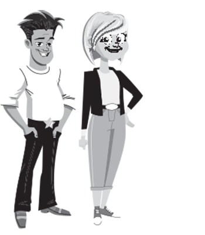
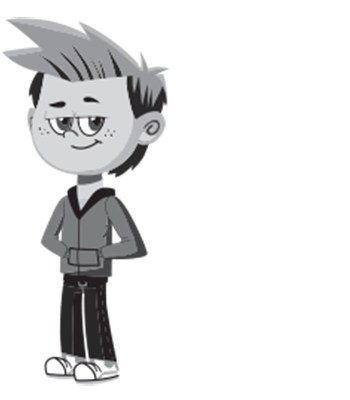
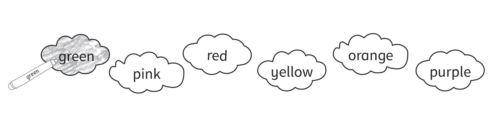
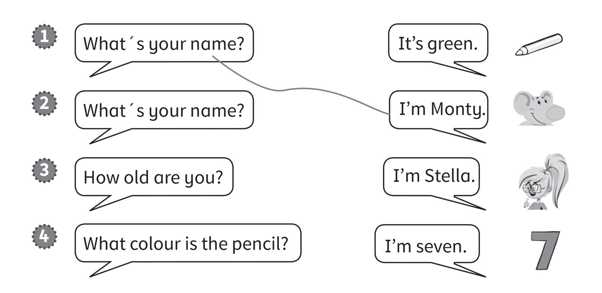
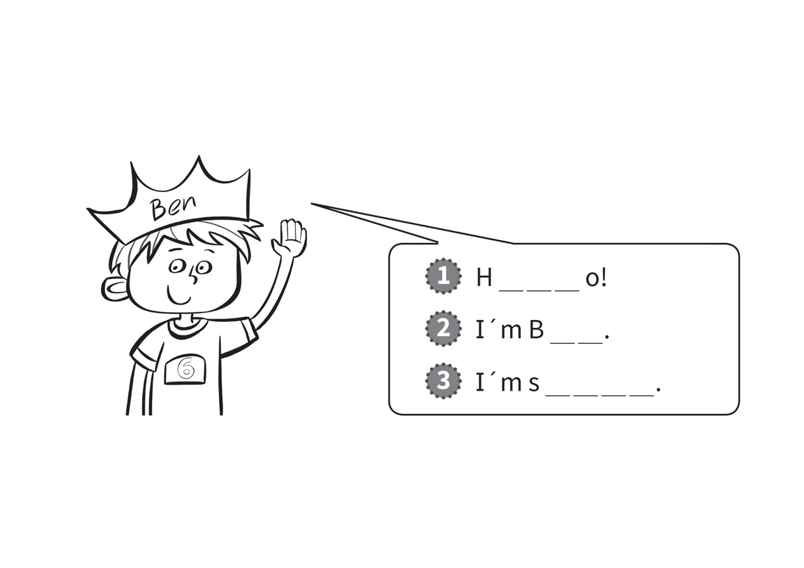

**[Vocabulary]{.underline}**

**1. Read. Circle the tick or cross. There is one example.   (one point
each)**

1\. Mr and Mrs Star *[✓]{.underline}* ✗

2\. Maskman ✓ ✗

*Maskman ✗*

3\. Simon ✓ ✗

*Simon ✗*

4\. Suzy ✓ ✗

*Suzy ✓*

5\. Marie ✓ ✗

*Marie ✓*

6\. Monty ✓ ✗

*Monty ✗*

**2. Read. Colour the number. There is one example.   (one point each)**

*2. two -- 2*

*3. three -- 3*

*4. four -- 4*

*5. five -- 5*

*6. six -- 6*

**3. Read and colour. There is one example.   (one point each)**

*Each word and colour must match.*

**[Grammar]{.underline}**

**4. Read and draw lines.   (one point each)**

*2. What's your name? -- I'm Stella.*

*3. How old are you? -- I'm seven.*

*4. What colour is the pencil? -- It's gree.*

**5. Look and complete the words. There is one example.   (one point
each)**

*1. Hello*

*2. Ben*

*3. six*

**[Listening]{.underline}**

**6. Listen and write the number. There is one example.   (one point
each)**

*2. Sue*

*3. Tom*

*4. Sam*

**Audio script**

1\. Hello. I'm Pat. I'm seven years old.

2\. Hello. I'm Sue. I'm nine years old.

3\. Hello. I'm Tom. I'm four years old.

4\. Hello. I'm Sam. I'm eight years old.

**7. Listen and colour. There is one example.   (one point each)**

*2. 2 blue*

*3. 9 yellow*

*4. 7 orange*

*5. 8 green*

*6. 5 brown*

**Audio script**

Grey six

blue two

yellow nine

orange seven

green eight

brown five.

**[Reading]{.underline}**

**8. Read and colour. There is one example.   (one point each)**

1\. Hello! I'm a pencil. I'm green.

2\. Hello! I'm a star. I'm yellow.

*star -- yellow*

3\. Hello! I'm six. I'm orange.

*6 -- orange*

4\. Hello! I'm Maskman. I'm blue.

*Maskman -- blue*

