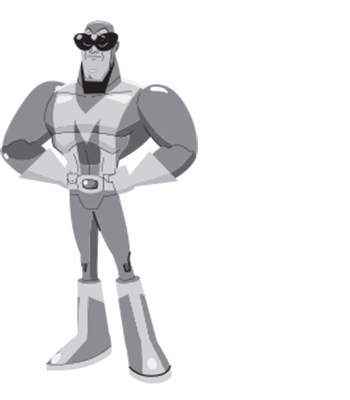
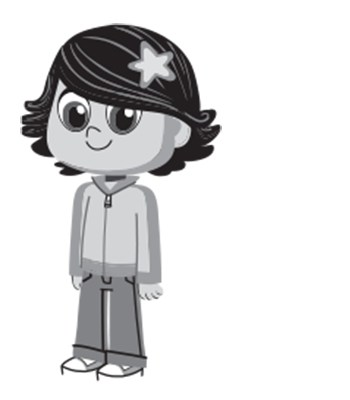
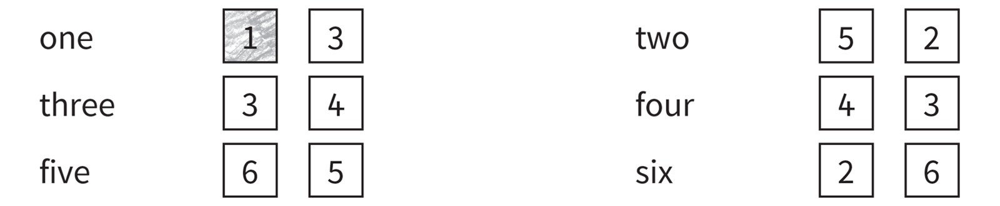
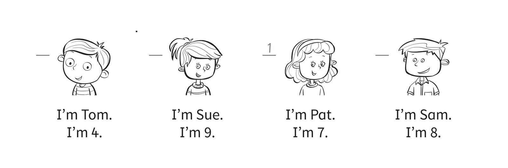
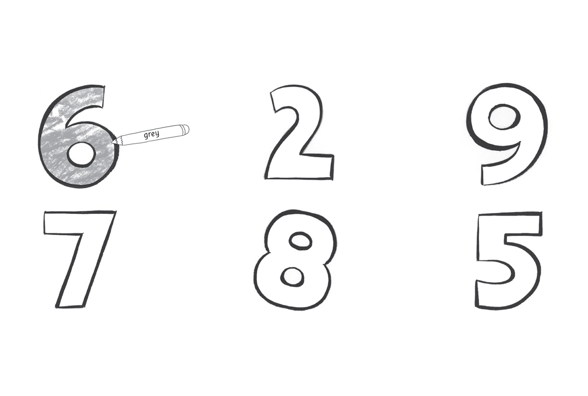
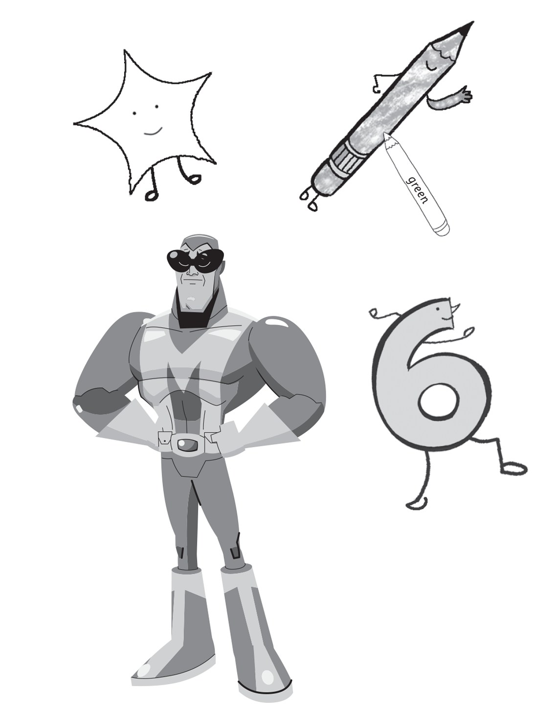

**[Vocabulary]{.underline}**

**1. Read. Circle the tick or cross. There is one example.   (one point
each)**

1\. Mr and Mrs Star *[✓]{.underline}* ✗

2\. Maskman ✓ ✗

3\. Simon ✓ ✗

4\. Suzy ✓ ✗

5\. Marie ✓ ✗

6\. Monty ✓ ✗

**2. Read. Colour the number. There is one example.   (one point each)**

**3. Read and colour. There is one example.   (one point each)**

**[Grammar]{.underline}**

**4. Read and draw lines.   (one point each)**

**5. Look and complete the words. There is one example.   (one point
each)**

**[Listening]{.underline}**

**6. Listen and write the number. There is one example.   (one point
each)**

**7. Listen and colour. There is one example.   (one point each)**

**[Reading]{.underline}**

**8. Read and colour. There is one example.   (one point each)**

1\. Hello! I'm a pencil. I'm green.

2\. Hello! I'm a star. I'm yellow.

3\. Hello! I'm six. I'm orange.

4\. Hello! I'm Maskman. I'm blue.

