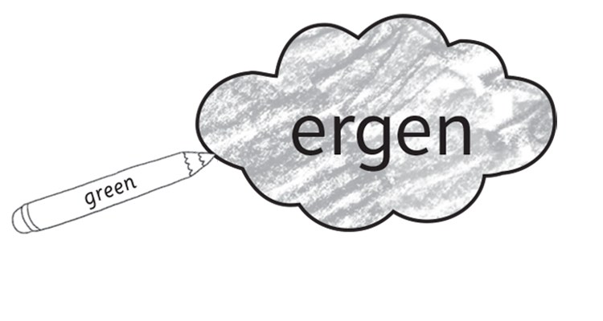
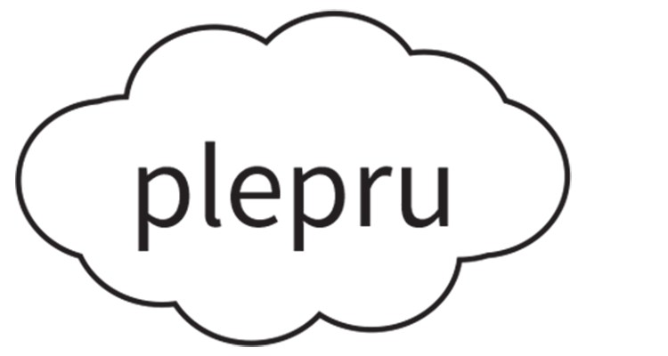
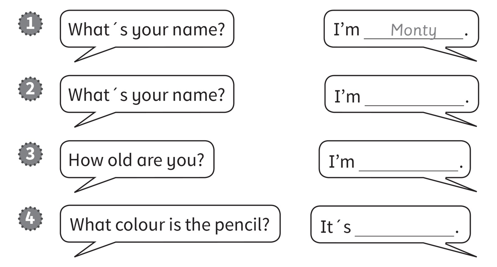
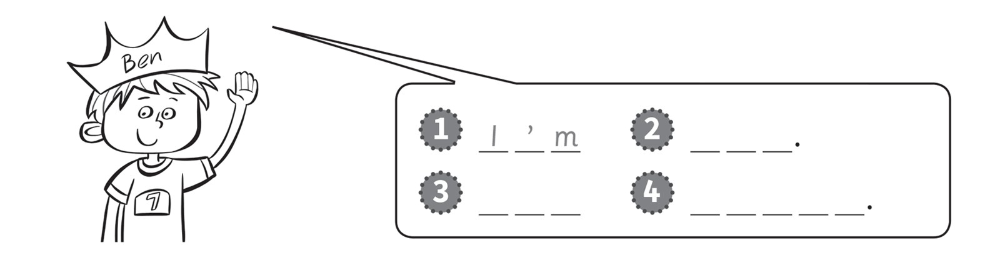
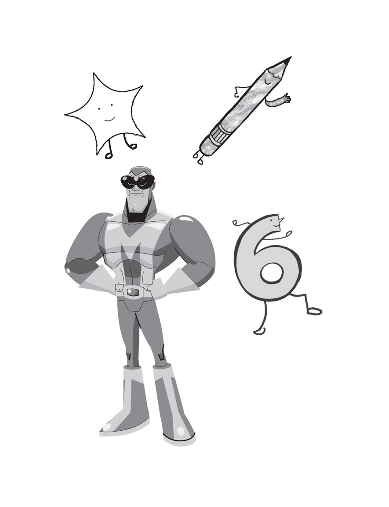

**[Vocabulary]{.underline}**

**1. Read and draw lines. There is one example.   (one point each)**

*2. a*

*3. d*

*4. f*

*5. e*

*6. c*

**2. Read and write the number. There is one example.   (one point
each)**

five \| four \| ~~one~~ \| six \| three \| two

1\. *2 -- two*

2\. *3 -- three*

3\. *4 -- four*

4\. *5 -- five*

5\. *6 -- six*

**3. Put the letters in order. Then colour. There is one example.   (one
point each)**

\_\_\_\_\_\_\_\_\_\_\_\_\_\_\_\_\_\_\_

*green*

\_\_\_\_\_\_\_\_\_\_\_\_\_\_\_\_\_\_\_

*red*

\_\_\_\_\_\_\_\_\_\_\_\_\_\_\_\_\_\_\_\_

*yellow*

\_\_\_\_\_\_\_\_\_\_\_\_\_\_\_\_\_\_\_\_\_

*pink*

\_\_\_\_\_\_\_\_\_\_\_\_\_\_\_\_\_\_\_\_\_

*purple*

\_\_\_\_\_\_\_\_\_\_\_\_\_\_\_\_\_\_\_\_\_

*orange*

**[Grammar]{.underline}**

**4. Read and complete the sentences. There is one example.   (one point
each)**

green \| Stella \| six \| ~~Monty~~

*2. What's your name? -- I'm Stella.*

*3. How old are you? -- I'm six.*

*4. What colour is the pencil? -- It's green.*

**5. Look and write.   (one point each)**

*2. Ben*

*3. I'm*

*4. seven*

**[Listening]{.underline}**

**6. Listen and complete. There is one example. There is one extra name
and number.   (one point each)**

Sue \| Ben \| ~~Pat~~ \| ten \| four \| eight

*2. Sue -- nine*

*3. Tom -- four*

*4. Sam -- eight*

**Audio script**

1\. Hello. I'm Pat. I'm seven years old.

2\. Hello. I'm Sue. I'm nine years old.

3\. Hello. I'm Tom. I'm four years old.

4\. Hello. I'm Sam. I'm eight years old.

**7. Listen and colour. There is one example. There are two extra
numbers.   (one point each)**

*7. orange*

*2. blue*

*9. yellow*

*5. brown (1 and 4 are extra numbers)*

*8. green*

*6. grey*

**Audio script**

Grey six

blue two

yellow nine

orange seven

green eight

brown five.

**[Reading]{.underline}**

**8. Put the letters in order. Then colour. There is one example.   (one
point each)**

~~licpne~~ \| xsi \| asMknam \| rat

1\. Hello! I'm a *[p]{.underline}* *[e]{.underline}* *[n]{.underline}*
*[c]{.underline}* *[i]{.underline}* *[l]{.underline}*.

    I'm green.

2\. Hello! I'm a \_ \_ \_ \_.

    I'm yellow.

*star (yellow)*

3\. Hello! I'm \_ \_ \_.

    I'm orange.

*six (orange)*

4\. Hello! I'm \_ \_ \_ \_ \_ \_ \_.

    I'm blue.

*Maskman (blue)*

