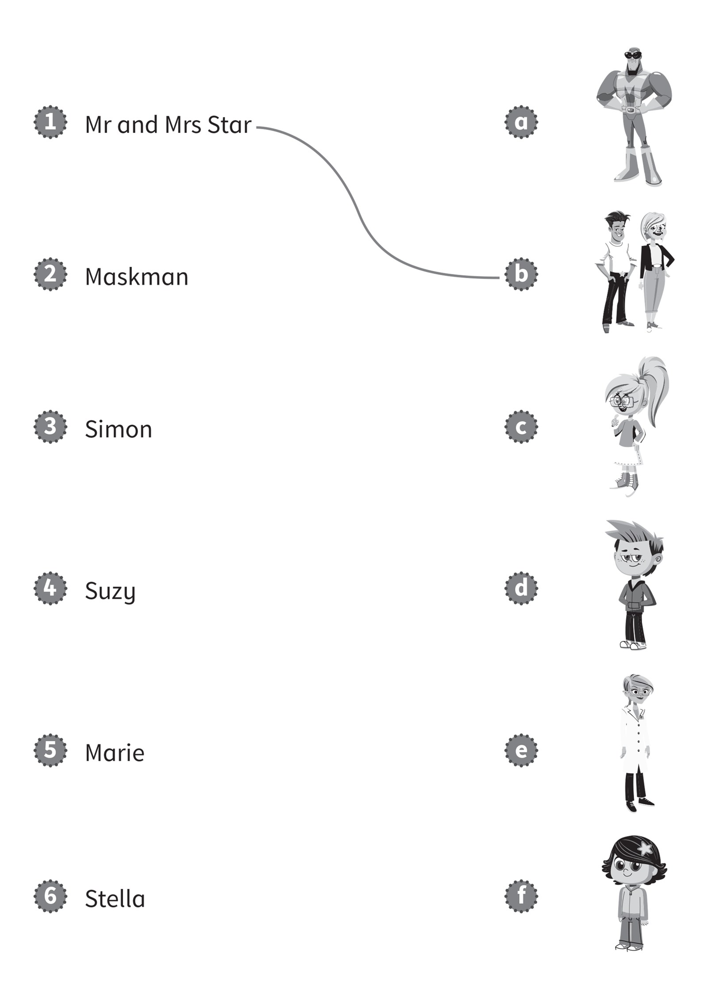
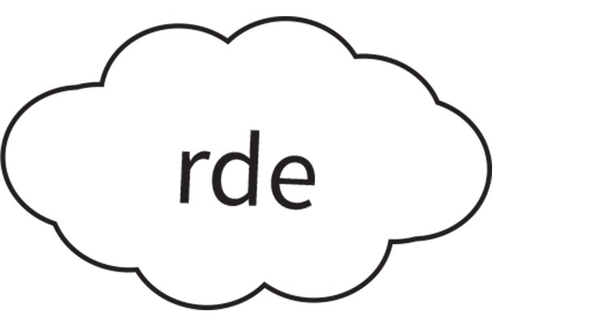
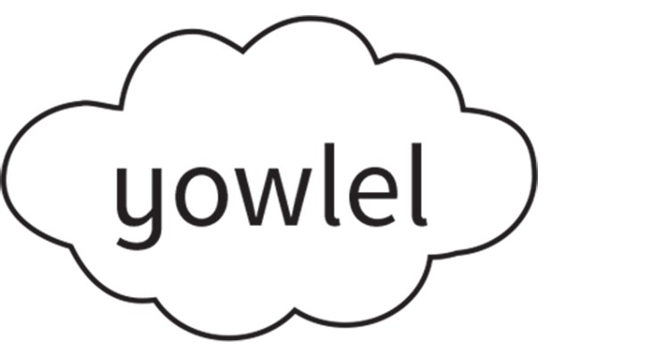
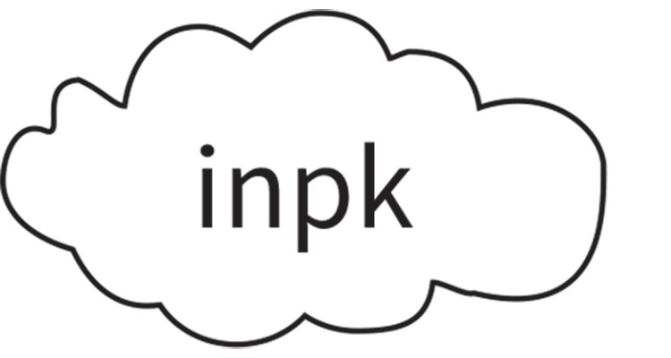
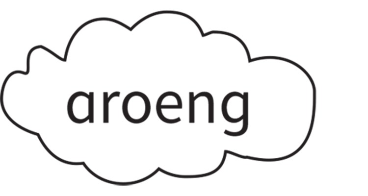
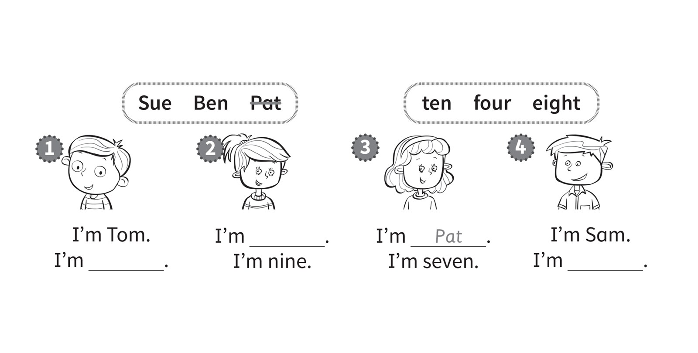
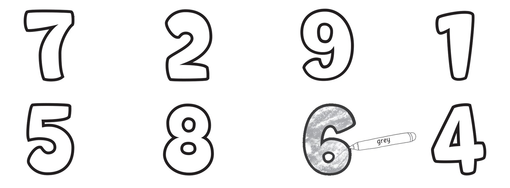

**[Vocabulary]{.underline}**

**1. Read and draw lines. There is one example.   (one point each)**

**2. Read and write the number. There is one example.   (one point
each)**

five \| four \| ~~one~~ \| six \| three \| two

1\. \_\_\_\_\_\_\_\_\_\_\_\_\_\_\_\_\_\_\_\_\_\_\_\_

2\. \_\_\_\_\_\_\_\_\_\_\_\_\_\_\_\_\_\_\_\_\_\_\_\_

3\. \_\_\_\_\_\_\_\_\_\_\_\_\_\_\_\_\_\_\_\_\_\_\_\_

4\. \_\_\_\_\_\_\_\_\_\_\_\_\_\_\_\_\_\_\_\_\_\_\_\_

5\. \_\_\_\_\_\_\_\_\_\_\_\_\_\_\_\_\_\_\_\_\_\_\_\_

**3. Put the letters in order. Then colour. There is one example.   (one
point each)**

\_\_\_\_\_\_\_\_\_\_\_\_\_\_\_\_\_\_\_

\_\_\_\_\_\_\_\_\_\_\_\_\_\_\_\_\_\_\_

\_\_\_\_\_\_\_\_\_\_\_\_\_\_\_\_\_\_\_\_

\_\_\_\_\_\_\_\_\_\_\_\_\_\_\_\_\_\_\_\_\_

\_\_\_\_\_\_\_\_\_\_\_\_\_\_\_\_\_\_\_\_\_

\_\_\_\_\_\_\_\_\_\_\_\_\_\_\_\_\_\_\_\_\_

**[Grammar]{.underline}**

**4. Read and complete the sentences. There is one example.   (one point
each)**

green \| Stella \| six \| ~~Monty~~

**5. Look and write.   (one point each)**

**[Listening]{.underline}**

**6. Listen and complete. There is one example. There is one extra name
and number.   (one point each)**

Sue \| Ben \| ~~Pat~~ \| ten \| four \| eight

**7. Listen and colour. There is one example. There are two extra
numbers.   (one point each)**

**[Reading]{.underline}**

**8. Put the letters in order. Then colour. There is one example.   (one
point each)**

~~licpne~~ \| xsi \| asMknam \| rat

1\. Hello! I'm a *[p]{.underline}* *[e]{.underline}* *[n]{.underline}*
*[c]{.underline}* *[i]{.underline}* *[l]{.underline}*.

    I'm green.

2\. Hello! I'm a \_ \_ \_ \_.

    I'm yellow.

3\. Hello! I'm \_ \_ \_.

    I'm orange.

4\. Hello! I'm \_ \_ \_ \_ \_ \_ \_.

    I'm blue.

