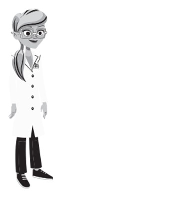
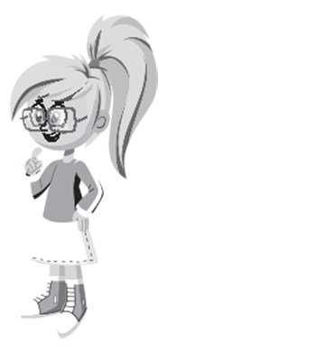
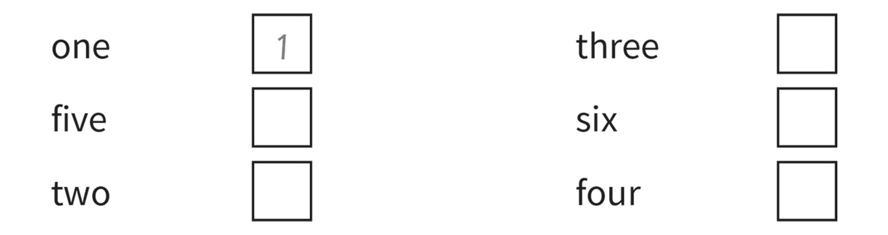
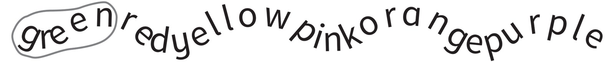
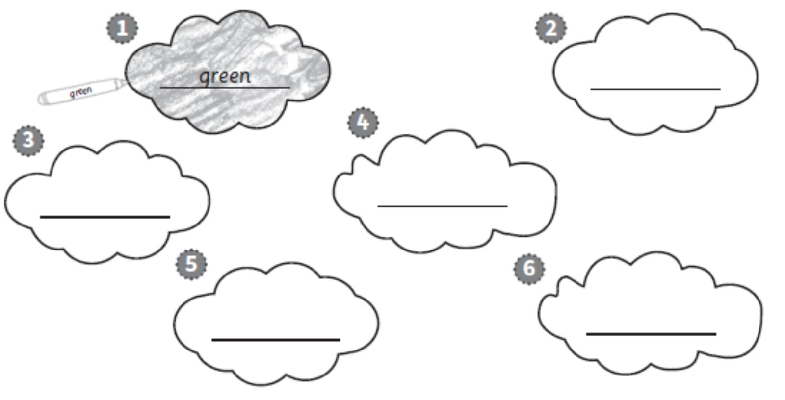
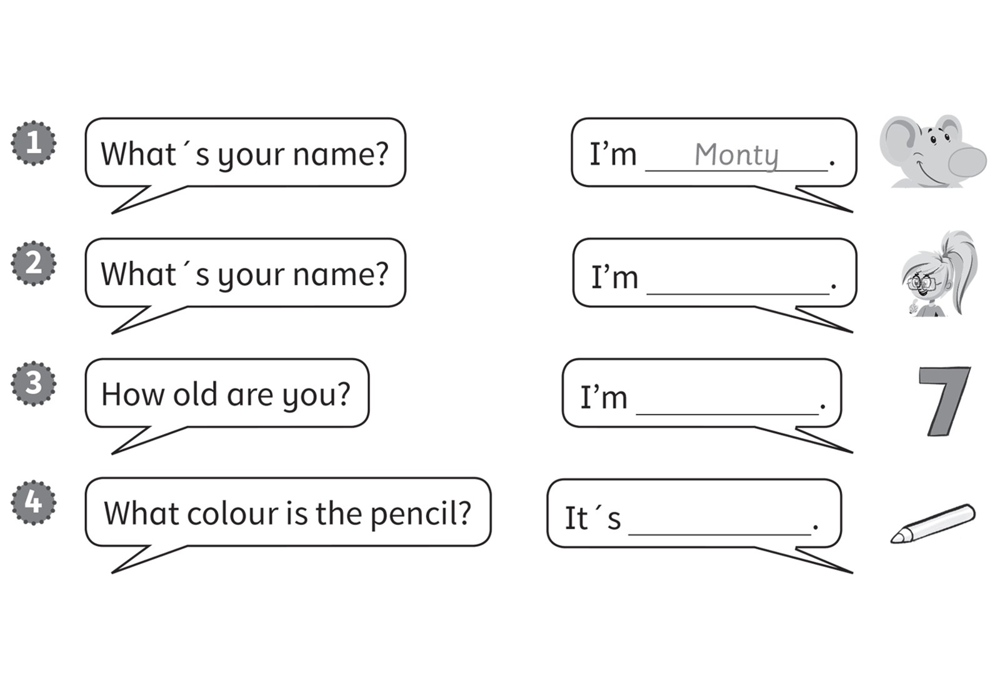
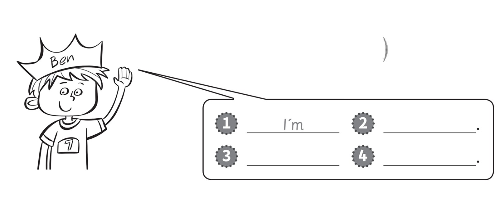
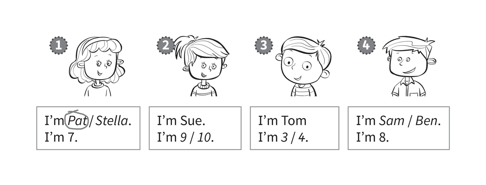
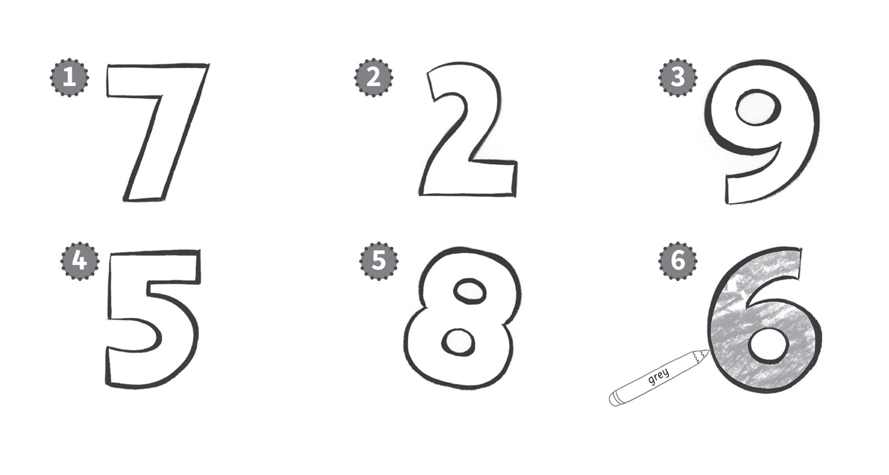
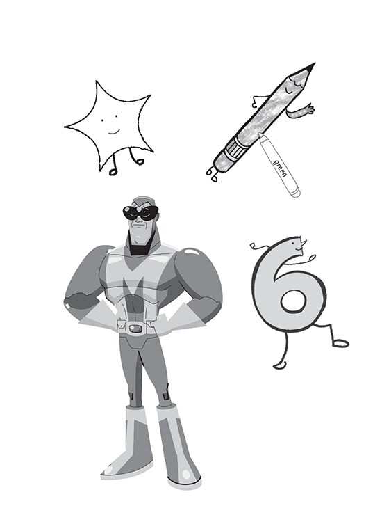

**[Vocabulary]{.underline}**

**1. Look and tick or cross. There is one example.   (one point each)**

1\. Mr and Mrs Star *[✓]{.underline}*

2\. Maskman \_\_

*✗*

3\. Simon \_\_

*✗*

4\. Suzy \_\_

*✓*

5\. Marie \_\_

*✓*

6\. Monty \_\_

*✗*

**2. Read and write the number. There is one example.   (one point
each)**

*1. three 3*

*2. five 5*

*3. six 6*

*4. two 2*

*5. four 4*

**3. Circle the words. Write and colour. There is one example.   (one
point each)**

*Each word and colour must match.*

**[Grammar]{.underline}**

**4. Read and write the words. There is one example.    (one point
each)**

green \| Stella \| seven \| ~~Monty~~

*2. What's your name? -- I'm Stella.*

*3. How old are you? -- I'm 6.*

*4. What colour is the pencil? -- It's green.*

**5. Look and write. There is one example.   (one point each)**

Ben \| ~~I'm~~ \| seven \| I'm

*2. Ben*

*3. I'm*

*4. seven*

**[Listening]{.underline}**

**6. Listen and circle the correct words or numbers. There is one
example.   (one point each)**

*2 -- 9*

*3 -- 4*

*4 -- Sam*

**Audio script**

1 Hello. I'm Pat. I'm seven years old.

2 Hello. I'm Sue. I'm nine years old.

3 Hello. I'm Tom. I'm four years old.

4 Hello. I'm Sam. I'm eight years old.

**7. Listen and colour. There is one example.   (one point each)**

*7. orange*

*2. blue*

*9. yellow*

*5. brown*

*8. green*

**Audio script**

Grey six

blue two

yellow nine

orange seven

green eight

brown five.

**[Reading]{.underline}**

**8. Look and write. Then colour. There is one example.   (one point
each)**

Maskman \| six \| star \| ~~pencil~~

1\. Hello! I'm a *[p]{.underline}* *[e]{.underline}* *[n]{.underline}*
*[c]{.underline}* *[i]{.underline}* *[l]{.underline}*.

    I'm green.

2\. Hello! I'm a \_ \_ \_ \_.

    I'm yellow.

*star (yellow)*

3\. Hello! I'm \_ \_ \_.

    I'm orange.

*six (orange)*

4\. Hello! I'm \_ \_ \_ \_ \_ \_.

    I'm blue.

*Maskman (blue)*

