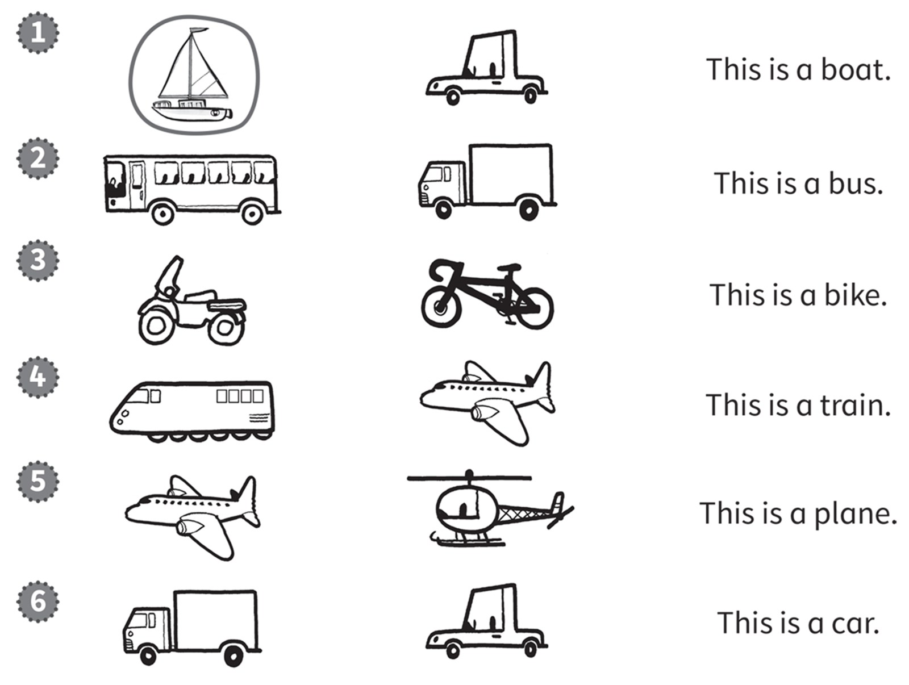
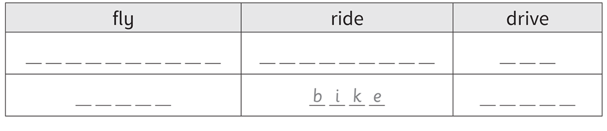
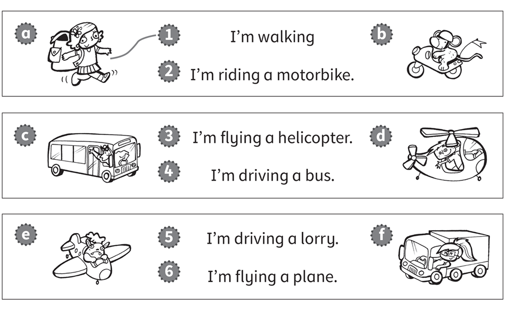
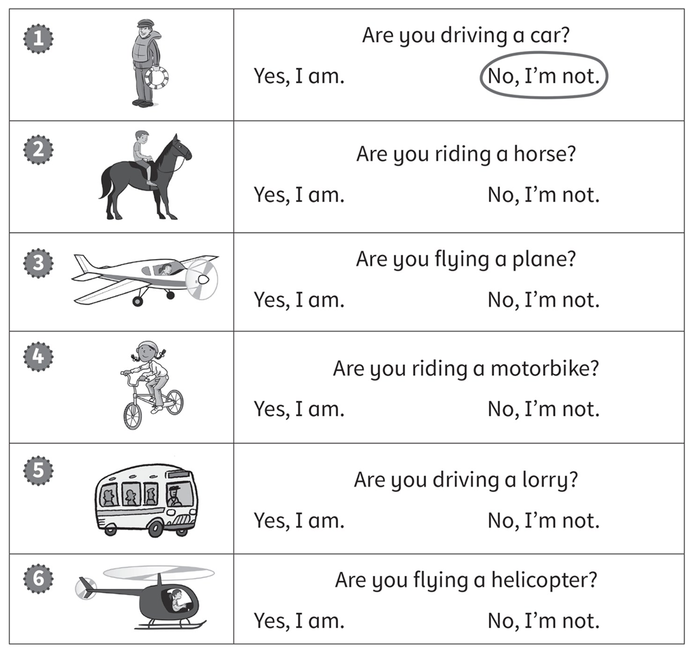
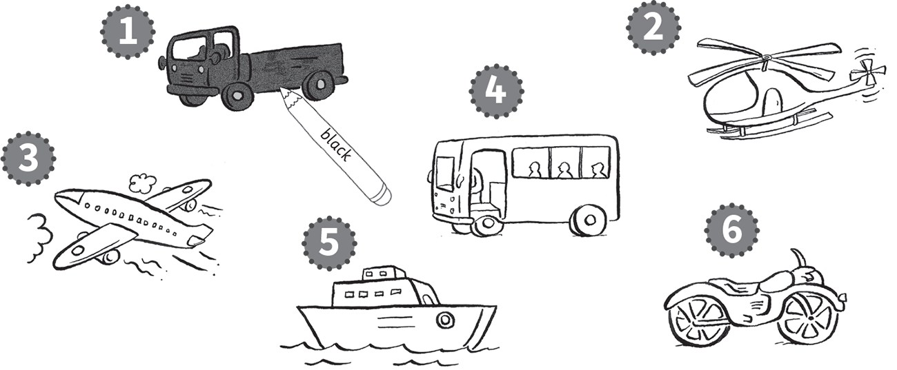
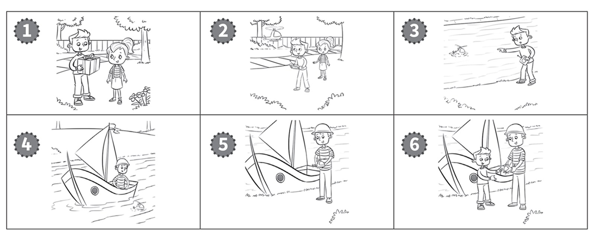

**[Vocabulary]{.underline}**

**1. Look and draw lines. There is one example.   (one point each)**

*2. lorry*

*3. plane*

*4. boat*

*5. car*

*6. helicopter*

**2. Look, read and circle. There is one example.   (one point each)**

***Students circle:***

*2. bus*

*3. bike*

*4. train*

*5. plane*

*6. car*

**3. Look and write. There is one example.   (one point each)**

~~bike~~ \| car \| helicopter \| lorry \| motorbike \| plane

*fly: helicopter, plane*

*ride: motorbike*

*drive: car, lorry*

**[Grammar]{.underline}**

**4. Look and draw lines. There is one example.   (one point each)**

*2. b*

*3. d*

*4. c*

*5. f*

*6. e*

**5. Look and read. Circle. There is one example.   (one point each)**

*2. Yes, I am.*

*3. Yes, I am.*

*4. No, I'm not.*

*5. No, I'm not.*

*6. Yes, I am.*

**[Listening]{.underline}**

**6. Listen and colour. There is one example.   (one point each)**

*2. yellow*

*3. red*

*4. blue*

*5. green*

*6. purple*

**Audio script**

1\. a black lorry

2\. a yellow helicopter

3\. a red plane

4\. a blue bus

5\. a green boat

6\. a purple motorbike

**7. Listen and draw lines. There is one example.   (one point each)**

*Hugo -- boy in the helicopter*

*Zoe -- girl in the plane*

*Mark -- boy in the lorry*

*Alice -- girl on the motorbike*

*Tom -- boy on the horse*

**Audio script**

1

**Man:** What are you doing, Clare?

**Clare:** I'm sailing in a boat.

2

**Woman:** What are you doing, Hugo?

**Hugo:** I'm flying a helicopter.

3

**Man:** What are you doing, Zoe?

**Zoe:** I'm flying a plane.

4

**Woman:** What are you doing, Mark?

**Mark:** I'm driving a lorry.

5

**Man:** What are you doing, Alice?

**Alice:** I'm riding a motorbike.

6

**Woman:** What are you doing, Tom?

**Tom:** I'm riding a horse!

**[Reading]{.underline}**

**8. Look and read. Write the number. There is one example.   (one point
each)**

*2. Peter is flying his plane.*

*3. Peter is sad. His helicopter is in the river.*

*4. Mr White is sailing his boat.*

*5. Mr White has got the helicopter.*

*6. Peter is happy. He says, ?Thank you!?*

