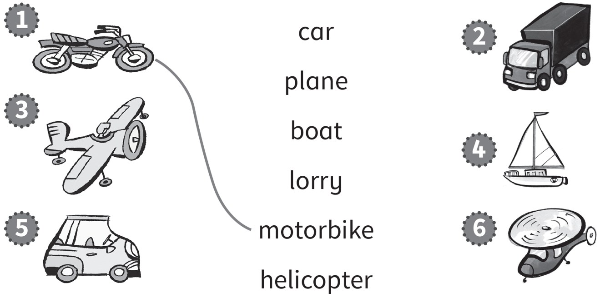
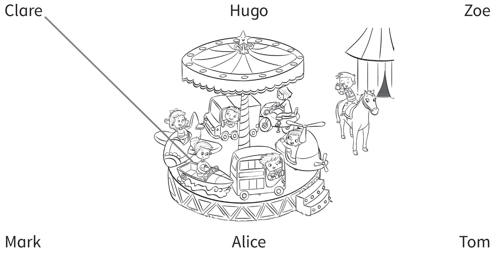
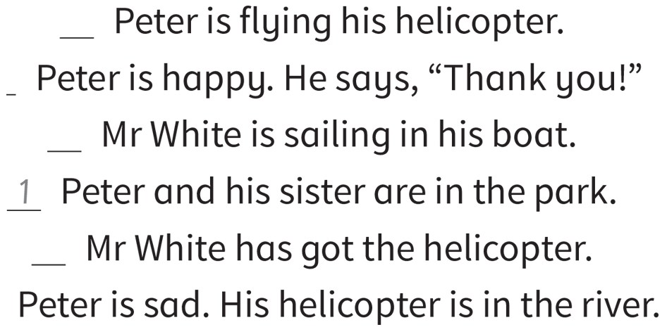

**[Vocabulary]{.underline}**

**1. Look and draw lines. There is one example.   (one point each)**

**2. Look, read and circle. There is one example.   (one point each)**

**3. Look and write. There is one example.   (one point each)**

~~bike~~ \| car \| helicopter \| lorry \| motorbike \| plane

**[Grammar]{.underline}**

**4. Look and draw lines. There is one example.   (one point each)**

**5. Look and read. Circle. There is one example.   (one point each)**

**[Listening]{.underline}**

**6. Listen and colour. There is one example.   (one point each)**

**7. Listen and draw lines. There is one example.   (one point each)**

**[Reading]{.underline}**

**8. Look and read. Write the number. There is one example.   (one point
each)**

