**[Vocabulary]{.underline}**

**1. Look and write the word. There is one example.   (one point each)**

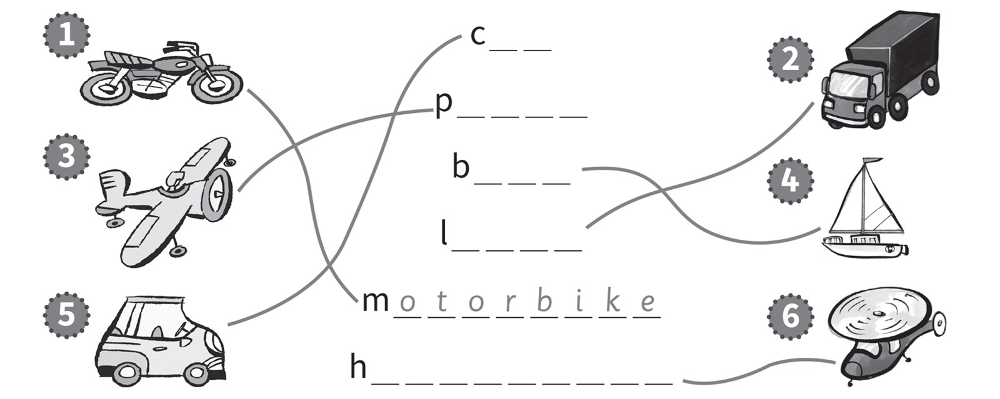

**2. Look and read. Put a tick or a cross. There is one example.   (one
point each)**

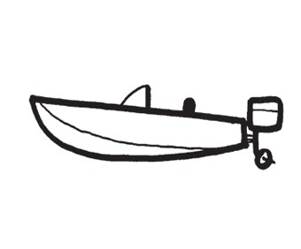

1\. This is a boat. *[✓]{.underline}*

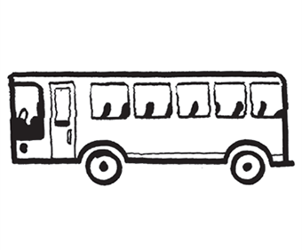

2\. This is a bus. \_\_\_\_

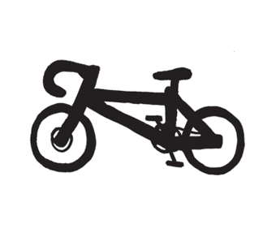

3\. This is a motorbike. \_\_\_\_

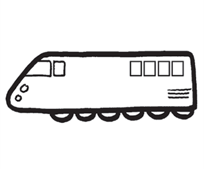

4\. This is a train. \_\_\_\_

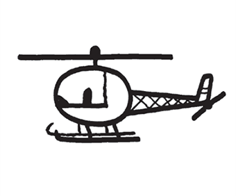

5\. This is a plane. \_\_\_\_

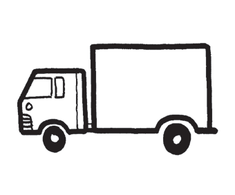

6\. This is a car. \_\_\_\_

**3. Look and write. There is one extra word. There is one
example.   (one point each)**

~~bike~~ \| car \| helicopter \| lorry \| motorbike \| plane \| boat

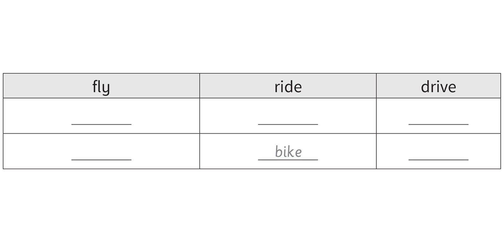

**[Grammar]{.underline}**

**4. Look and write. There is one example.   (one point each)**

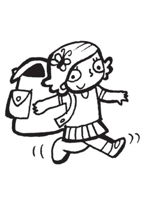

1\. I'm *[walking]{.underline}*. (walk)

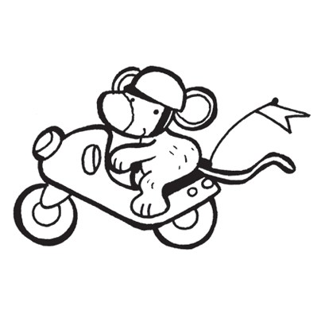

2\. I'm \_\_\_\_\_\_\_\_\_\_\_\_\_\_\_\_\_\_\_\_. (a ride / motorbike)

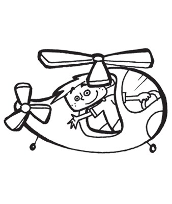

3\. I'm \_\_\_\_\_\_\_\_\_\_\_\_\_\_\_\_\_\_\_\_. (a fly / helicopter)

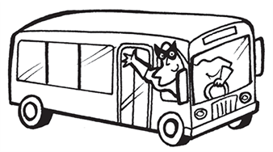

4\. I'm \_\_\_\_\_\_\_\_\_\_\_\_\_\_\_\_\_\_\_\_. (a drive / bus)

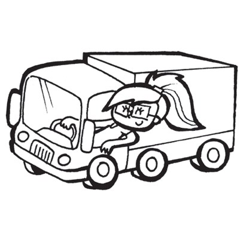

5\. I'm \_\_\_\_\_\_\_\_\_\_\_\_\_\_\_\_\_\_\_\_. (a drive / lorry)

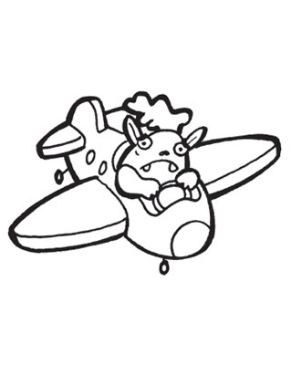

6\. I'm \_\_\_\_\_\_\_\_\_\_\_\_\_\_\_\_\_\_\_\_. (a fly / plane)

**5. Look and read. Put the words in order and write the answer. There
is one example.   (one point each)**

I \| No \| Yes \| not \| 'm \| am

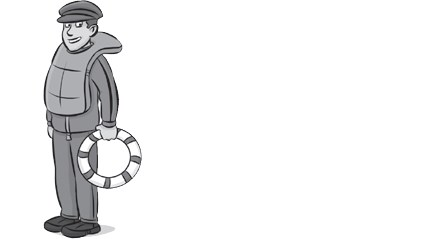

1\. Are you (virdngi) *[driving]{.underline}* a car?

*[No]{.underline}*, *[I'm]{.underline}* *[not]{.underline}*.

2\. Are you (diring) \_\_\_\_\_\_\_\_\_\_ a horse?

\_\_\_\_\_, \_\_\_\_\_ \_\_\_\_\_.

3\. Are you (gynfil) \_\_\_\_\_\_\_\_\_\_ a plane?

\_\_\_\_\_, \_\_\_\_\_ \_\_\_\_\_.

4\. Are you (grindi) \_\_\_\_\_\_\_\_\_\_ a motorbike?

\_\_\_\_\_, \_\_\_\_\_ \_\_\_\_\_.

5\. Are you (gridivn) \_\_\_\_\_\_\_\_\_\_ a lorry?

\_\_\_\_\_, \_\_\_\_\_ \_\_\_\_\_.

6\. Are you (igflyn) \_\_\_\_\_\_\_\_\_\_ a helicopter?

\_\_\_\_\_, \_\_\_\_\_ \_\_\_\_\_.

**[Listening]{.underline}**

**6. Listen and colour. There are three extra pictures. There is one
example.   (one point each)**

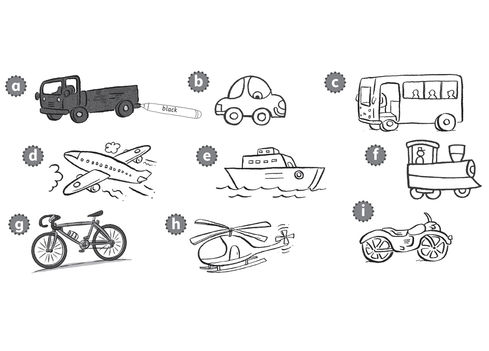

**7. Listen and draw lines. There are two extra names. There is one
example.   (one point each)**

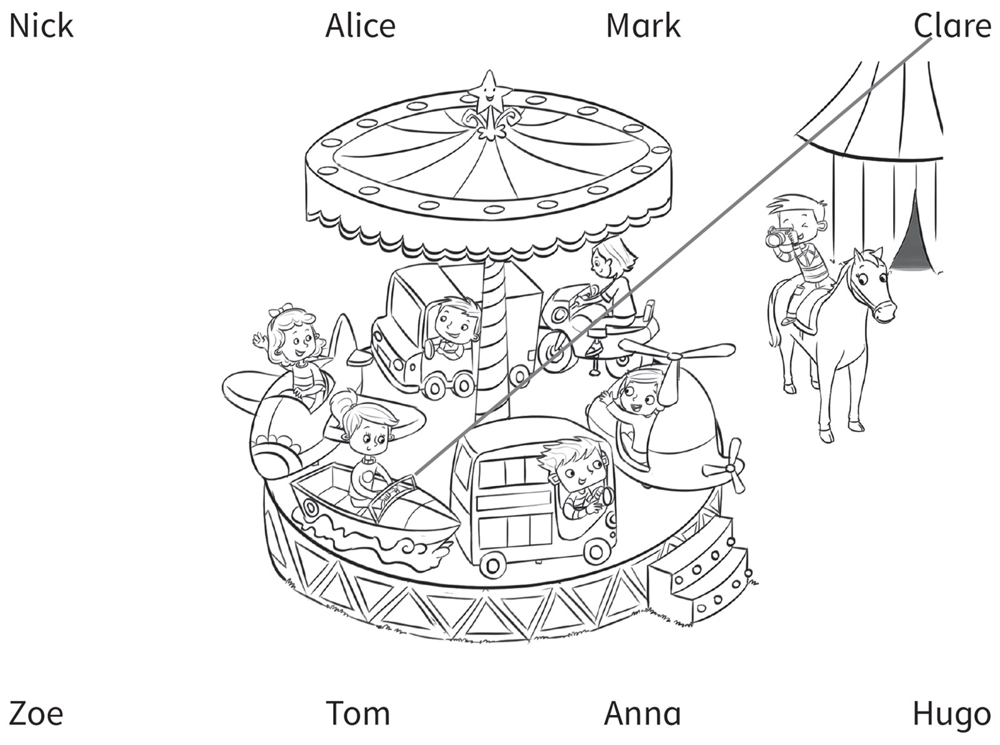

**[Reading]{.underline}**

**8. Read and match the text and pictures. Write the number. There is
one example.   (one point each)**

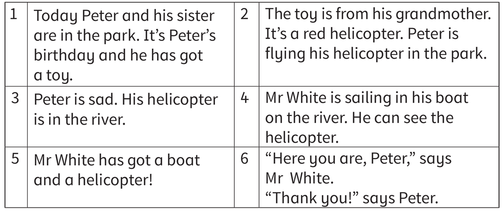

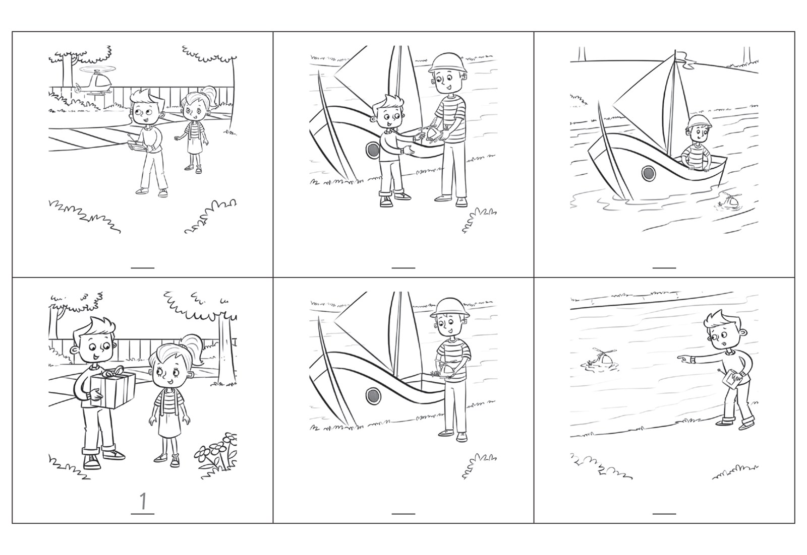

