**[Vocabulary]{.underline}**

**1. Look and complete the words. Draw lines. There is one
example.   (one point each)**

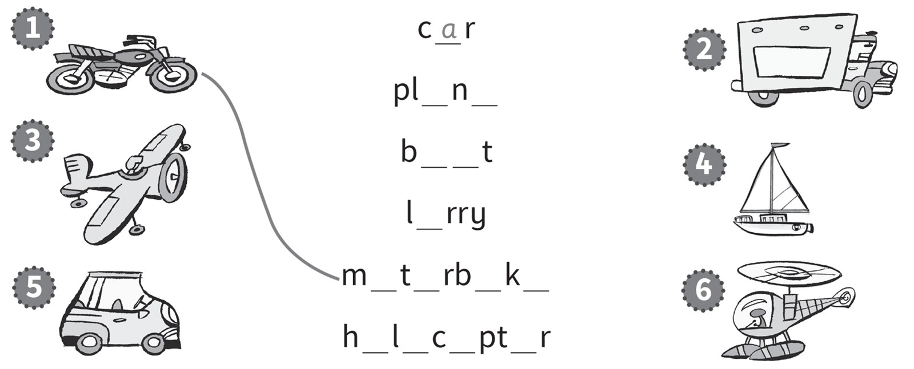

*2. lorry*

*3. plane*

*4. boat*

*5. car*

*6. helicopter*

**2. Look and circle the word. There is one example.   (one point
each)**

1\. This is a *[boat]{.underline}* / *car*.

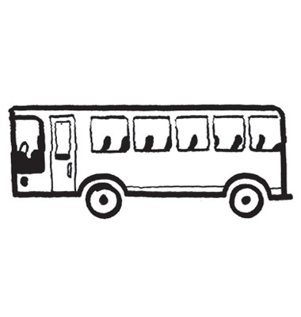

2\. This is a *lorry* / *bus*.

*bus*

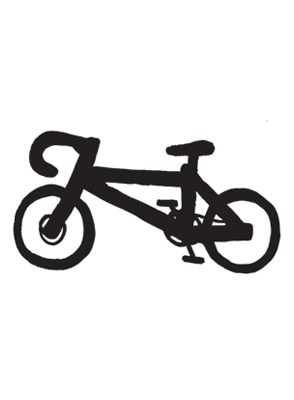

3\. This is a *bike* / *motorbike*.

*bike*

4\. This is a *train* / *plane*.

*train*

5\. This is a *plane* / *helicopter*.

*helicopter*

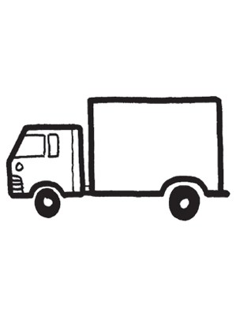

6\. This is a *car* / *lorry*.

*lorry*

**3. Look and read. Put a tick or a cross. There is one example.   (one
point each)**

*motorbike ✓*

*helicopter ✓*

*bus ✗*

*car ✓*

*horse ✗*

**[Grammar]{.underline}**

**4. Look and draw lines. There is one example.   (one point each)**

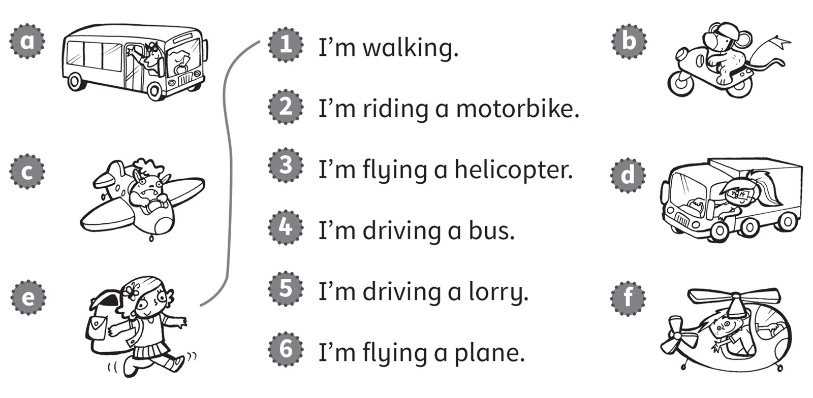

*2. b*

*3. f*

*4. a*

*5. d*

*6. c*

**5. Look and read. Write *Yes, I am* or *No, I'm not*. There is one
example.   (one point each)**

1\. Are you driving a car?

*[No, I'm not.]{.underline}*

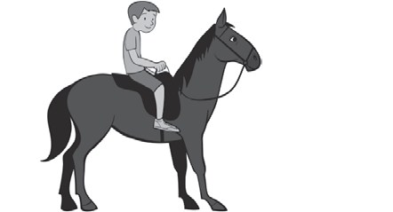

2\. Are you riding a horse?

\_\_\_\_\_\_\_\_\_\_\_\_\_\_\_

*Yes, I am*

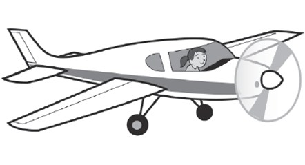

3\. Are you flying a plane?

\_\_\_\_\_\_\_\_\_\_\_\_\_\_\_

*Yes, I am*

4\. Are you riding a motorbike?

\_\_\_\_\_\_\_\_\_\_\_\_\_\_\_

*No, I'm not*

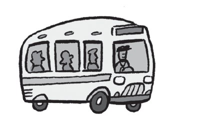

5\. Are you driving a lorry?

\_\_\_\_\_\_\_\_\_\_\_\_\_\_\_

*No, I'm not*

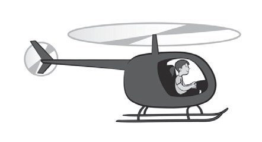

6\. Are you flying a helicopter?

\_\_\_\_\_\_\_\_\_\_\_\_\_\_\_

*Yes, I am*

**[Listening]{.underline}**

**6. Listen and colour. There is one example.   (one point each)**

*bus -- blue*

*plane -- red*

*boat -- green*

*helicopter -- yellow*

*motorbike -- purple*

**Audio script**

1\. a black lorry

2\. a yellow helicopter

3\. a red plane

4\. a blue bus

5\. a green boat

6\. a purple motorbike

**7. Listen and draw the lines. There is one example.   (one point
each)**

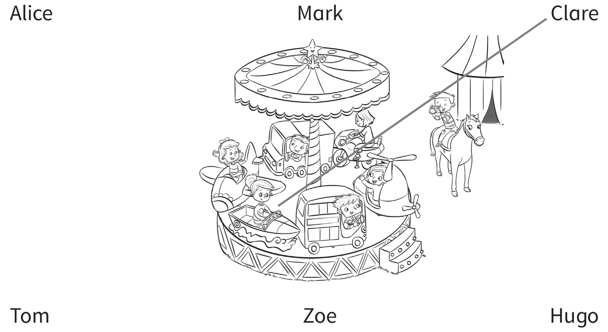

*Hugo -- boy in the helicopter*

*Zoe -- girl in the plane*

*Mark -- boy in the lorry*

*Alice -- girl on the motorbike*

*Tom -- boy on the horse*

**Audio script**

1

**Man:** What are you doing, Clare?

**Clare:** I'm sailing in a boat.

2

**Woman:** What are you doing, Hugo?

**Hugo:** I'm flying a helicopter.

3

**Man:** What are you doing, Zoe?

**Zoe:** I'm flying a plane.

4

**Woman:** What are you doing, Mark?

**Mark:** I'm driving a lorry.

5

**Man:** What are you doing, Alice?

**Alice:** I'm riding a motorbike.

6

**Woman:** What are you doing, Tom?

**Tom:** I'm riding a horse!

**[Reading]{.underline}**

**8. Look, read and order the sentences. Write the number. There is one
example.   (one point each)**

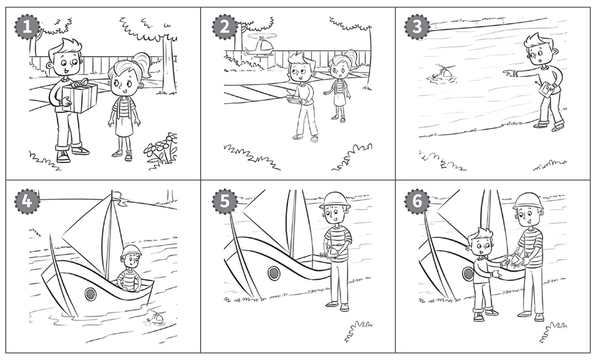

*Order of texts: 2, 6, 4, (1), 5, 3*

