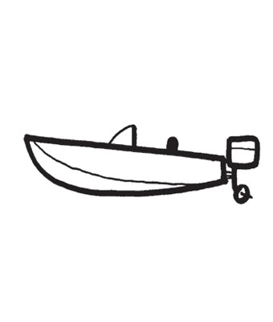
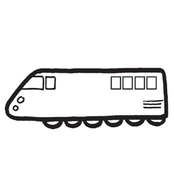
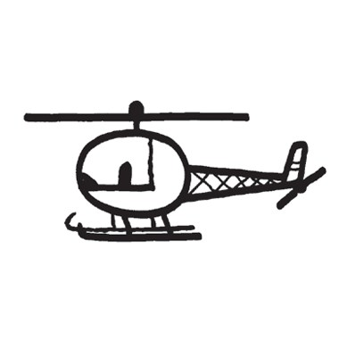
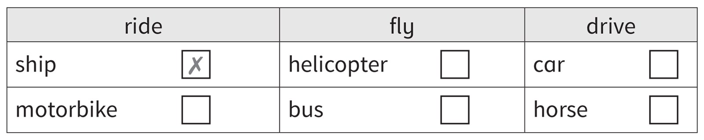
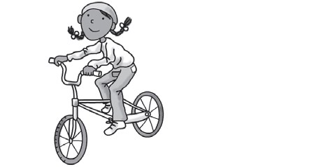
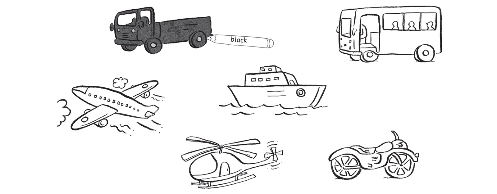

**[Vocabulary]{.underline}**

**1. Look and complete the words. Draw lines. There is one
example.   (one point each)**

**2. Look and circle the word. There is one example.   (one point
each)**

1\. This is a *[boat]{.underline}* / *car*.

2\. This is a *lorry* / *bus*.

3\. This is a *bike* / *motorbike*.

4\. This is a *train* / *plane*.

5\. This is a *plane* / *helicopter*.

6\. This is a *car* / *lorry*.

**3. Look and read. Put a tick or a cross. There is one example.   (one
point each)**

**[Grammar]{.underline}**

**4. Look and draw lines. There is one example.   (one point each)**

**5. Look and read. Write *Yes, I am* or *No, I'm not*. There is one
example.   (one point each)**

1\. Are you driving a car?

*[No, I'm not.]{.underline}*

2\. Are you riding a horse?

\_\_\_\_\_\_\_\_\_\_\_\_\_\_\_

3\. Are you flying a plane?

\_\_\_\_\_\_\_\_\_\_\_\_\_\_\_

4\. Are you riding a motorbike?

\_\_\_\_\_\_\_\_\_\_\_\_\_\_\_

5\. Are you driving a lorry?

\_\_\_\_\_\_\_\_\_\_\_\_\_\_\_

6\. Are you flying a helicopter?

\_\_\_\_\_\_\_\_\_\_\_\_\_\_\_

**[Listening]{.underline}**

**6. Listen and colour. There is one example.   (one point each)**

**7. Listen and draw the lines. There is one example.   (one point
each)**

**[Reading]{.underline}**

**8. Look, read and order the sentences. Write the number. There is one
example.   (one point each)**

