**[Vocabulary]{.underline}**

**1. Look and write the letter. There is one example.   (one point
each)**

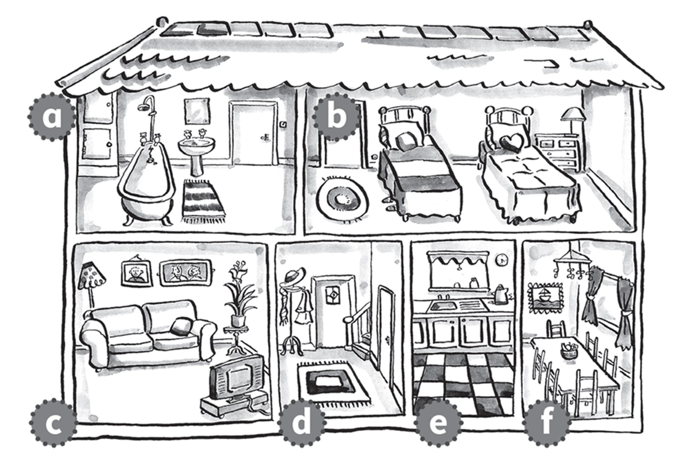

1\. hall *[d]{.underline}*

2\. dining room ☐

*f*

3\. bedroom ☐

*b*

4\. kitchen ☐

*e*

5\. bathroom ☐

*a*

6\. bathroom ☐

*c*

**2. Look and draw lines. There is one example.   (one point each)**

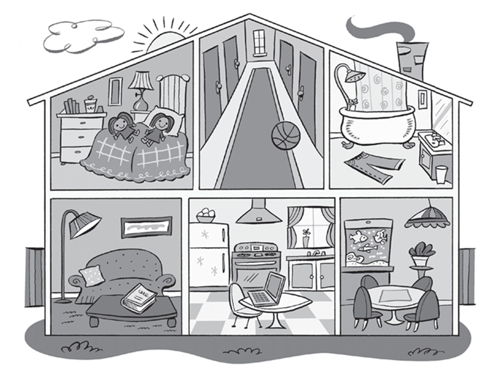

*2. in the living room*

*3. in the kitchen*

*4. in the bathroom*

*5. in the bedroom*

*6. in the dining room*

**3. Look and circle. There is one example.   (one point each)**

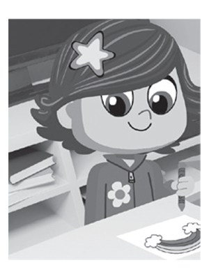

1\. *[drawing]{.underline}* / *driving* a picture

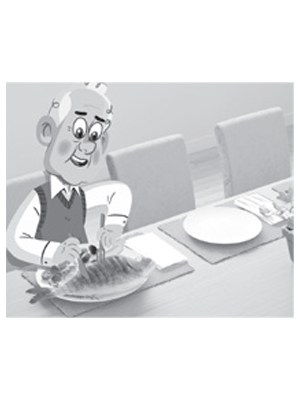

2\. *eating* / *reading* a fish

*eating*

3\. *walking* / *having* a bath

*having*

4\. *watching* / *listening* to music

*listening*

5\. *watching* / *walking* TV

*watching*

6\. *reading* / *playing* a book

*reading*

**[Grammar]{.underline}**

**4. Read and put a tick or a cross. There is one example.   (one point
each)**

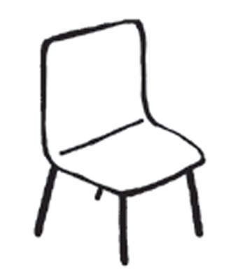

1\. He's drawing a picture. *[✓]{.underline}*

2\. She's reading a book. ☐

*✓*

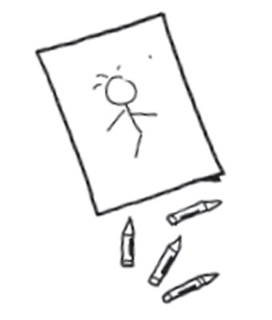

3\. He's sitting on a chair. ☐

*✗*

4\. He's listening to music. ☐

*✓*

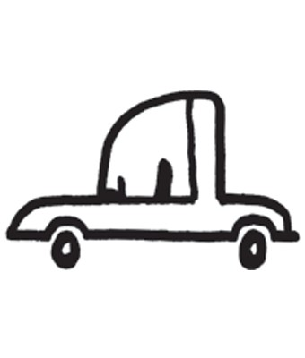

5\. He's driving a car. ☐

*✓*

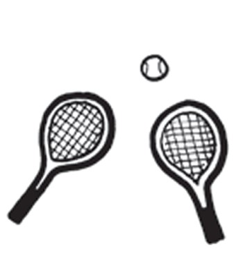

6\. They're playing tennis. ☐

*✓*

**5. Look and read. Circle. There is one example.   (one point each)**

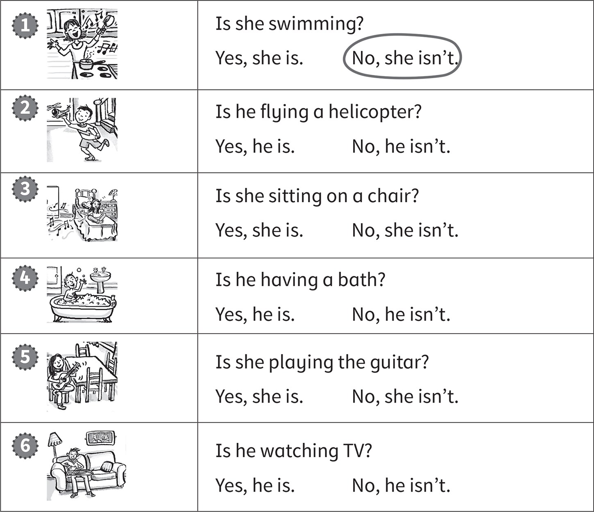

**[Listening]{.underline}**

**6. Listen and draw lines. There is one example.   (one point each)**

*2. guitar -- living room*

*3. car -- hall*

*4. book -- bedroom*

*5. computer -- kitchen*

*6. shoes -- dining room*

**Audio script**

1

**Boy:** Where's my ball?

**Woman:** It's in the bathroom.

2

**Boy:** Where's my guitar?

**Woman:** It's on the sofa in the living room.

3

**Boy:** Where's my car?

**Woman:** It's in the hall.

4

**Boy:** Where's my book?

**Woman:** It's on the bed in the bedroom.

5

**Boy:** Where's my computer?

**Woman:** It's on the table in the kitchen.

6

**Boy:** Where are my shoes?

**Woman:** They're under the table in the dining room.

**7. Listen and write the number. There is one example.   (one point
each)**

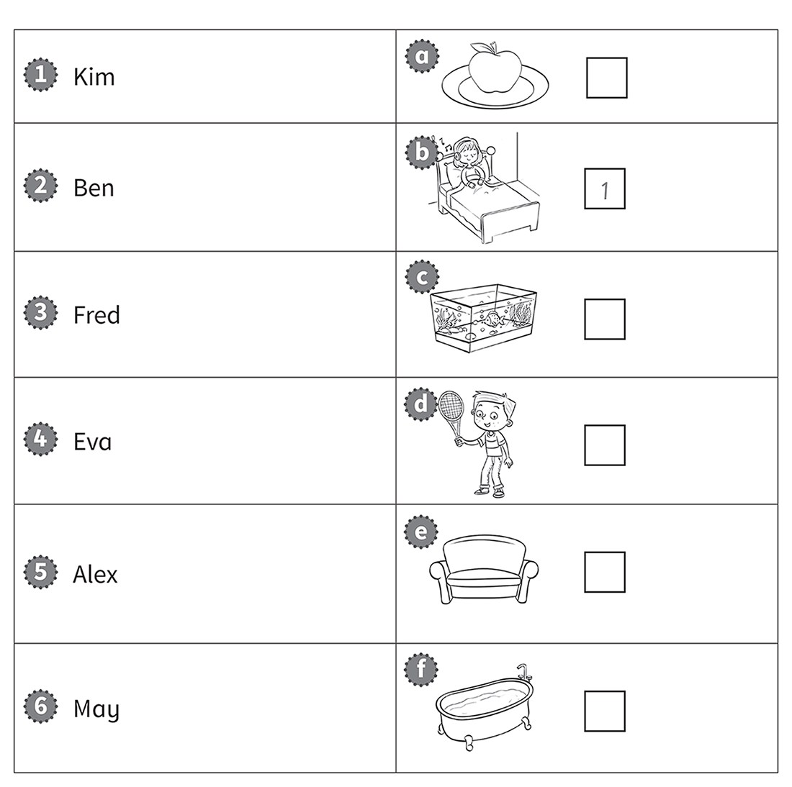

*2. Ben d*

*3. Fred f*

*4. Eva a*

*5. Alex c*

*6. May e*

**Audio script**

1

**Man:** What's Kim doing?

**Girl:** She's listening to music.

2

**Man:** What's Ben playing?

**Girl:** He's playing tennis.

3

**Man:** What's Fred doing?

**Girl:** He's reading in the bath.

4

**Man:** What's Eva eating?

**Girl:** She's eating an apple.

5

**Man:** What is Alex watching?

**Girl:** He's watching the fish.

6

**Man:** Where is May sitting?

**Girl:** She's sitting on the sofa in the living room.

**[Reading]{.underline}**

**8. Read and write *yes* or *no*. There is one example.   (one point
each)**

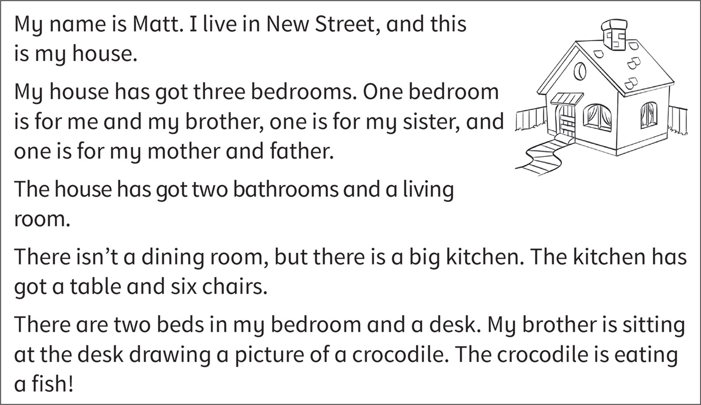

1\. Matt has got two brothers. *[no]{.underline}*

2\. There are three bedrooms in the house. \_\_\_\_\_\_\_\_

*yes*

3\. There is a big dining room. \_\_\_\_\_\_\_\_

*no*

4\. There is a table in the kitchen. \_\_\_\_\_\_\_\_

*yes*

5\. His brother is reading a book. \_\_\_\_\_\_\_\_

*no*

6\. The crocodile is eating a fish. \_\_\_\_\_\_\_

*Yes*

