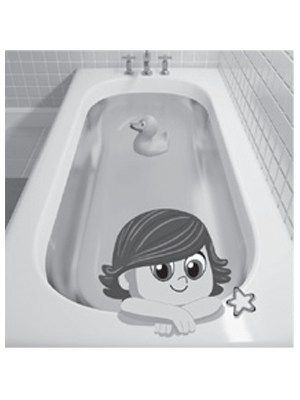
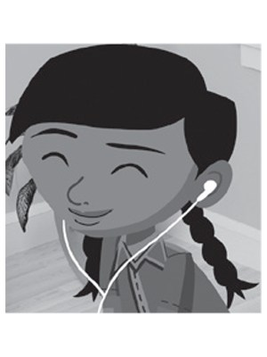
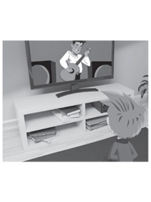
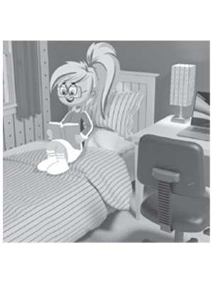
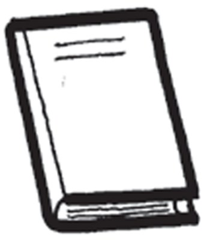
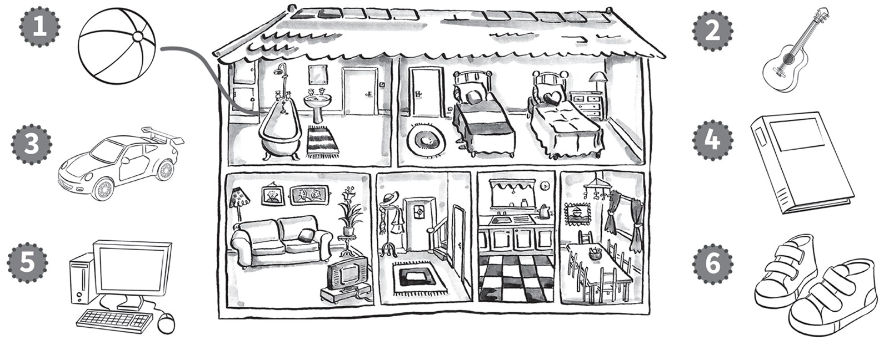

**[Vocabulary]{.underline}**

**1. Look and write the letter. There is one example.   (one point
each)**

1\. hall *[d]{.underline}*

2\. dining room ☐

3\. bedroom ☐

4\. kitchen ☐

5\. bathroom ☐

6\. bathroom ☐

**2. Look and draw lines. There is one example.   (one point each)**

**3. Look and circle. There is one example.   (one point each)**

1\. *[drawing]{.underline}* / *driving* a picture

2\. *eating* / *reading* a fish

3\. *walking* / *having* a bath

4\. *watching* / *listening* to music

5\. *watching* / *walking* TV

6\. *reading* / *playing* a book

**[Grammar]{.underline}**

**4. Read and put a tick or a cross. There is one example.   (one point
each)**

1\. He's drawing a picture. *[✓]{.underline}*

2\. She's reading a book. ☐

3\. He's sitting on a chair. ☐

4\. He's listening to music. ☐

5\. He's driving a car. ☐

6\. They're playing tennis. ☐

**5. Look and read. Circle. There is one example.   (one point each)**

**[Listening]{.underline}**

**6. Listen and draw lines. There is one example.   (one point each)**

**7. Listen and write the number. There is one example.   (one point
each)**

**[Reading]{.underline}**

**8. Read and write *yes* or *no*. There is one example.   (one point
each)**

1\. Matt has got two brothers. *[no]{.underline}*

2\. There are three bedrooms in the house. \_\_\_\_\_\_\_\_

3\. There is a big dining room. \_\_\_\_\_\_\_\_

4\. There is a table in the kitchen. \_\_\_\_\_\_\_\_

5\. His brother is reading a book. \_\_\_\_\_\_\_\_

6\. The crocodile is eating a fish. \_\_\_\_\_\_\_

