**[Vocabulary]{.underline}**

**1. Look and write the word. There is one example.   (one point each)**

1\. *[bathroom]{.underline}*

2\. *bedroom*

3\. *living room*

4\. *hall*

5\. *kitchen*

6\. *dining room*

**2. Look and draw lines. There is one example.   (one point each)**

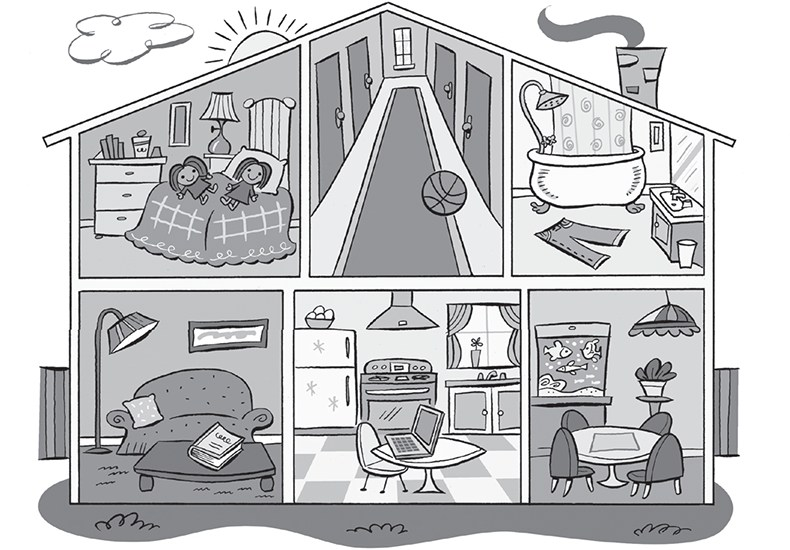

*2. It's in the living room.*

*3. It's in the kitchen.*

*4. They're in the bathroom.*

*5. They're in the bedroom.*

*6. They're in the dining room.*

**3. Look and put the letters in order. Write. There is one
example.   (one point each)**

eta \| ~~radw~~ \| ehva \| isntel \| dare \| hctaw

  --------------------------------------------------------------------------------------------------------------------------------------------------------------------------------------------------------------------- -- ------------------------------------------------------------------------------------------------------------------------------------------------------------------------------------------------------------------ -- ------------------------------------------------------------------------------------------------------------------------------------------------------------------------------------------------------------------
   1.      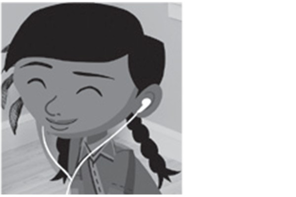      
  *[draw]{.underline}* a picture                                                                                                                                                                                           2. *listen* to music                                                                                                                                                                                                  3. *watch* TV

  --------------------------------------------------------------------------------------------------------------------------------------------------------------------------------------------------------------------- -- ------------------------------------------------------------------------------------------------------------------------------------------------------------------------------------------------------------------ -- ------------------------------------------------------------------------------------------------------------------------------------------------------------------------------------------------------------------

  ------------------------------------------------------------------------------------------------------------------------------------------------------------------------------------------------------------------ -- ------------------------------------------------------------------------------------------------------------------------------------------------------------------------------------------------------------------ -- ------------------------------------------------------------------------------------------------------------------------------------------------------------------------------------------------------------------
  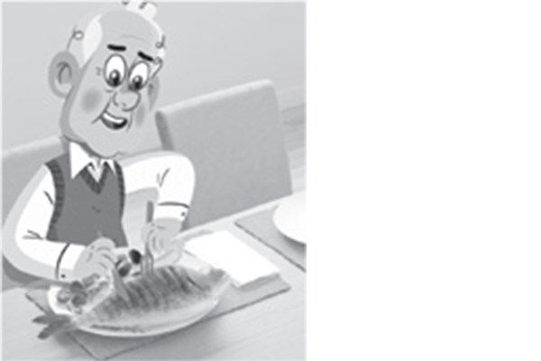      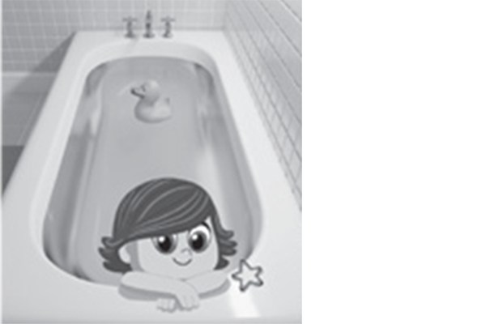      
  4. *eat* a fish                                                                                                                                                                                                       5. *have* a bath                                                                                                                                                                                                      6. *read* a book

  ------------------------------------------------------------------------------------------------------------------------------------------------------------------------------------------------------------------ -- ------------------------------------------------------------------------------------------------------------------------------------------------------------------------------------------------------------------ -- ------------------------------------------------------------------------------------------------------------------------------------------------------------------------------------------------------------------

**[Grammar]{.underline}**

**4. Complete the sentences. There are two extra words. There is one
example.   (one point each)**

reading \| listening \| sitting \| driving \| ~~drawing~~ \| watching \|
flying \| playing

  ---------------------------------------------------------------------------------------------------------------------------------------------------------------------------------------------------------------------- -- ------------------------------------------------------------------------------------------------------------------------------------------------------------------------------------------------------------------- -- -------------------------------------------------------------------------------------------------------------------------------------------------------------------------------------------------------------------
  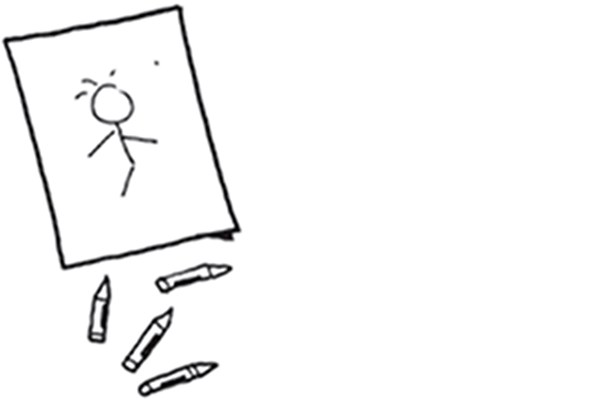 1.      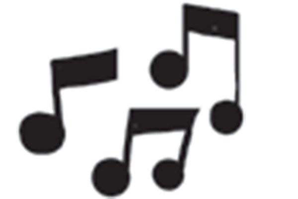      
  He's *[drawing]{.underline}* a picture.                                                                                                                                                                                   2. They're *listening* to music.                                                                                                                                                                                       3. She's *reading* a book.

  ---------------------------------------------------------------------------------------------------------------------------------------------------------------------------------------------------------------------- -- ------------------------------------------------------------------------------------------------------------------------------------------------------------------------------------------------------------------- -- -------------------------------------------------------------------------------------------------------------------------------------------------------------------------------------------------------------------

  ------------------------------------------------------------------------------------------------------------------------------------------------------------------------------------------------------------------- -- -------------------------------------------------------------------------------------------------------------------------------------------------------------------------------------------------------------------
        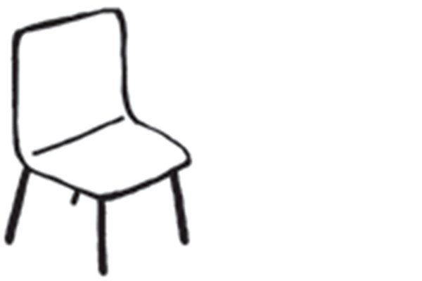
  4. He's *driving* a car.                                                                                                                                                                                               5. He's *sitting* on a chair.

  ------------------------------------------------------------------------------------------------------------------------------------------------------------------------------------------------------------------- -- -------------------------------------------------------------------------------------------------------------------------------------------------------------------------------------------------------------------

  -------------------------------------------------------------------------------------------------------------------------------------------------------------------------------------------------------------------
  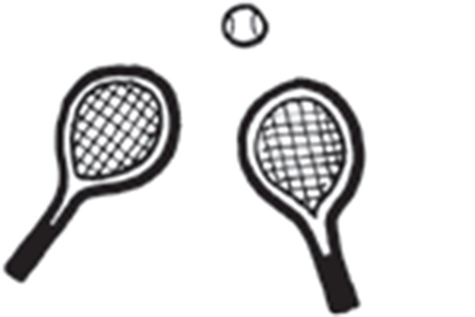
  6. They're *playing* tennis.

  -------------------------------------------------------------------------------------------------------------------------------------------------------------------------------------------------------------------

**5. Look and read. Write the answer. There is one example.   (one point
each)**

she \| he \| Yes \| No \| is \| isn't

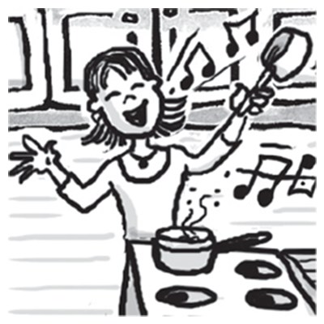

1\. Is she swimming?

    *[No]{.underline}*, *[she]{.underline}* *[isn't]{.underline}*.

2\. Is he flying a helicopter?

    \_\_\_\_\_\_\_\_\_\_\_\_, \_\_\_\_\_\_\_\_\_\_\_\_
\_\_\_\_\_\_\_\_\_\_\_\_.

*Yes, he is.*

3\. Is she sitting on a chair?

    \_\_\_\_\_\_\_\_\_\_\_\_, \_\_\_\_\_\_\_\_\_\_\_\_
\_\_\_\_\_\_\_\_\_\_\_\_.

*No, she isn't.*

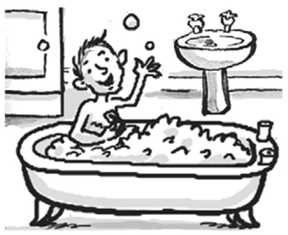

4\. Is he having a bath?

    \_\_\_\_\_\_\_\_\_\_\_\_, \_\_\_\_\_\_\_\_\_\_\_\_
\_\_\_\_\_\_\_\_\_\_\_\_.

*Yes, he is.*

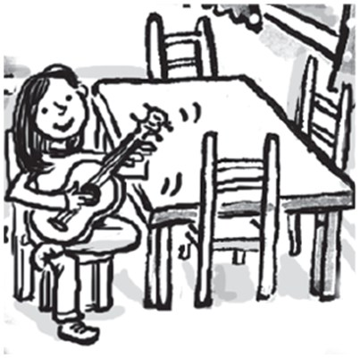

5\. Is she playing the guitar?

    \_\_\_\_\_\_\_\_\_\_\_\_, \_\_\_\_\_\_\_\_\_\_\_\_
\_\_\_\_\_\_\_\_\_\_\_\_.

*Yes, she is.*

6\. Is he watching TV?

    \_\_\_\_\_\_\_\_\_\_\_\_, \_\_\_\_\_\_\_\_\_\_\_\_
\_\_\_\_\_\_\_\_\_\_\_\_.

*No, he isn't.*

**[Listening]{.underline}**

**6. Listen and look. Circle *Yes* or *No*. There is one example.   (one
point each)**

*2. No*

*3. Yes*

*4. No*

*5. Yes*

*6. No*

**Audio script**

1

**Boy:** Where's my ball?

**Woman:** It's in the bathroom.

2

**Boy:** Where's my guitar?

**Woman:** It's on the sofa in the living room.

3

**Boy:** Where's my car?

**Woman:** It's in the hall.

4

**Boy:** Where's my book?

**Woman:** It's on the bed in the bedroom.

5

**Boy:** Where's my computer?

**Woman:** It's on the table in the kitchen.

6

**Boy:** Where are my shoes?

**Woman:** They're under the table in the dining room.

**7. Listen and tick. There is one example.   (one point each)**

*2. Ben -- tennis (racket)*

*3. Fred -- bath*

*4. Eva -- apple*

*5. Alex -- fish*

*6. May -- sofa*

**Audio script**

1

**Man:** What's Kim doing?

**Girl:** She's listening to music.

2

**Man:** What's Ben playing?

**Girl:** He's playing tennis.

3

**Man:** What's Fred doing?

**Girl:** He's reading in the bath.

4

**Man:** What's Eva eating?

**Girl:** She's eating an apple.

5

**Man:** What is Alex watching?

**Girl:** He's watching the fish.

6

**Man:** Where is May sitting?

**Girl:** She's sitting on the sofa in the living room.

**[Reading]{.underline}**

**8. Read and answer. Write [one]{.underline} word. There is one
example.   (one point each)**

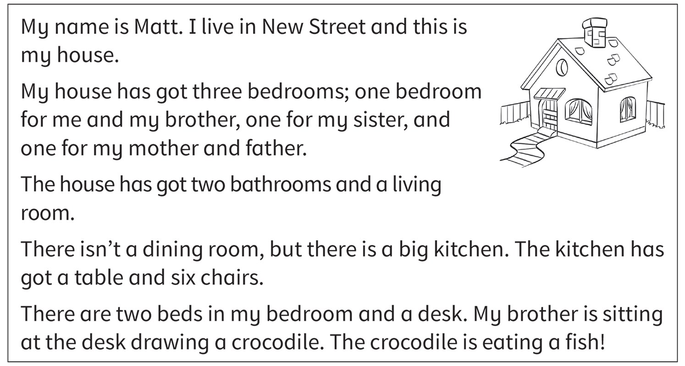

1\. How many brothers has Matt got?

    *[one]{.underline}*

2\. How many bedrooms are there?

    \_\_\_\_\_\_\_\_\_\_\_\_

*three*

3\. Is there a dining room?

    \_\_\_\_\_\_\_\_\_\_\_\_

*no*

4\. Where is the table?

    in the \_\_\_\_\_\_\_\_\_\_\_\_

*kitchen*

5\. What is his brother doing?

    \_\_\_\_\_\_\_\_\_\_\_\_

*drawing*

6\. What is the crocodile eating?

    a \_\_\_\_\_\_\_\_\_\_\_\_

*fish*

