**[Vocabulary]{.underline}**

**1. Look and write the word. There is one example.   (one point each)**

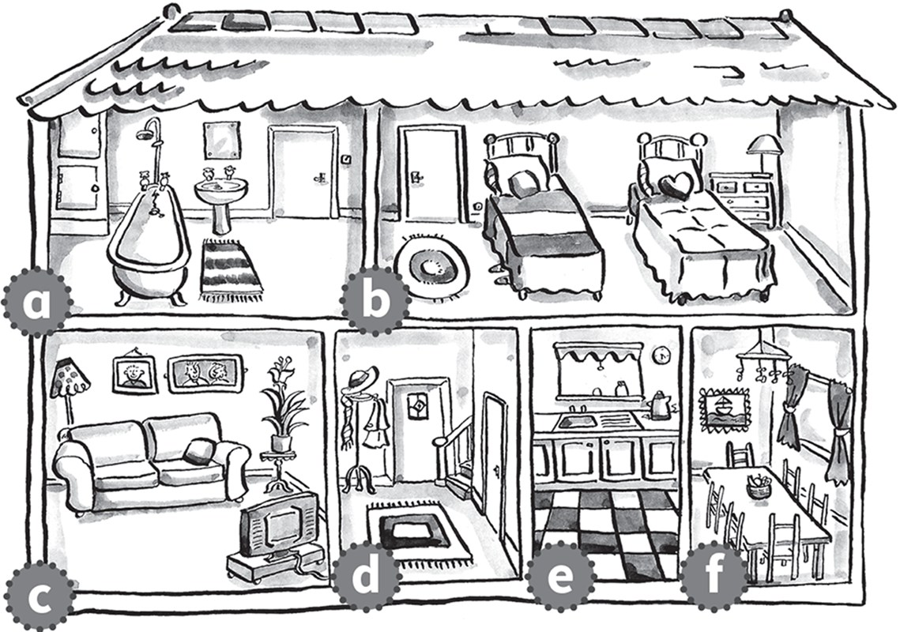

1\. *[bathroom]{.underline}*

2\. \_\_\_\_\_\_\_\_\_\_\_\_\_\_\_\_\_\_

3\. \_\_\_\_\_\_\_\_\_\_\_\_\_\_\_\_\_\_

4\. \_\_\_\_\_\_\_\_\_\_\_\_\_\_\_\_\_\_

5\. \_\_\_\_\_\_\_\_\_\_\_\_\_\_\_\_\_\_

6\. \_\_\_\_\_\_\_\_\_\_\_\_\_\_\_\_\_\_

**2. Look and draw lines. There is one example.   (one point each)**

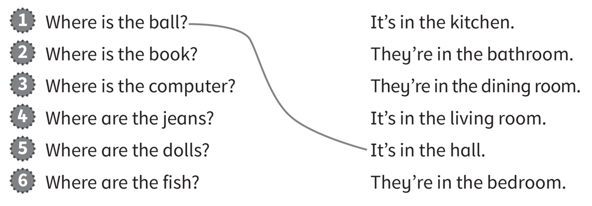

**3. Look and put the letters in order. Write. There is one
example.   (one point each)**

eta \| ~~radw~~ \| ehva \| isntel \| dare \| hctaw

  ------------------------------------------------------------------------------------------------------------------------------------------------------------------------------------------------------------------------ -- --------------------------------------------------------------------------------------------------------------------------------------------------------------------------------------------------------------------- -- ---------------------------------------------------------------------------------------------------------------------------------------------------------------------------------------------------------------------
  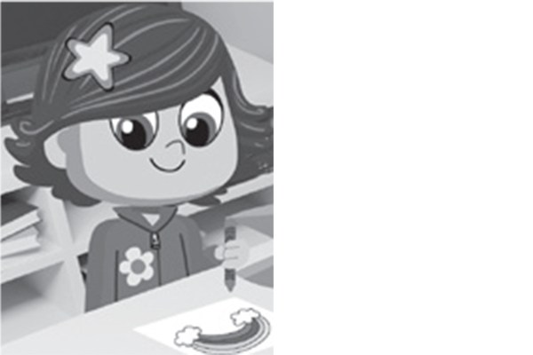 1.            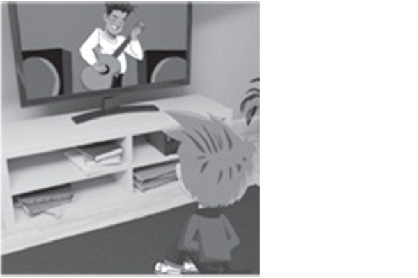
  *[draw]{.underline}* a picture                                                                                                                                                                                              2. \_\_\_\_\_\_ to music                                                                                                                                                                                                 3. \_\_\_\_\_\_ TV

  ------------------------------------------------------------------------------------------------------------------------------------------------------------------------------------------------------------------------ -- --------------------------------------------------------------------------------------------------------------------------------------------------------------------------------------------------------------------- -- ---------------------------------------------------------------------------------------------------------------------------------------------------------------------------------------------------------------------

  --------------------------------------------------------------------------------------------------------------------------------------------------------------------------------------------------------------------- -- --------------------------------------------------------------------------------------------------------------------------------------------------------------------------------------------------------------------- -- ---------------------------------------------------------------------------------------------------------------------------------------------------------------------------------------------------------------------
              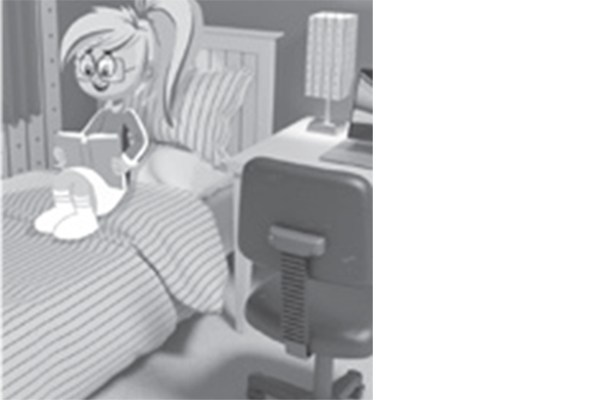
  4. \_\_\_\_\_\_ a fish                                                                                                                                                                                                   5. \_\_\_\_\_\_ a bath                                                                                                                                                                                                   6. \_\_\_\_\_\_ a book

  --------------------------------------------------------------------------------------------------------------------------------------------------------------------------------------------------------------------- -- --------------------------------------------------------------------------------------------------------------------------------------------------------------------------------------------------------------------- -- ---------------------------------------------------------------------------------------------------------------------------------------------------------------------------------------------------------------------

**[Grammar]{.underline}**

**4. Complete the sentences. There are two extra words. There is one
example.   (one point each)**

reading \| listening \| sitting \| driving \| ~~drawing~~ \| watching \|
flying \| playing

  ------------------------------------------------------------------------------------------------------------------------------------------------------------------------------------------------------------------------- -- ---------------------------------------------------------------------------------------------------------------------------------------------------------------------------------------------------------------------- -- ----------------------------------------------------------------------------------------------------------------------------------------------------------------------------------------------------------------------
   1.            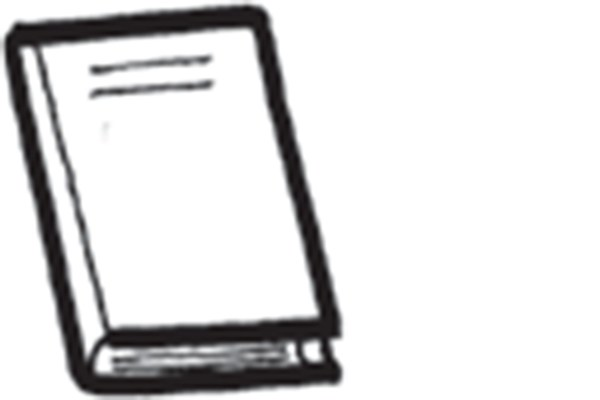
  He's *[drawing]{.underline}* a picture.                                                                                                                                                                                      2. They're \_\_\_\_\_\_\_\_\_ to music.                                                                                                                                                                                   3. She's \_\_\_\_\_\_\_\_\_ a book.

  ------------------------------------------------------------------------------------------------------------------------------------------------------------------------------------------------------------------------- -- ---------------------------------------------------------------------------------------------------------------------------------------------------------------------------------------------------------------------- -- ----------------------------------------------------------------------------------------------------------------------------------------------------------------------------------------------------------------------

  ---------------------------------------------------------------------------------------------------------------------------------------------------------------------------------------------------------------------- -- ----------------------------------------------------------------------------------------------------------------------------------------------------------------------------------------------------------------------
  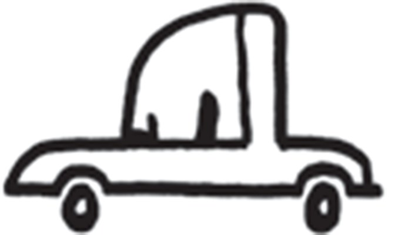      
  4. He's \_\_\_\_\_\_\_\_\_ a car.                                                                                                                                                                                         5. He's \_\_\_\_\_\_\_\_\_ on a chair.

  ---------------------------------------------------------------------------------------------------------------------------------------------------------------------------------------------------------------------- -- ----------------------------------------------------------------------------------------------------------------------------------------------------------------------------------------------------------------------

  ----------------------------------------------------------------------------------------------------------------------------------------------------------------------------------------------------------------------
  
  6. They're \_\_\_\_\_\_\_\_\_ tennis.

  ----------------------------------------------------------------------------------------------------------------------------------------------------------------------------------------------------------------------

**5. Look and read. Write the answer. There is one example.   (one point
each)**

she \| he \| Yes \| No \| is \| isn't

1\. Is she swimming?

    *[No]{.underline}*, *[she]{.underline}* *[isn't]{.underline}*.

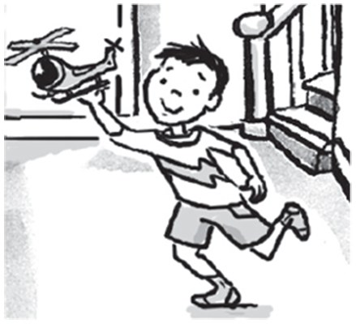

2\. Is he flying a helicopter?

    \_\_\_\_\_\_\_\_\_\_\_\_, \_\_\_\_\_\_\_\_\_\_\_\_
\_\_\_\_\_\_\_\_\_\_\_\_.

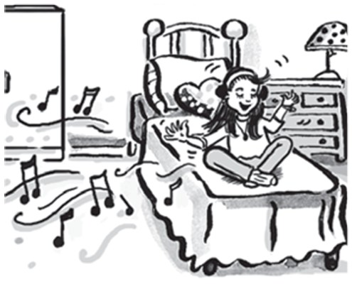

3\. Is she sitting on a chair?

    \_\_\_\_\_\_\_\_\_\_\_\_, \_\_\_\_\_\_\_\_\_\_\_\_
\_\_\_\_\_\_\_\_\_\_\_\_.

4\. Is he having a bath?

    \_\_\_\_\_\_\_\_\_\_\_\_, \_\_\_\_\_\_\_\_\_\_\_\_
\_\_\_\_\_\_\_\_\_\_\_\_.

5\. Is she playing the guitar?

    \_\_\_\_\_\_\_\_\_\_\_\_, \_\_\_\_\_\_\_\_\_\_\_\_
\_\_\_\_\_\_\_\_\_\_\_\_.

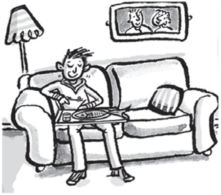

6\. Is he watching TV?

    \_\_\_\_\_\_\_\_\_\_\_\_, \_\_\_\_\_\_\_\_\_\_\_\_
\_\_\_\_\_\_\_\_\_\_\_\_.

**[Listening]{.underline}**

**6. Listen and look. Circle *Yes* or *No*. There is one example.   (one
point each)**

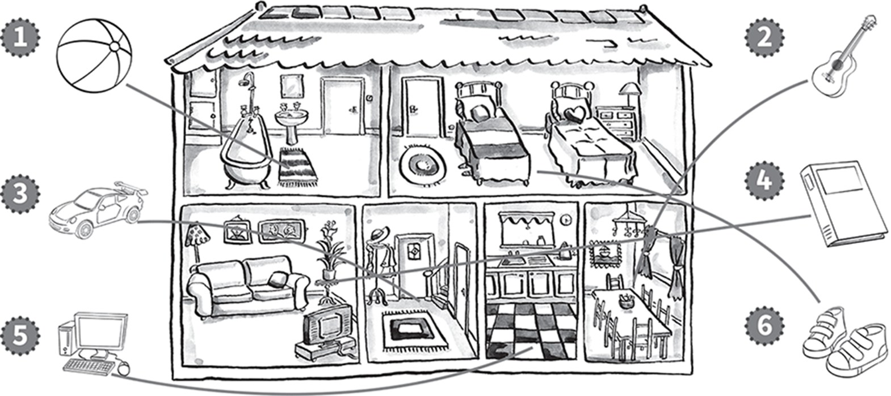

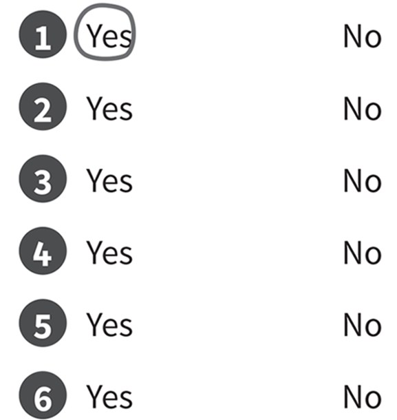

**7. Listen and tick. There is one example.   (one point each)**

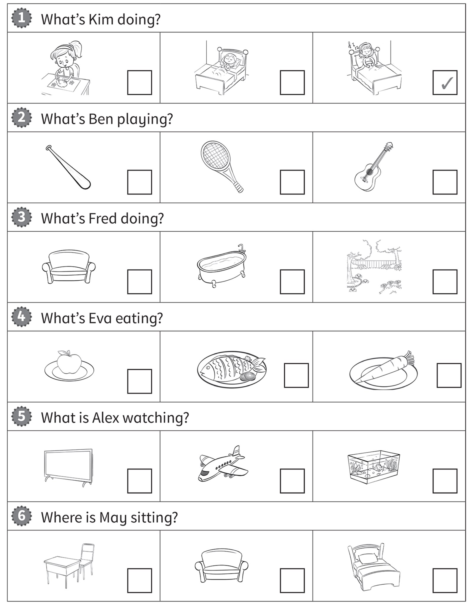

**[Reading]{.underline}**

**8. Read and answer. Write [one]{.underline} word. There is one
example.   (one point each)**

1\. How many brothers has Matt got?

    *[one]{.underline}*

2\. How many bedrooms are there?

    \_\_\_\_\_\_\_\_\_\_\_\_

3\. Is there a dining room?

    \_\_\_\_\_\_\_\_\_\_\_\_

4\. Where is the table?

    in the \_\_\_\_\_\_\_\_\_\_\_\_

5\. What is his brother doing?

    \_\_\_\_\_\_\_\_\_\_\_\_

6\. What is the crocodile eating?

    a \_\_\_\_\_\_\_\_\_\_\_\_

