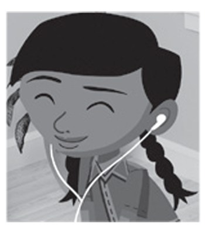
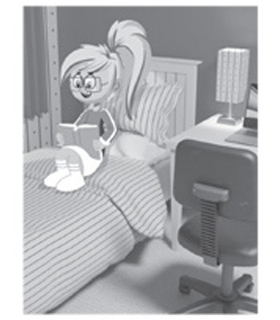
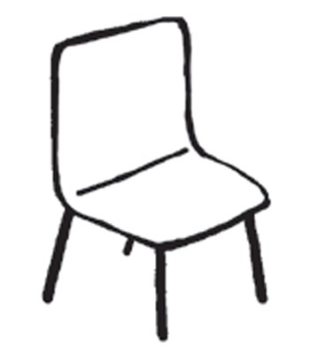
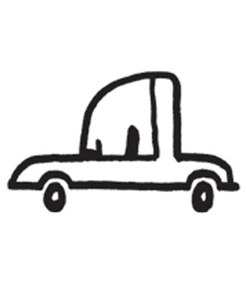
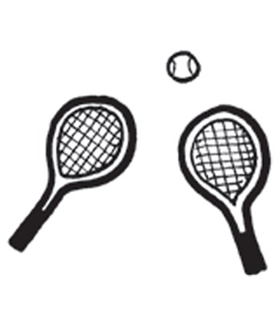

**[Vocabulary]{.underline}**

**1. Look and draw lines. There is one example.   (one point each)**

bedroom \| kitchen \| dining room \| living room \| ~~bathroom~~ \| hall

*b. bedroom*

*c. living room*

*d. hall*

*e. kitchen*

*f. dining room*

**2. Look and write *yes* or *no*. There is one example.   (one point
each)**

1\. The ball is in the hall. *[yes]{.underline}*

2\. The book is in the bathroom. \_\_\_\_\_\_\_\_

*no*

3\. The computer is in the kitchen. \_\_\_\_\_\_\_\_

*yes*

4\. The jeans are in the bathroom. \_\_\_\_\_\_\_\_

*yes*

5\. The dolls are in the living room. \_\_\_\_\_\_\_\_

*no*

6\. The fish are in the bedroom. \_\_\_\_\_\_\_\_

*no*

**3. Look and write. There is one example.   (one point each)**

~~drawing~~ \| eating \| having \| listening \| reading \| watching

  ------------------------------------------------------------------------------------------------------------------------------------------------------------------------------------------------------------------ --- -------------------------------
  1\.                                                                                                                                                                                                                    a\. \_\_\_\_\_\_\_\_\_\_ TV
         

  ------------------------------------------------------------------------------------------------------------------------------------------------------------------------------------------------------------------ --- -------------------------------

  ------------------------------------------------------------------------------------------------------------------------------------------------------------------------------------------------------------------ --- -------------------------------
  2\.                                                                                                                                                                                                                    b\. \_\_\_\_\_\_\_\_\_\_ a fish
         

  ------------------------------------------------------------------------------------------------------------------------------------------------------------------------------------------------------------------ --- -------------------------------

*listening*

  ------------------------------------------------------------------------------------------------------------------------------------------------------------------------------------------------------------------ --- -------------------------------
  3\.                                                                                                                                                                                                                    c\. \_\_\_\_\_\_\_\_\_\_ a bath
         

  ------------------------------------------------------------------------------------------------------------------------------------------------------------------------------------------------------------------ --- -------------------------------

*watching*

  ------------------------------------------------------------------------------------------------------------------------------------------------------------------------------------------------------------------ --- -------------------------------
  4\.                                                                                                                                                                                                                    d\. \_\_\_\_\_\_\_\_\_\_ a book
         

  ------------------------------------------------------------------------------------------------------------------------------------------------------------------------------------------------------------------ --- -------------------------------

*eating*

  ------------------------------------------------------------------------------------------------------------------------------------------------------------------------------------------------------------------ --- -------------------------------
  5\.                                                                                                                                                                                                                    e\. \_\_\_\_\_\_\_\_\_\_ to
         music

  ------------------------------------------------------------------------------------------------------------------------------------------------------------------------------------------------------------------ --- -------------------------------

*having*

  ------------------------------------------------------------------------------------------------------------------------------------------------------------------------------------------------------------------ --- -------------------------------
  6\.                                                                                                                                                                                                                    f\. *[drawing]{.underline}* a
         picture

  ------------------------------------------------------------------------------------------------------------------------------------------------------------------------------------------------------------------ --- -------------------------------

*reading*

**[Grammar]{.underline}**

**4. Put the words in order. Write. There is one example.   (one point
each)**

1\. drawing He's a picture. *[He's drawing a picture.]{.underline}*

2\. a reading She's book. \_\_\_\_\_\_\_\_\_\_\_\_

*She's reading a book.*

3\. on sitting a He's chair. \_\_\_\_\_\_\_\_\_\_\_\_

*He's sitting on a chair.*

4\. to They're music. listening \_\_\_\_\_\_\_\_\_\_\_\_

*They're listening to music.*

5\. car. a driving He's \_\_\_\_\_\_\_\_\_\_\_\_

*He's driving a car.*

6\. tennis. They're playing \_\_\_\_\_\_\_\_\_\_\_\_

*They're playing tennis.*

**5. Look and read. Write *Yes*, *he* / *she is* or *No*, *he* / *she
isn't.* There is one example.   (one point each)**

1\. Is she swimming?

    *[No, she isn't.]{.underline}*

2\. Is he flying a helicopter?

    \_\_\_\_\_, \_\_\_\_\_ \_\_\_\_\_.

*Yes, he is.*

3\. Is she sitting on a chair?

    \_\_\_\_\_, \_\_\_\_\_ \_\_\_\_\_.

*No, she isn't.*

4\. Is he having a bath?

    \_\_\_\_\_, \_\_\_\_\_ \_\_\_\_\_.

*Yes, he is.*

5\. Is she playing the guitar?

    \_\_\_\_\_, \_\_\_\_\_ \_\_\_\_\_.

*Yes, she is.*

6\. Is he watching TV?

    \_\_\_\_\_, \_\_\_\_\_ \_\_\_\_\_.

*No, he isn't.*

**[Listening]{.underline}**

**6. Listen and draw lines. There are two extra pictures. There is one
example.   (one point each)**

*2. guitar -- living room*

*3. car -- hall*

*4. book -- bedroom*

*5. computer -- kitchen*

*6. shoes -- dining room*

**Audio script**

1

**Boy:** Where's my ball?

**Woman:** It's in the bathroom.

2

**Boy:** Where's my guitar?

**Woman:** It's on the sofa in the living room.

3

**Boy:** Where's my car?

**Woman:** It's in the hall.

4

**Boy:** Where's my book?

**Woman:** It's on the bed in the bedroom.

5

**Boy:** Where's my computer?

**Woman:** It's on the table in the kitchen.

6

**Boy:** Where are my shoes?

**Woman:** They're under the table in the dining room.

**7. Listen and tick. There is one example.   (one point each)**

*2. Ben -- tennis (racket)*

*3. Fred -- bath*

*4. Eva -- apple*

*5. Alex -- fish*

*6. May -- sofa*

**Audio script**

1

**Man:** What's Kim doing?

**Girl:** She's listening to music.

2

**Man:** What's Ben playing?

**Girl:** He's playing tennis.

3

**Man:** What's Fred doing?

**Girl:** He's reading in the bath.

4

**Man:** What's Eva eating?

**Girl:** She's eating an apple.

5

**Man:** What is Alex watching?

**Girl:** He's watching the fish.

6

**Man:** Where is May sitting?

**Girl:** She's sitting on the sofa in the living room.

**[Reading]{.underline}**

**8. Read and write. There is one example.   (one point each)**

1\. Matt has got a brother and a *[sister]{.underline}*.

2\. There are three \_\_\_\_\_\_\_\_\_\_\_\_ in the house.

*Ben -- tennis (racket)*

3\. There isn't a \_\_\_\_\_\_\_\_\_\_\_\_.

*Fred -- bath*

4\. The kitchen has got a \_\_\_\_\_\_\_\_\_\_\_\_.

*Eva -- apple*

5\. His brother is drawing a crocodile in the \_\_\_\_\_\_\_\_\_\_\_\_.

*Alex -- fish*

6\. The crocodile is eating a \_\_\_\_\_\_\_\_\_\_\_\_.

*May -- sofa*

**Audio script**

1

**Man:** What's Kim doing?

**Girl:** She's listening to music.

2

**Man:** What's Ben playing?

**Girl:** He's playing tennis.

3

**Man:** What's Fred doing?

**Girl:** He's reading in the bath.

4

**Man:** What's Eva eating?

**Girl:** She's eating an apple.

5

**Man:** What is Alex watching?

**Girl:** He's watching the fish.

6

**Man:** Where is May sitting?

**Girl:** She's sitting on the sofa in

the living room.

