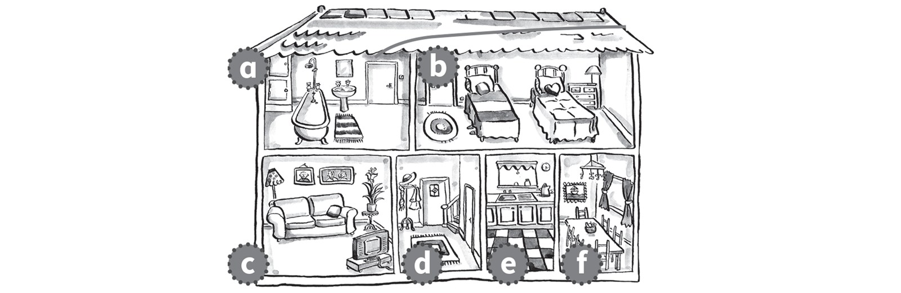
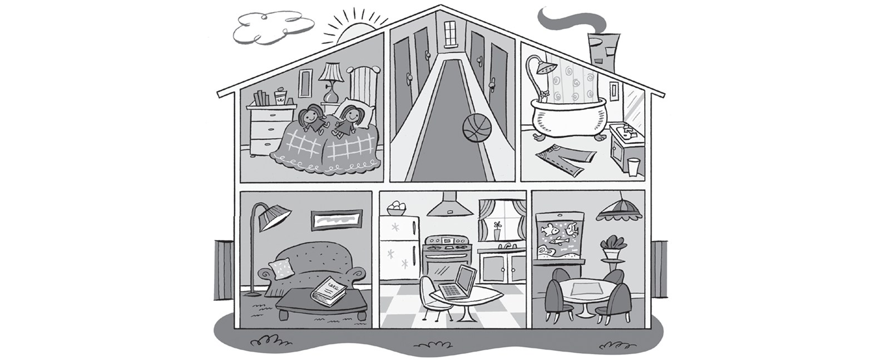
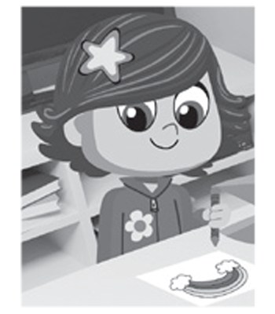
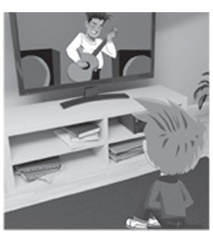
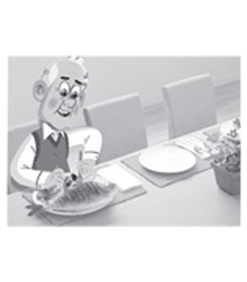
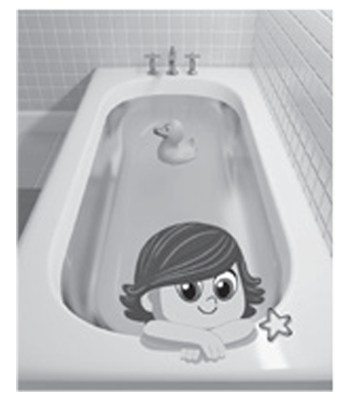
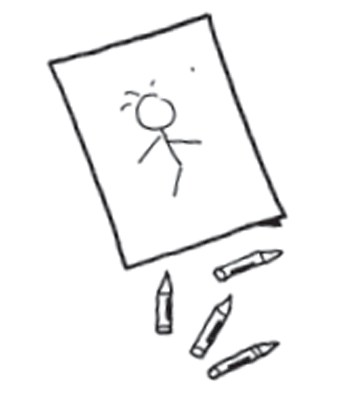
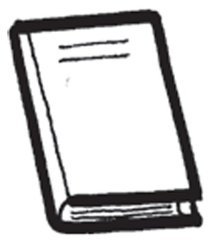
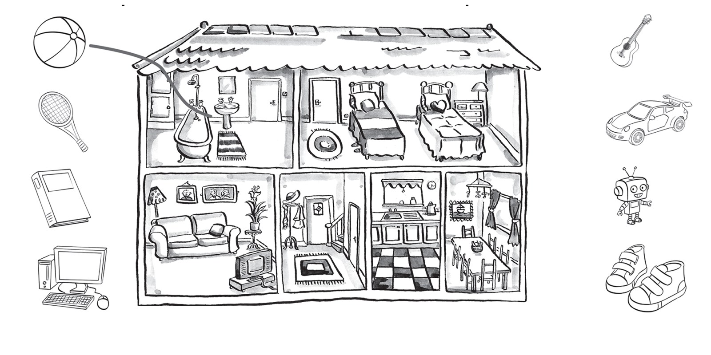
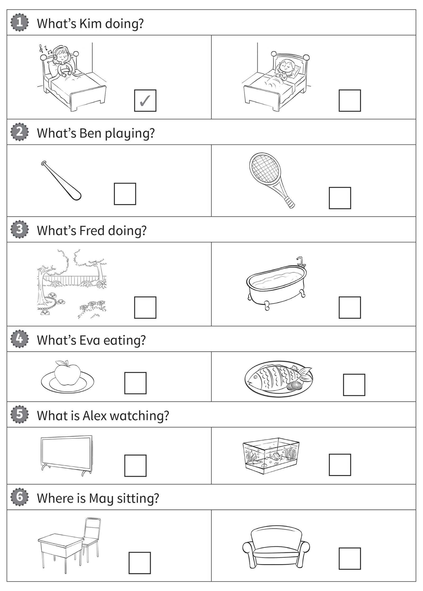

**[Vocabulary]{.underline}**

**1. Look and draw lines. There is one example.   (one point each)**

bedroom \| kitchen \| dining room \| living room \| ~~bathroom~~ \| hall

**2. Look and write *yes* or *no*. There is one example.   (one point
each)**

1\. The ball is in the hall. *[yes]{.underline}*

2\. The book is in the bathroom. \_\_\_\_\_\_\_\_

3\. The computer is in the kitchen. \_\_\_\_\_\_\_\_

4\. The jeans are in the bathroom. \_\_\_\_\_\_\_\_

5\. The dolls are in the living room. \_\_\_\_\_\_\_\_

6\. The fish are in the bedroom. \_\_\_\_\_\_\_\_

**3. Look and write. There is one example.   (one point each)**

~~drawing~~ \| eating \| having \| listening \| reading \| watching

  --------------------------------------------------------------------------------------------------------------------------------------------------------------------------------------------------------------------- --- -------------------------------
  1\.                                                                                                                                                                                                                       a\. \_\_\_\_\_\_\_\_\_\_ a fish
         

  --------------------------------------------------------------------------------------------------------------------------------------------------------------------------------------------------------------------- --- -------------------------------

  --------------------------------------------------------------------------------------------------------------------------------------------------------------------------------------------------------------------- --- -------------------------------
  2\.                                                                                                                                                                                                                       b\. \_\_\_\_\_\_\_\_\_\_ TV
         

  --------------------------------------------------------------------------------------------------------------------------------------------------------------------------------------------------------------------- --- -------------------------------

  --------------------------------------------------------------------------------------------------------------------------------------------------------------------------------------------------------------------- --- -------------------------------
  3\.                                                                                                                                                                                                                       c\. \_\_\_\_\_\_\_\_\_\_ a book
         

  --------------------------------------------------------------------------------------------------------------------------------------------------------------------------------------------------------------------- --- -------------------------------

  --------------------------------------------------------------------------------------------------------------------------------------------------------------------------------------------------------------------- --- -------------------------------
  4\.                                                                                                                                                                                                                       d\. \_\_\_\_\_\_\_\_\_\_ a bath
         

  --------------------------------------------------------------------------------------------------------------------------------------------------------------------------------------------------------------------- --- -------------------------------

  --------------------------------------------------------------------------------------------------------------------------------------------------------------------------------------------------------------------- --- -------------------------------
  5\.                                                                                                                                                                                                                       e\. *[drawing]{.underline}* a
         picture

  --------------------------------------------------------------------------------------------------------------------------------------------------------------------------------------------------------------------- --- -------------------------------

  --------------------------------------------------------------------------------------------------------------------------------------------------------------------------------------------------------------------- --- -------------------------------
  6\.                                                                                                                                                                                                                       f\. \_\_\_\_\_\_\_\_\_\_ to
         music

  --------------------------------------------------------------------------------------------------------------------------------------------------------------------------------------------------------------------- --- -------------------------------

**[Grammar]{.underline}**

**4. Put the words in order. Write. There is one example.   (one point
each)**

1\. drawing He's a picture. *[He's drawing a picture.]{.underline}*

2\. a reading She's book. \_\_\_\_\_\_\_\_\_\_\_\_

3\. on sitting a He's chair. \_\_\_\_\_\_\_\_\_\_\_\_

4\. to They're music. listening \_\_\_\_\_\_\_\_\_\_\_\_

5\. car. a driving He's \_\_\_\_\_\_\_\_\_\_\_\_

6\. tennis. They're playing \_\_\_\_\_\_\_\_\_\_\_\_

**5. Look and read. Write *Yes*, *he* / *she is* or *No*, *he* / *she
isn't.* There is one example.   (one point each)**

1\. Is she swimming?

    *[No, she isn't.]{.underline}*

2\. Is he flying a helicopter?

    \_\_\_\_\_, \_\_\_\_\_ \_\_\_\_\_.

3\. Is she sitting on a chair?

    \_\_\_\_\_, \_\_\_\_\_ \_\_\_\_\_.

4\. Is he having a bath?

    \_\_\_\_\_, \_\_\_\_\_ \_\_\_\_\_.

5\. Is she playing the guitar?

    \_\_\_\_\_, \_\_\_\_\_ \_\_\_\_\_.

6\. Is he watching TV?

    \_\_\_\_\_, \_\_\_\_\_ \_\_\_\_\_.

**[Listening]{.underline}**

**6. Listen and draw lines. There are two extra pictures. There is one
example.   (one point each)**

**7. Listen and tick. There is one example.   (one point each)**

**[Reading]{.underline}**

**8. Read and write. There is one example.   (one point each)**

1\. Matt has got a brother and a *[sister]{.underline}*.

2\. There are three \_\_\_\_\_\_\_\_\_\_\_\_ in the house.

3\. There isn't a \_\_\_\_\_\_\_\_\_\_\_\_.

4\. The kitchen has got a \_\_\_\_\_\_\_\_\_\_\_\_.

5\. His brother is drawing a crocodile in the \_\_\_\_\_\_\_\_\_\_\_\_.

6\. The crocodile is eating a \_\_\_\_\_\_\_\_\_\_\_\_.

