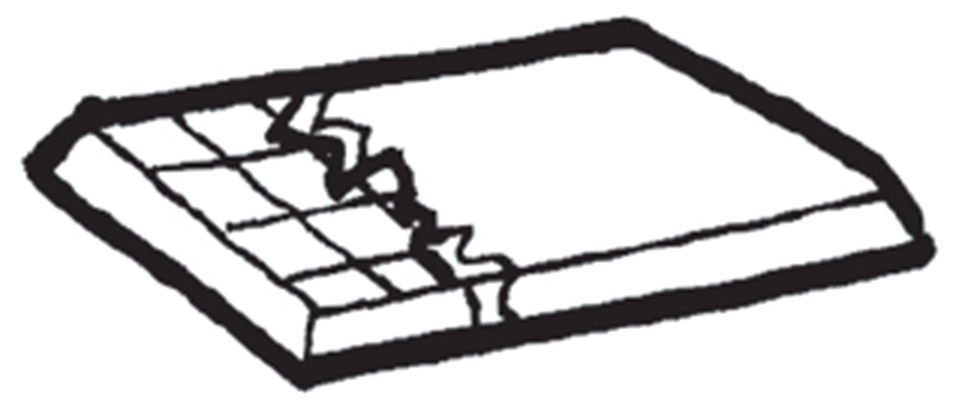
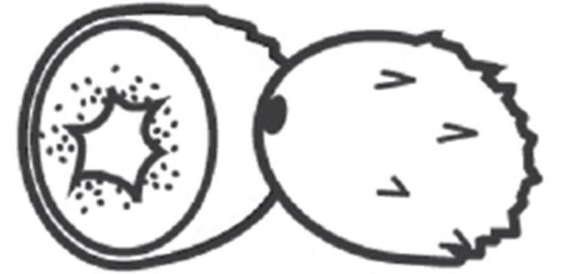
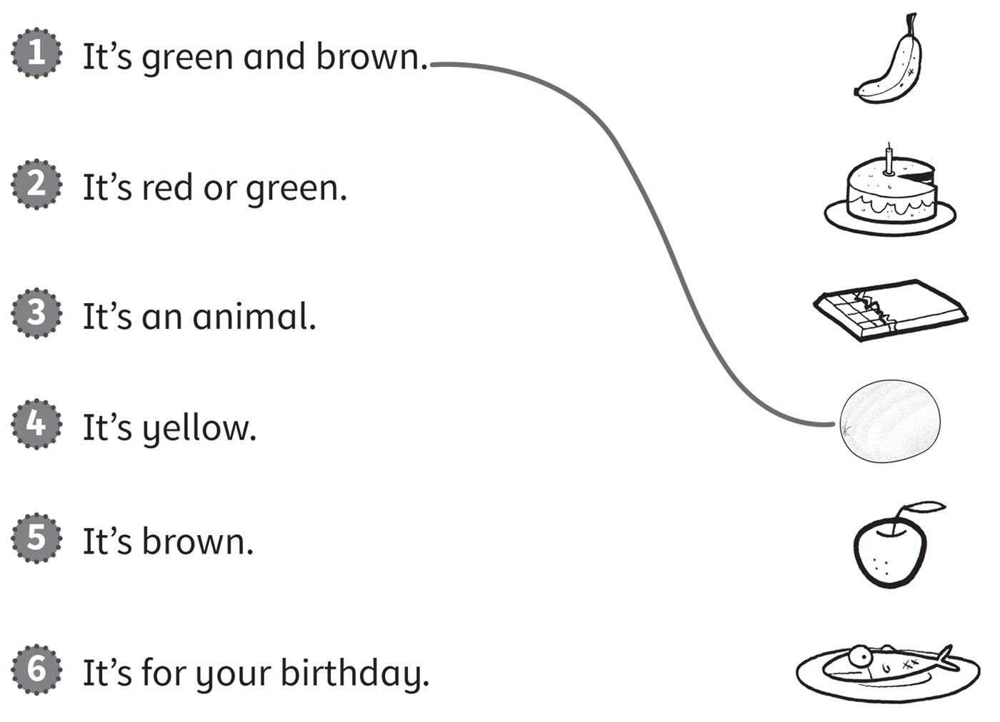
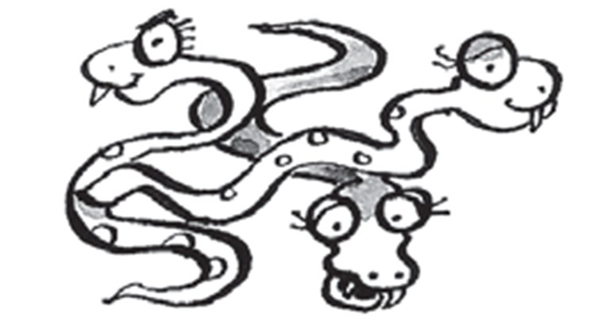
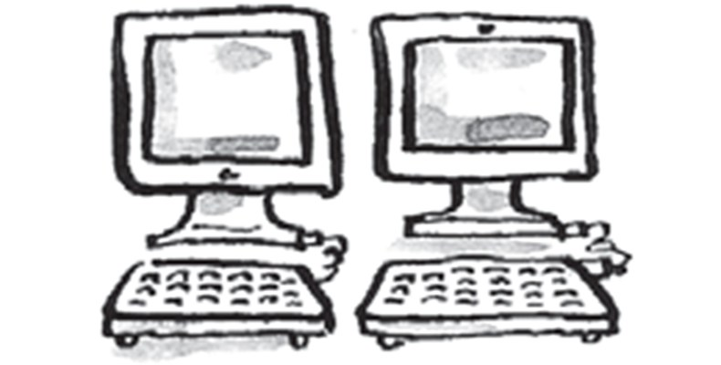
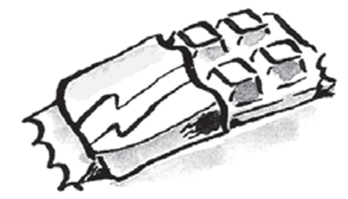
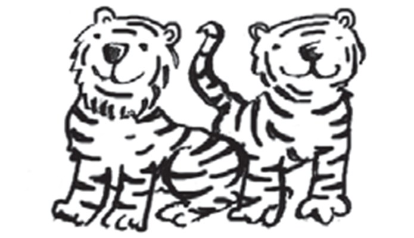
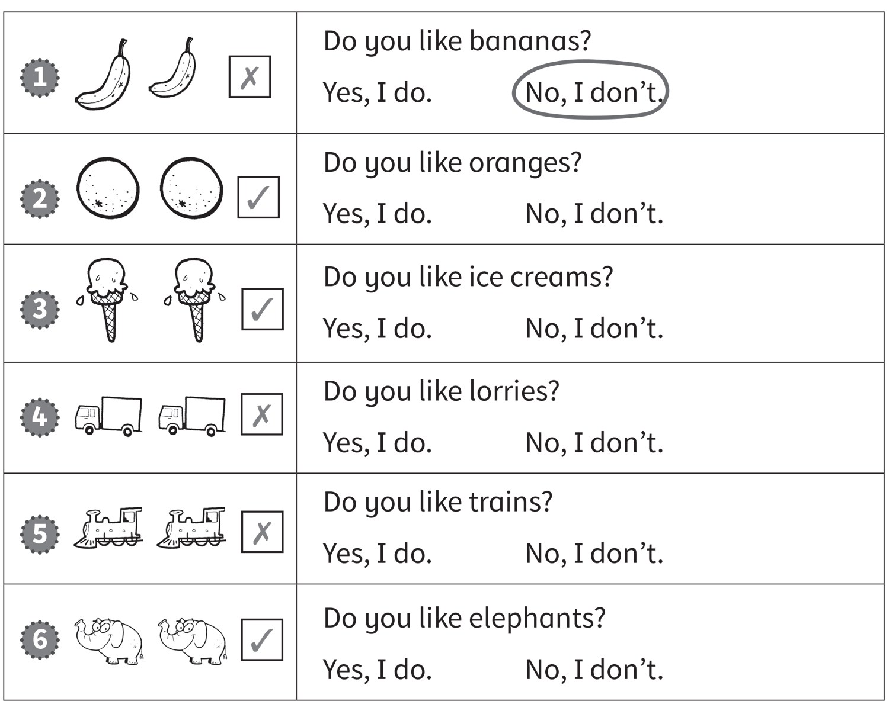
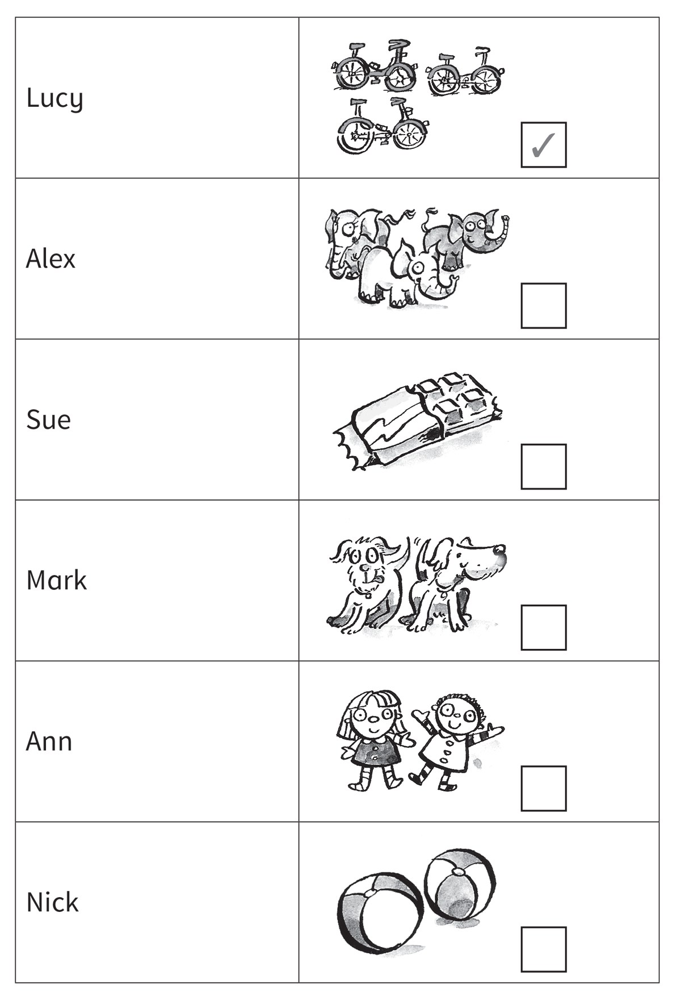
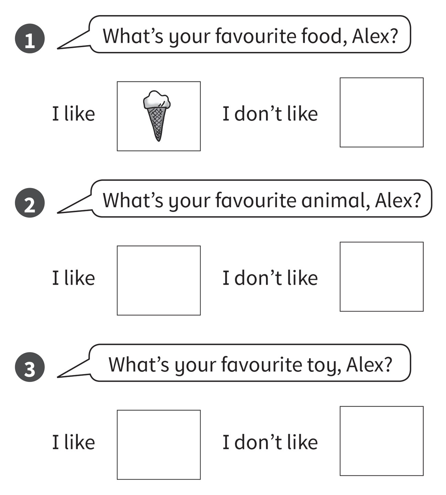

**[Vocabulary]{.underline}**

**1. Complete the words. There is one example.   (one point each)**

1\. a*[pp]{.underline}*l*[e]{.underline}*

2\. ch_c_l_t\_

*chocolate*

3\. b_r_e\_

*burger*

4\. i_e c_e_m

*ice cream*

5\. k_w\_

*kiwi*

6\. c_k\_

*cake*

**2. Look and write the name. There is one example.   (one point each)**

1\. *[Ben]{.underline}*'s eating an apple.

2\. *Bill*'s eating an ice cream.

3\. *Sam*'s eating a banana.

4\. *Dan*'s eating chocolate.

5\. *Pat*'s eating a hamburger.

6\. *Tom*'s eating cake.

**3. Look, read and draw lines. There is one example.   (one point
each)**

*2. apple*

*3. fish*

*4. banana*

*5. chocolate*

*6. cake*

**[Grammar]{.underline}**

**4. Look and read. Draw a ☺ or a ☹. There is one example.   (one point
each)**

1\. I don't like hamburgers.

*☹*

2\. I don't like snakes.

*☹*

3\. I like computers.

*☺*

4\. I like chocolate.

*☺*

5\. I don't like tigers.

*☹*

6\. I like apples.

*☺*

**5. Look and read. Circle. There is one example.   (one point each)**

*2. Yes, I do.*

*3. Yes, I do.*

*4. No, I don't.*

*5. No, I don't.*

*6. Yes, I do.*

**[Listening]{.underline}**

**6. Listen and circle the tick or the cross. There is one
example.   (one point each)**

*Simon: bananas -- ✓, chocolate -- ✗*

*Stella: ice cream -- ✓, cake -- ✗, apples -- ✓*

**Audio script**

**Simon:** I don't like burgers. I like bananas. I don't like chocolate.

**Stella:** I like ice cream. I don't like cake. I like apples.

**7. Listen and tick or cross. There is one example.   (one point
each)**

*2. Alex -- elephants ✓*

*3. Sue -- chocolate ✗*

*4. Mark -- dogs ✗*

*5. Ann -- dolls ✓*

*6. Nick -- balls ✓*

**Audio script**

**Woman:** Lucy, do you like bikes?

**Lucy:** Yes, I do.

**Woman:** Alex, do you like elephants?

**Alex:** Yes, I do. They're my favourite animal.

**Woman:** Sue, do you like chocolate?

**Sue:** No, I don't.

**Woman:** Mark, do you like dogs?

**Mark:** No, I don't. I like cats!

**Woman:** Ann, do you like dolls?

**Ann:** Yes, I do. I've got two dolls.

**Woman:** Nick, do you like balls?

**Nick:** Yes, I do. I like football and basketball.

**[Reading]{.underline}**

**8. Read and draw. There is one example.   (one point each)**

*1. don't like -- drawing of a banana*

*2. like -- drawing of a snake, don't like -- drawing of a crocodile*

*3. like -- drawing of a helicopter, don't like -- drawing of a car*

