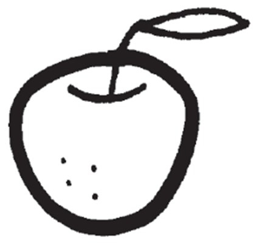
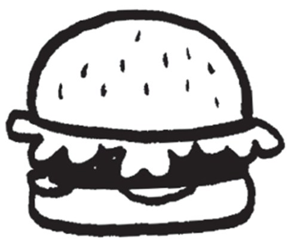
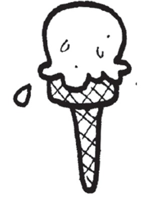
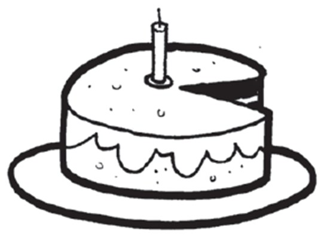
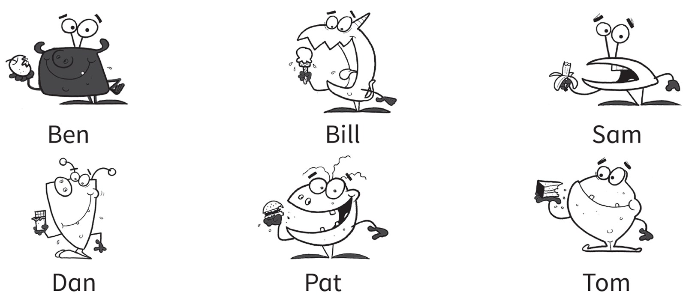
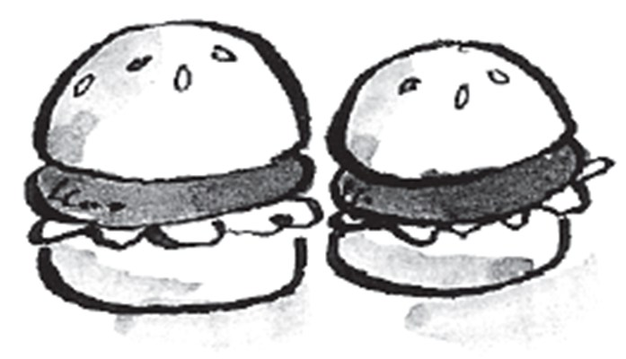
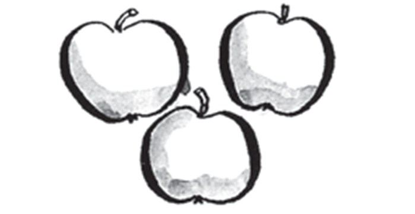
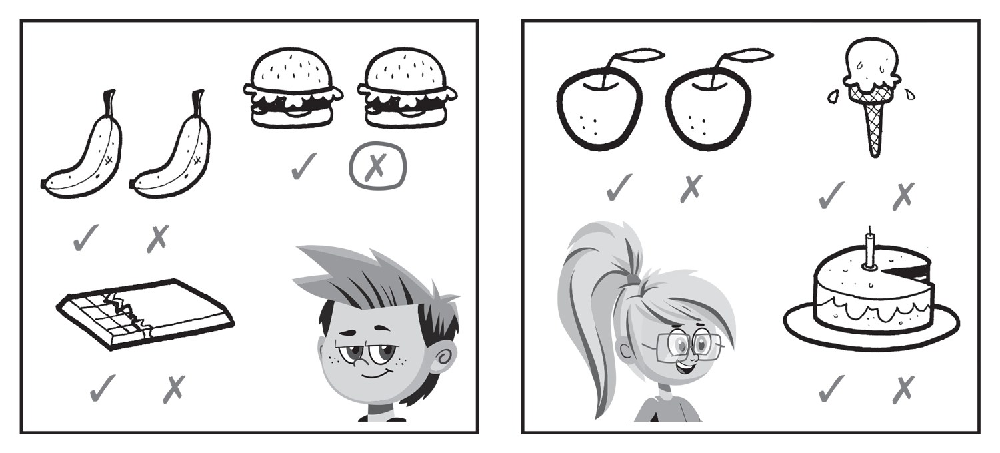
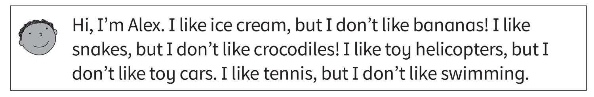

**[Vocabulary]{.underline}**

**1. Complete the words. There is one example.   (one point each)**

1\. a*[pp]{.underline}*l*[e]{.underline}*

2\. ch_c_l_t\_

3\. b_r_e\_

4\. i_e c_e_m

5\. k_w\_

6\. c_k\_

**2. Look and write the name. There is one example.   (one point each)**

1\. *[Ben]{.underline}*'s eating an apple.

2\. \_\_\_\_\_\_\_\_\_\_\_'s eating an ice cream.

3\. \_\_\_\_\_\_\_\_\_\_\_'s eating a banana.

4\. \_\_\_\_\_\_\_\_\_\_\_'s eating chocolate.

5\. \_\_\_\_\_\_\_\_\_\_\_'s eating a hamburger.

6\. \_\_\_\_\_\_\_\_\_\_\_'s eating cake.

**3. Look, read and draw lines. There is one example.   (one point
each)**

**[Grammar]{.underline}**

**4. Look and read. Draw a ☺ or a ☹. There is one example.   (one point
each)**

1\. I don't like hamburgers.

2\. I don't like snakes.

3\. I like computers.

4\. I like chocolate.

5\. I don't like tigers.

6\. I like apples.

**5. Look and read. Circle. There is one example.   (one point each)**

**[Listening]{.underline}**

**6. Listen and circle the tick or the cross. There is one
example.   (one point each)**

**7. Listen and tick or cross. There is one example.   (one point
each)**

**[Reading]{.underline}**

**8. Read and draw. There is one example.   (one point each)**

