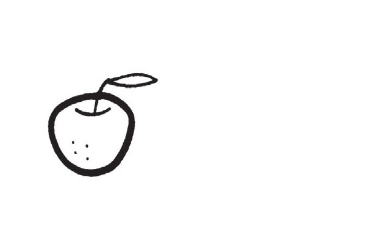
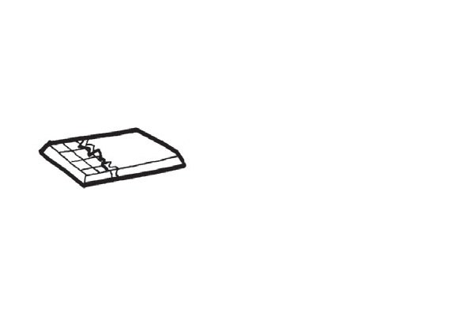
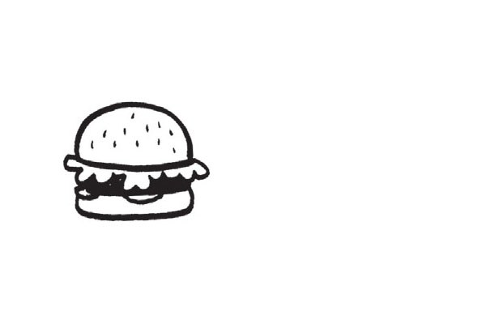
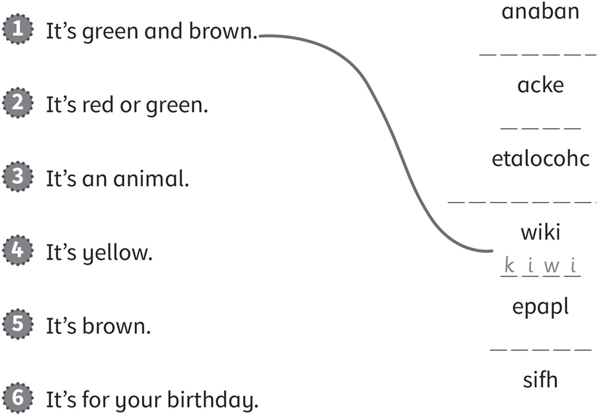
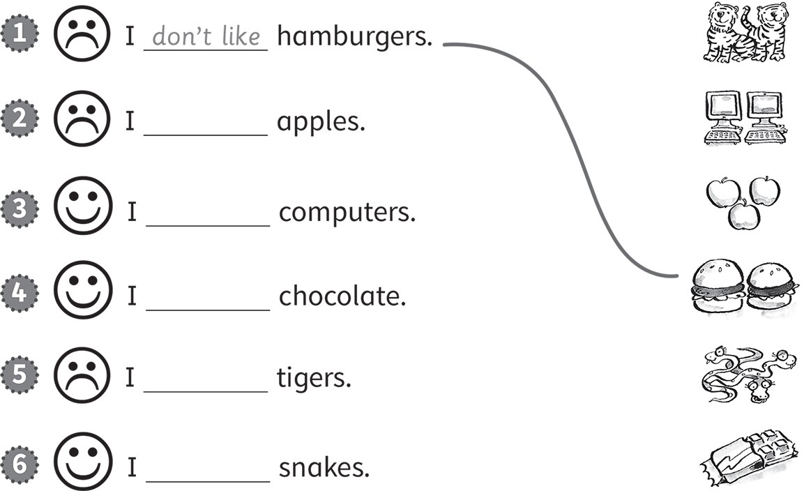
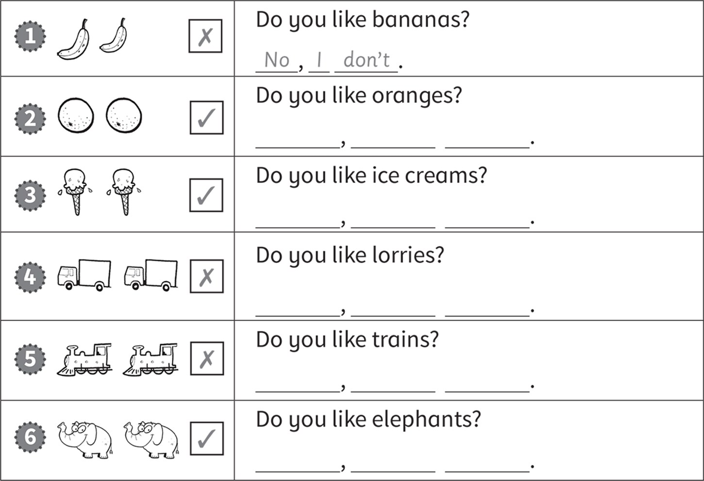
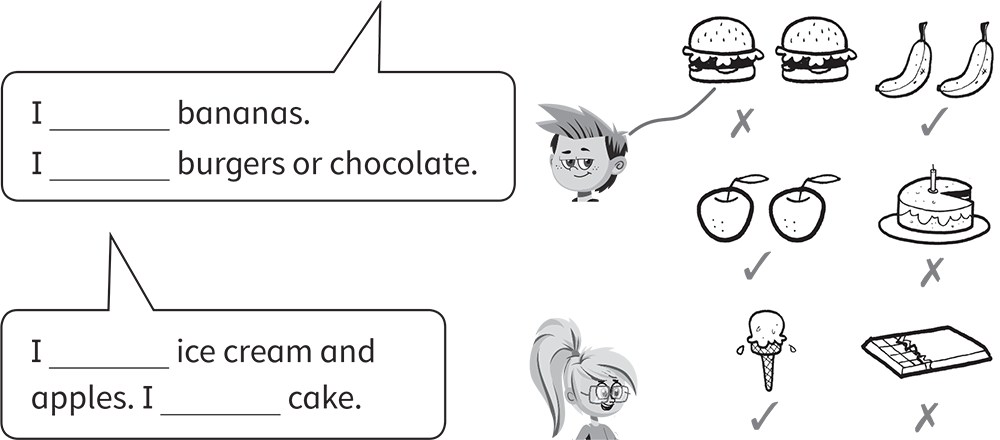
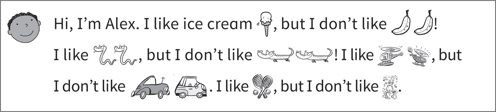

**[Vocabulary]{.underline}**

**1. Find and circle. Then write. There is one example.   (one point
each)**

  ---------------------------------------------------------------------------------------------------------------------------------------------------------------------------------------------------------------------- -- ------------------------------------------------------------------------------------------------------------------------------------------------------------------------------------------------------------------- -- -------------------------------------------------------------------------------------------------------------------------------------------------------------------------------------------------------------------
   1.            
  *[apple]{.underline}*                                                                                                                                                                                                     2. *chocolate*                                                                                                                                                                                                         3. *burger*

  ---------------------------------------------------------------------------------------------------------------------------------------------------------------------------------------------------------------------- -- ------------------------------------------------------------------------------------------------------------------------------------------------------------------------------------------------------------------- -- -------------------------------------------------------------------------------------------------------------------------------------------------------------------------------------------------------------------

  ------------------------------------------------------------------------------------------------------------------------------------------------------------------------------------------------------------------- -- ------------------------------------------------------------------------------------------------------------------------------------------------------------------------------------------------------------------- -- -------------------------------------------------------------------------------------------------------------------------------------------------------------------------------------------------------------------
              
  4. *ice cream*                                                                                                                                                                                                         5. *kiwi*                                                                                                                                                                                                              6. *cake*

  ------------------------------------------------------------------------------------------------------------------------------------------------------------------------------------------------------------------- -- ------------------------------------------------------------------------------------------------------------------------------------------------------------------------------------------------------------------- -- -------------------------------------------------------------------------------------------------------------------------------------------------------------------------------------------------------------------

**2. Look and write the name. There is one example.   (one point each)**

  ------------------------------- --- -----------------------------------
  1\. Who is eating cake?             *[Tom]{.underline}*

  ------------------------------- --- -----------------------------------

  ------------------------------- --- -----------------------------------
  2\. Who is eating a banana?         *Sam*

  ------------------------------- --- -----------------------------------

  ------------------------------- --- -----------------------------------
  3\. Who is eating a hamburger?      *Pat*

  ------------------------------- --- -----------------------------------

  ------------------------------- --- -----------------------------------
  4\. Who is eating an apple?         *Ben*

  ------------------------------- --- -----------------------------------

  ------------------------------- --- -----------------------------------
  5\. Who is eating chocolate?        *Dan*

  ------------------------------- --- -----------------------------------

  ------------------------------- --- -----------------------------------
  6\. Who is eating an ice cream?     *Bill*

  ------------------------------- --- -----------------------------------

**3. Read and put the letters in order. Draw lines. There is one
example.   (one point each)**

*2. apple*

*3. fish*

*4. banana*

*5. chocolate*

*6. cake*

**[Grammar]{.underline}**

**4. Look, read and draw lines. Write *like / don't like*. There is one
example.   (one point each)**

*2. don't like -- apples*

*3. like -- computers*

*4. like -- chocolate*

*5. don't like -- tigers*

*6. like -- snakes*

**5. Look and write the answer. There is one example.   (one point
each)**

do \| I \| don't \| No \| Yes

*1. [No, I don't.]{.underline}*

*2. Yes, I do.*

*3. No, I don't.*

*4. No, I don't.*

*5. Yes, I do.*

**[Listening]{.underline}**

**6. Listen and draw lines. Then complete the sentences. There is one
example.   (one point each)**

*1. Simon: bananas -- ✓, chocolate -- ✗*

*2. Stella: ice cream -- ✓, cake -- ✗, apples -- ✓*

**Audio script**

**Simon**: I don't like burgers. I like bananas. I don't like chocolate.

**Stella**: I like ice cream. I don't like cake. I like apples.

**7. Listen and circle. Then tick or cross. There is one example.   (one
point each)**

*2. Alex -- elephants ✓*

*3. Sue -- chocolate ✗*

*4. Mark -- dogs ✗*

*5. Ann -- dolls ✓*

*6. Nick -- balls ✓*

**Audio script**

**Woman**: Lucy, do you like bikes?

**Lucy**: Yes, I do.

**Woman**: Alex, do you like elephants?

**Alex**: Yes, I do. They're my favourite animal.

**Woman**: Sue, do you like chocolate?

**Sue**: No, I don't.

**Woman**: Mark, do you like dogs?

**Mark**: No, I don't. I like cats!

**Woman**: Ann, do you like dolls?

**Ann**: Yes, I do. I've got two dolls.

**Woman**: Nick, do you like balls?

**Nick**: Yes, I do. I like football and basketball.

**[Reading]{.underline}**

**8. Read and write your answer. There is one example.   (one point
each)**

1\. What's your favourite food, Alex?

    I like *[ice cream]{.underline}*, but I don't like
\_\_\_\_\_\_\_\_\_\_\_\_\_\_\_.

*bananas*

2\. What's your favourite animal, Alex?

    I like \_\_\_\_\_\_\_\_\_\_\_\_\_\_\_, but I don't like
\_\_\_\_\_\_\_\_\_\_\_\_\_\_\_.

*snakes, crocodiles*

3\. What's your favourite toy, Alex?

    I like \_\_\_\_\_\_\_\_\_\_\_\_\_\_\_, but I don't like
\_\_\_\_\_\_\_\_\_\_\_\_\_\_\_.

*helicopters, cars*

