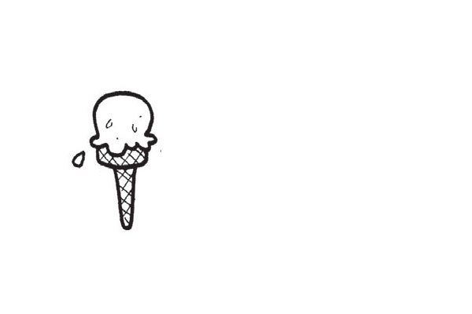
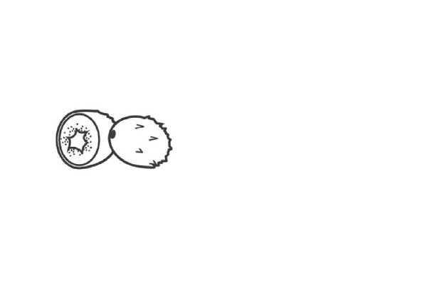
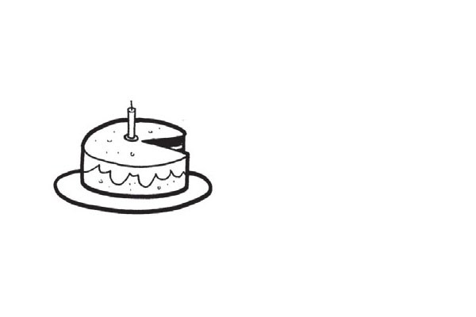
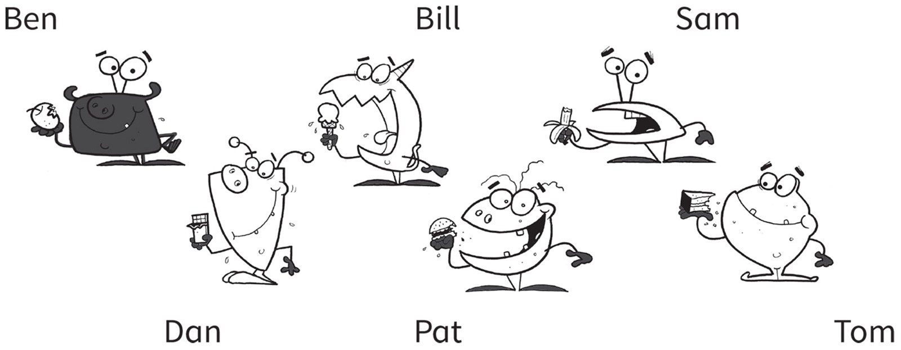
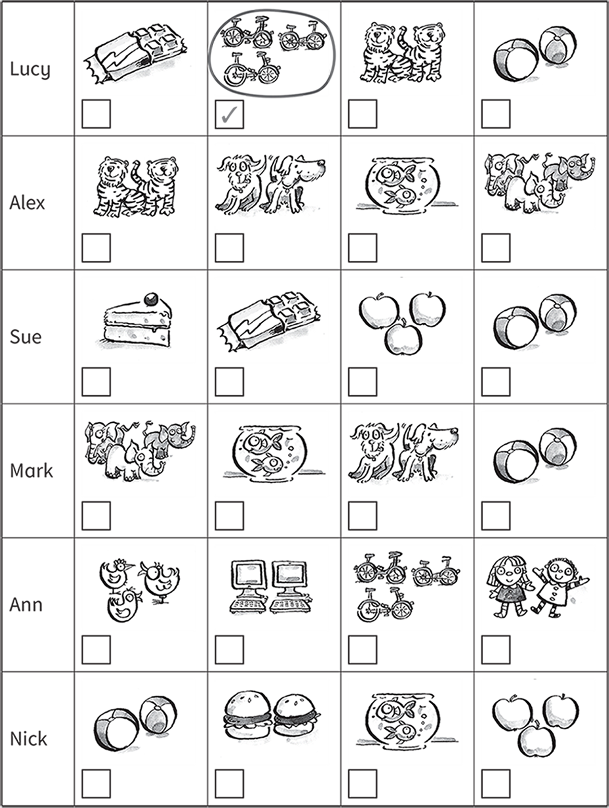

**[Vocabulary]{.underline}**

**1. Find and circle. Then write. There is one example.   (one point
each)**

  ------------------------------------------------------------------------------------------------------------------------------------------------------------------------------------------------------------------------- -- ---------------------------------------------------------------------------------------------------------------------------------------------------------------------------------------------------------------------- -- ----------------------------------------------------------------------------------------------------------------------------------------------------------------------------------------------------------------------
   1.            
  *[apple]{.underline}*                                                                                                                                                                                                        2. \_\_\_\_\_\_\_\_\_                                                                                                                                                                                                     3. \_\_\_\_\_\_\_\_\_

  ------------------------------------------------------------------------------------------------------------------------------------------------------------------------------------------------------------------------- -- ---------------------------------------------------------------------------------------------------------------------------------------------------------------------------------------------------------------------- -- ----------------------------------------------------------------------------------------------------------------------------------------------------------------------------------------------------------------------

  ---------------------------------------------------------------------------------------------------------------------------------------------------------------------------------------------------------------------- -- ---------------------------------------------------------------------------------------------------------------------------------------------------------------------------------------------------------------------- -- ----------------------------------------------------------------------------------------------------------------------------------------------------------------------------------------------------------------------
              
  4. \_\_\_\_\_\_\_\_\_                                                                                                                                                                                                     5. \_\_\_\_\_\_\_\_\_                                                                                                                                                                                                     6. \_\_\_\_\_\_\_\_\_

  ---------------------------------------------------------------------------------------------------------------------------------------------------------------------------------------------------------------------- -- ---------------------------------------------------------------------------------------------------------------------------------------------------------------------------------------------------------------------- -- ----------------------------------------------------------------------------------------------------------------------------------------------------------------------------------------------------------------------

**2. Look and write the name. There is one example.   (one point each)**

  ------------------------------- --- -----------------------------------
  1\. Who is eating cake?             *[Tom]{.underline}*

  ------------------------------- --- -----------------------------------

  ------------------------------- --- -----------------------------------
  2\. Who is eating a banana?         \_\_\_\_\_

  ------------------------------- --- -----------------------------------

  ------------------------------- --- -----------------------------------
  3\. Who is eating a hamburger?      \_\_\_\_\_

  ------------------------------- --- -----------------------------------

  ------------------------------- --- -----------------------------------
  4\. Who is eating an apple?         \_\_\_\_\_

  ------------------------------- --- -----------------------------------

  ------------------------------- --- -----------------------------------
  5\. Who is eating chocolate?        \_\_\_\_\_

  ------------------------------- --- -----------------------------------

  ------------------------------- --- -----------------------------------
  6\. Who is eating an ice cream?     \_\_\_\_\_

  ------------------------------- --- -----------------------------------

**3. Read and put the letters in order. Draw lines. There is one
example.   (one point each)**

**[Grammar]{.underline}**

**4. Look, read and draw lines. Write *like / don't like*. There is one
example.   (one point each)**

**5. Look and write the answer. There is one example.   (one point
each)**

do \| I \| don't \| No \| Yes

**[Listening]{.underline}**

**6. Listen and draw lines. Then complete the sentences. There is one
example.   (one point each)**

**7. Listen and circle. Then tick or cross. There is one example.   (one
point each)**

**[Reading]{.underline}**

**8. Read and write your answer. There is one example.   (one point
each)**

1\. What's your favourite food, Alex?

    I like *[ice cream]{.underline}*, but I don't like
\_\_\_\_\_\_\_\_\_\_\_\_\_\_\_.

2\. What's your favourite animal, Alex?

    I like \_\_\_\_\_\_\_\_\_\_\_\_\_\_\_, but I don't like
\_\_\_\_\_\_\_\_\_\_\_\_\_\_\_.

3\. What's your favourite toy, Alex?

    I like \_\_\_\_\_\_\_\_\_\_\_\_\_\_\_, but I don't like
\_\_\_\_\_\_\_\_\_\_\_\_\_\_\_.

