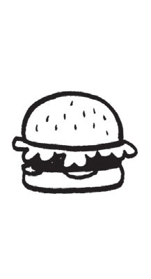
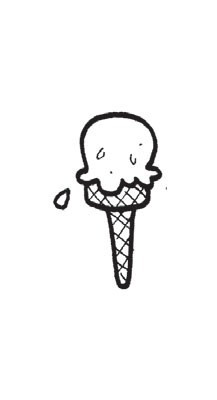
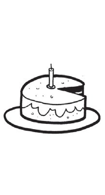
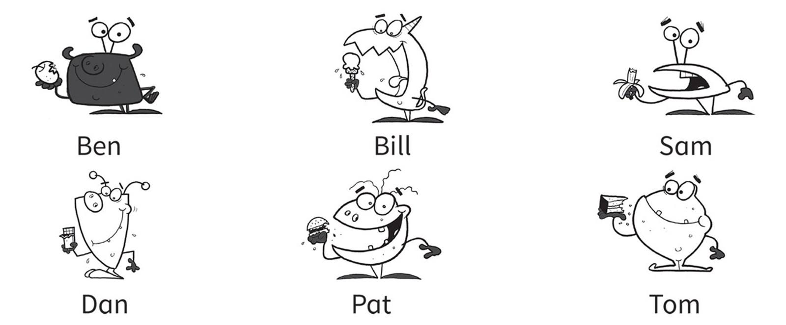
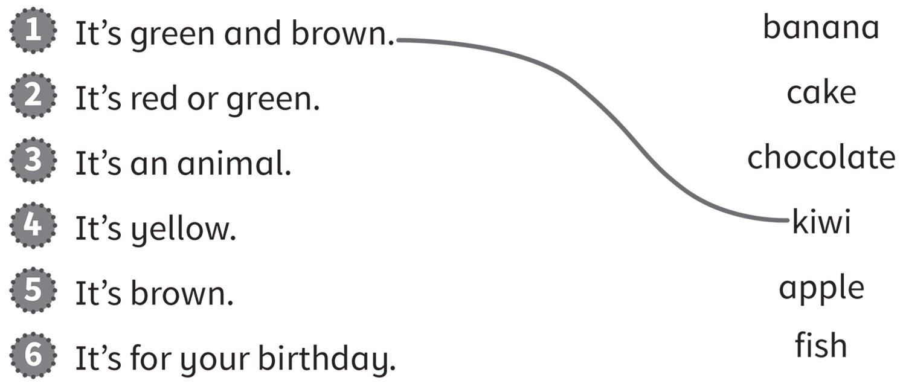
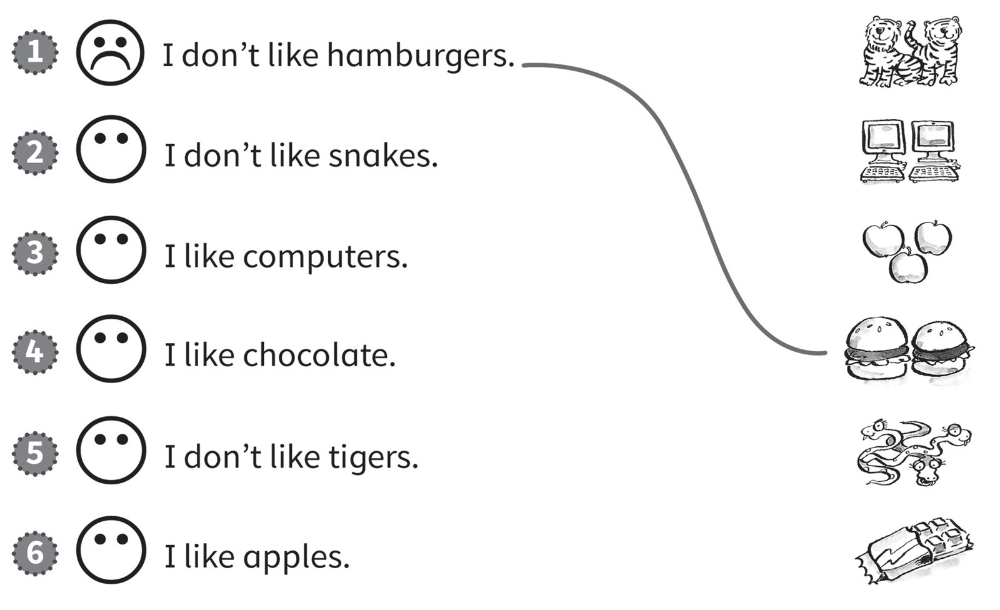
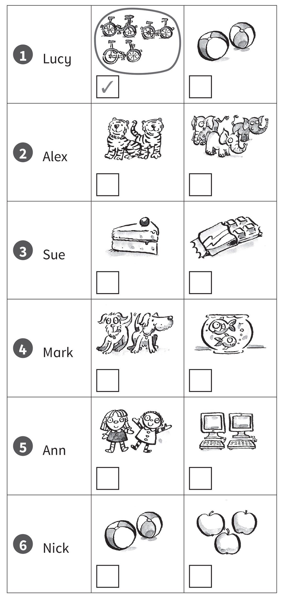
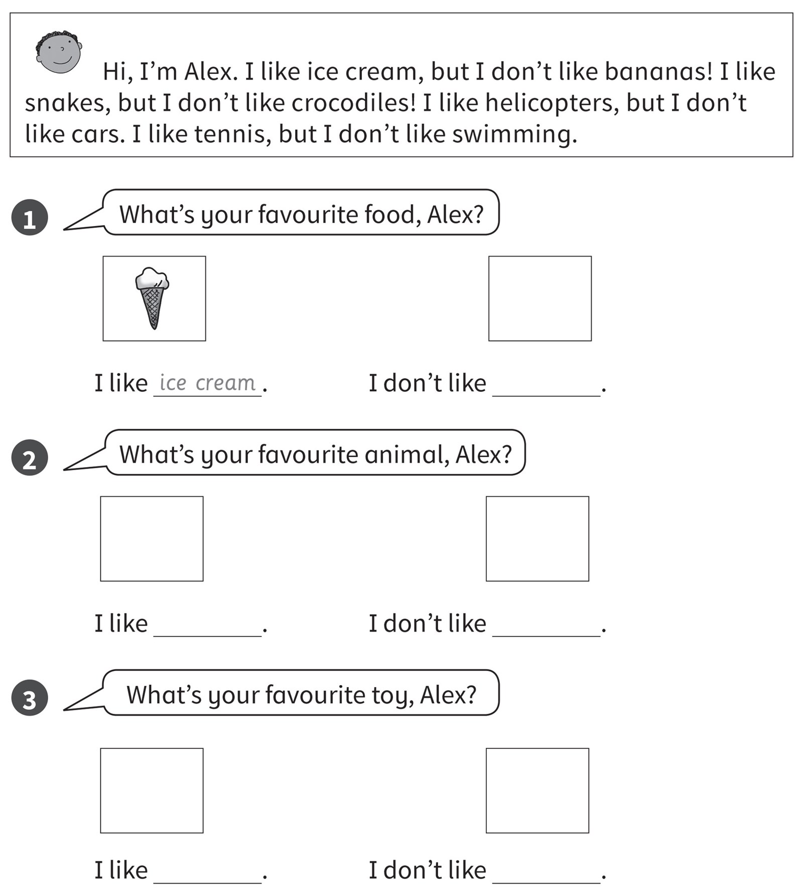

**[Vocabulary]{.underline}**

**1. Put the letters in order. Write. There is one example.   (one point
each)**

1\. paelp

    *[apple]{.underline}*

2\. ohtcoaelc

    \_\_\_\_\_\_\_\_\_\_

*chocolate*

3\. begurr

    \_\_\_\_\_\_\_\_\_\_

*burger*

4\. cie merca

    \_\_\_\_\_\_\_\_\_\_

*ice cream*

5\. iiwk

    \_\_\_\_\_\_\_\_\_\_

*kiwi*

6\. kcea

    \_\_\_\_\_\_\_\_\_\_

*cake*

**2. Look and write the name. There is one example.   (one point each)**

1\. *[Tom]{.underline}*'s eating cake.

2\. *Sam*'s eating a banana

3\. *Pat*'s eating a hamburger.

4\. *Ben*'s eating an apple.

5\. *Dan*'s eating chocolate.

6\. *Bill*'s eating an ice cream.

**3. Look, read and draw lines. There is one example.   (one point
each)**

*2. apple*

*3. fish*

*4. banana*

*5. chocolate*

*6. cake*

**[Grammar]{.underline}**

**4. Look and read. Draw lines and draw a ☺ or a ☹. There is one
example.   (one point each)**

*2. snakes ☹*

*3. computers ☺*

*4. chocolate ☺*

*5. tigers☹*

*6. apples ☺*

**5. Look and write *Yes, I do or No, I don't*. There is one
example.   (one point each)**

*1. [No, I don't.]{.underline}*

*2. Yes, I do.*

*3. Yes, I do.*

*4. No, I don't.*

*5. No, I don't.*

*6. Yes, I do.*

**[Listening]{.underline}**

**6. Listen and draw lines. There is one example.   (one point each)**

*1. Simon: bananas -- ✓, chocolate -- ✗*

*2. Stella: ice cream -- ✓, cake -- ✗, apples -- ✓*

**Audio script**

**Simon**: I don't like burgers. I like bananas. I don't like chocolate.

**Stella**: I like ice cream. I don't like cake. I like apples.

**7. Listen and circle. Then tick or cross. There is one example.   (one
point each)**

*2. Alex -- elephants ✓*

*3. Sue -- chocolate ✗*

*4. Mark -- dogs ✗*

*5. Ann -- dolls ✓*

*6. Nick -- balls ✓*

**Audio script**

**Woman**: Lucy, do you like bikes?

**Lucy**: Yes, I do.

**Woman**: Alex, do you like elephants?

**Alex**: Yes, I do. They're my favourite animal.

**Woman**: Sue, do you like chocolate?

**Sue**: No, I don't.

**Woman**: Mark, do you like dogs?

**Mark**: No, I don't. I like cats!

**Woman**: Ann, do you like dolls?

**Ann**: Yes, I do. I've got two dolls.

**Woman**: Nick, do you like balls?

**Nick**: Yes, I do. I like football and basketball.

**[Reading]{.underline}**

**8. Read, write and draw. There is one example.   (one point each)**

*1. don't like bananas -- drawing of a banana*

*2. like snakes -- drawing of a snake*

*don't like crocodiles -- drawing of a crocodile*

*3. like helicopters -- drawing of a helicopter*

*don't like cars -- drawing of a car*

