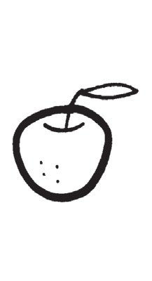
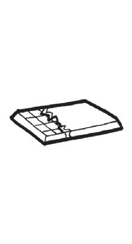
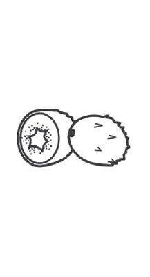
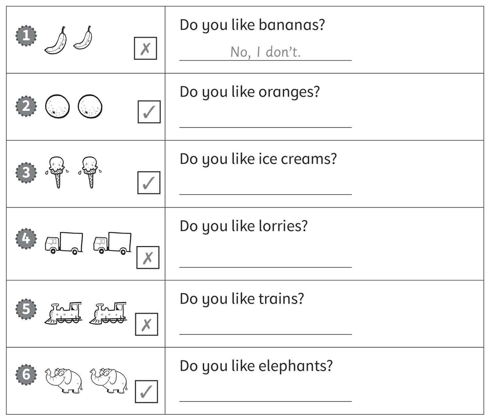
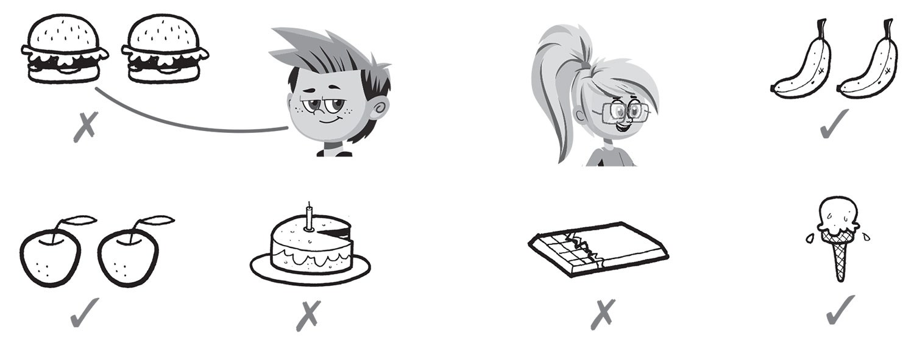

**[Vocabulary]{.underline}**

**1. Put the letters in order. Write. There is one example.   (one point
each)**

1\. paelp

    *[apple]{.underline}*

2\. ohtcoaelc

    \_\_\_\_\_\_\_\_\_\_

3\. begurr

    \_\_\_\_\_\_\_\_\_\_

4\. cie merca

    \_\_\_\_\_\_\_\_\_\_

5\. iiwk

    \_\_\_\_\_\_\_\_\_\_

6\. kcea

    \_\_\_\_\_\_\_\_\_\_

**2. Look and write the name. There is one example.   (one point each)**

1\. *[Tom]{.underline}*'s eating cake.

2\. \_\_\_\_\_\_\_\_\_\_\_'s eating a banana

3\. \_\_\_\_\_\_\_\_\_\_\_'s eating a hamburger.

4\. \_\_\_\_\_\_\_\_\_\_\_'s eating an apple.

5\. \_\_\_\_\_\_\_\_\_\_\_'s eating chocolate.

6\. \_\_\_\_\_\_\_\_\_\_\_'s eating an ice cream.

**3. Look, read and draw lines. There is one example.   (one point
each)**

**[Grammar]{.underline}**

**4. Look and read. Draw lines and draw a ☺ or a ☹. There is one
example.   (one point each)**

**5. Look and write *Yes, I do or No, I don't*. There is one
example.   (one point each)**

**[Listening]{.underline}**

**6. Listen and draw lines. There is one example.   (one point each)**

**7. Listen and circle. Then tick or cross. There is one example.   (one
point each)**

**[Reading]{.underline}**

**8. Read, write and draw. There is one example.   (one point each)**

