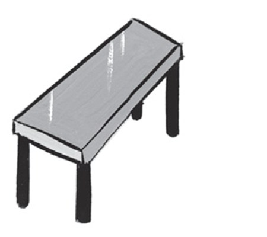
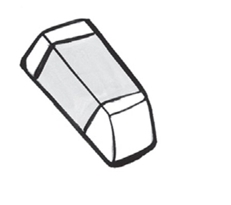
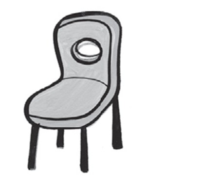
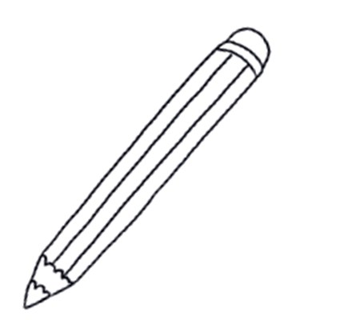
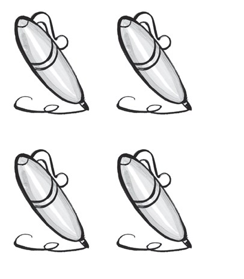
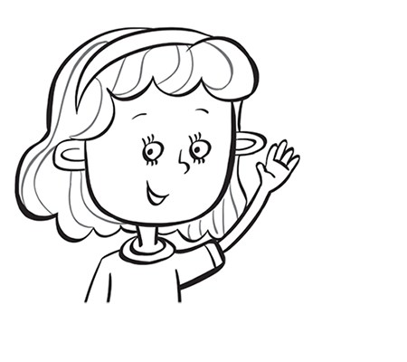
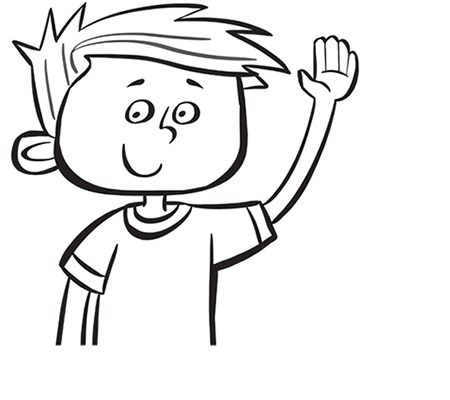
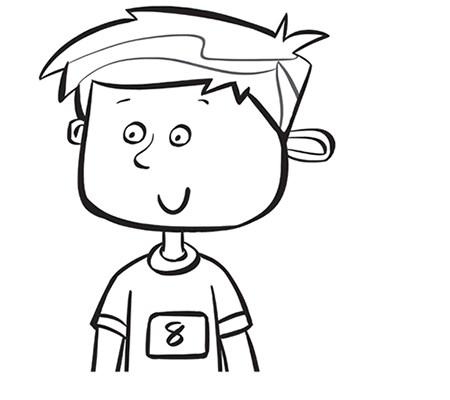
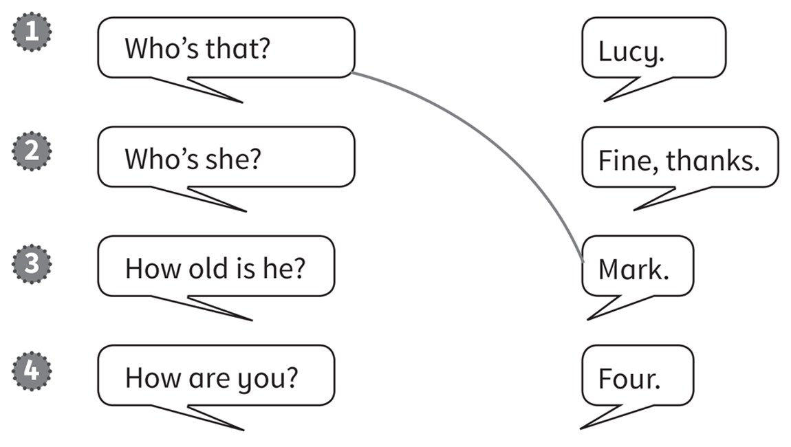
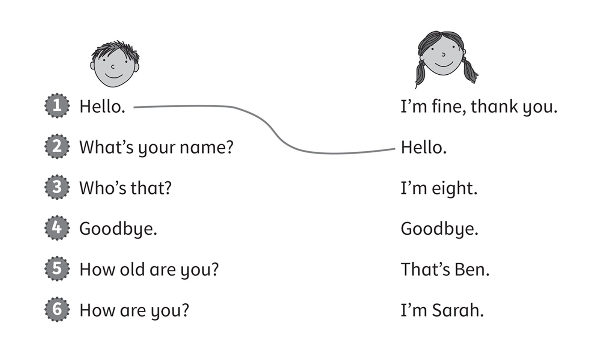

**[Vocabulary]{.underline}**

**1. Complete the words. There is one example.   (one point each)**

~~b~~ \| a \| e \| s \| p \| i

1\. *[b]{.underline}*ook

2\. t_ble

*table*

3\. \_en

*pen*

4\. era_er

*eraser*

5\. cha_r

*chair*

6\. p_ncil

*pencil*

**2. Count and circle the tick or cross. There is one example.   (one
point each)**

1\.

four
✓  *[✗]{.underline}*

2\.

two
✓  ✗

*✓*

3\.

three
✓  ✗

*✗*

4\.

five
✓  ✗

*✓*

5\.

six
✓  ✗

*✗*

6\.

one
✓  ✗

*✗*

**[Grammar]{.underline}**

**3. Look, read and circle the correct words. There is one
example.   (one point each)**

1\. *He's* / *[She's]{.underline}* Anna.

2\. *He's* / *She's* Dan.

*He's*

3\. *He's* / *She's* 8.

*He's*

4\. *He's* / *She's* 7.

*She's*

**4. Read and draw lines. There is one example.   (one point each)**

*2. Lucy*

*3. Four*

*4. Fine, thanks*

**[Listening]{.underline}**

**5. Listen and write the number. There is one example.   (one point
each)**

*2. two chairs*

*3. one book*

*4. five erasers*

*5. six pencils*

*6. four pens*

**Audio script**

1 -- three tables

2 -- two chairs

3 -- one book

4 -- five erasers

5 -- six pencils

6 -- four pens.

**6. Listen and draw lines.   (one point each)**

*2. What's your name? I'm Sarah.*

*3. Who's that? That's Ben.*

*4. Goodbye. Goobye.*

*5. How old are you? I'm eight.*

*6. How are you? I'm fine, thank you.*

**Audio script**

1\. **Boy:** Hello. Girl: Hello.

2\. **Boy:** What's your name? Girl: I'm Sarah.

3\. **Boy:** Who's that? Girl: That's Ben.

4\. **Boy:** Goodbye. Girl: Goodbye.

5\. **Boy:** How old are you? Girl: I'm eight.

6\. **Boy:** How are you? Girl: I'm fine, thank you.

**[Reading]{.underline}**

**7. Read and colour.   (one point each)**

*2. chair (red)*

*3. eraser (pink)*

*4. pencil (orange)*

*5. pen (blue)*

*6. book (purple)*

**8. Look and circle.   (one point each)**

*2. How old is she? -- She's 5.*

*3. What colour is the book? -- It's red.*

