**[Vocabulary]{.underline}**

**1. Complete the words. There is one example.   (one point each)**

~~b~~ \| a \| e \| s \| p \| i

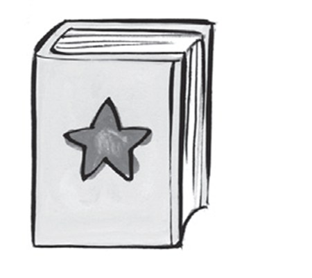

1\. *[b]{.underline}*ook

2\. t_ble

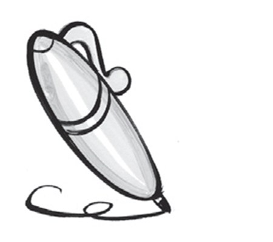

3\. \_en

4\. era_er

5\. cha_r

6\. p_ncil

**2. Count and circle the tick or cross. There is one example.   (one
point each)**

1\.

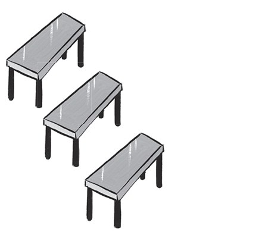four
✓  *[✗]{.underline}*

2\.

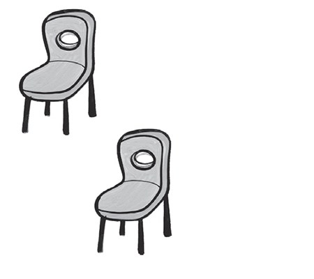two
✓  ✗

3\.

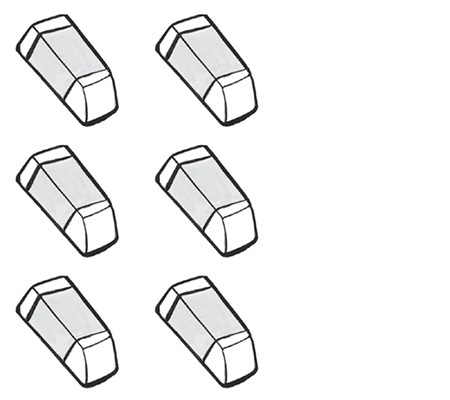three
✓  ✗

4\.

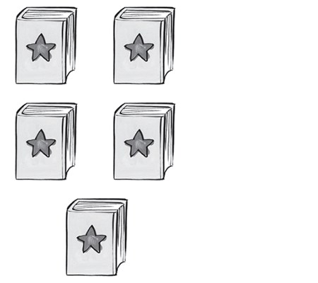five
✓  ✗

5\.

six
✓  ✗

6\.

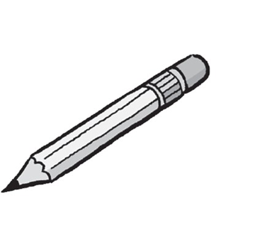one
✓  ✗

**[Grammar]{.underline}**

**3. Look, read and circle the correct words. There is one
example.   (one point each)**

1\. *He's* / *[She's]{.underline}* Anna.

2\. *He's* / *She's* Dan.

3\. *He's* / *She's* 8.

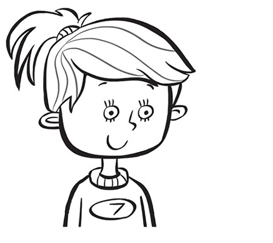

4\. *He's* / *She's* 7.

**4. Read and draw lines. There is one example.   (one point each)**

**[Listening]{.underline}**

**5. Listen and write the number. There is one example.   (one point
each)**

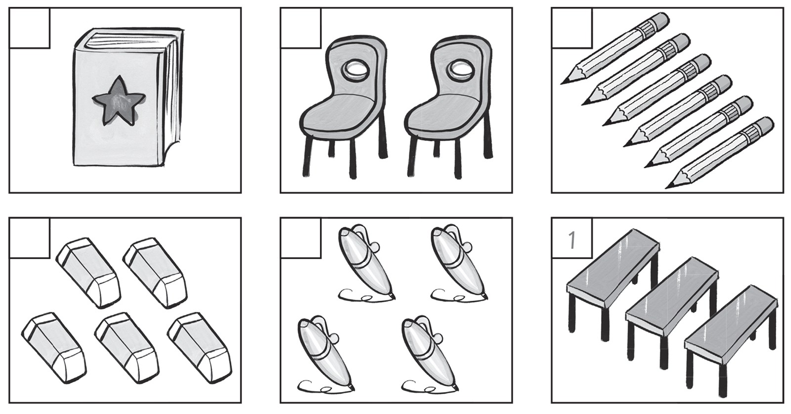

**6. Listen and draw lines.   (one point each)**

**[Reading]{.underline}**

**7. Read and colour.   (one point each)**

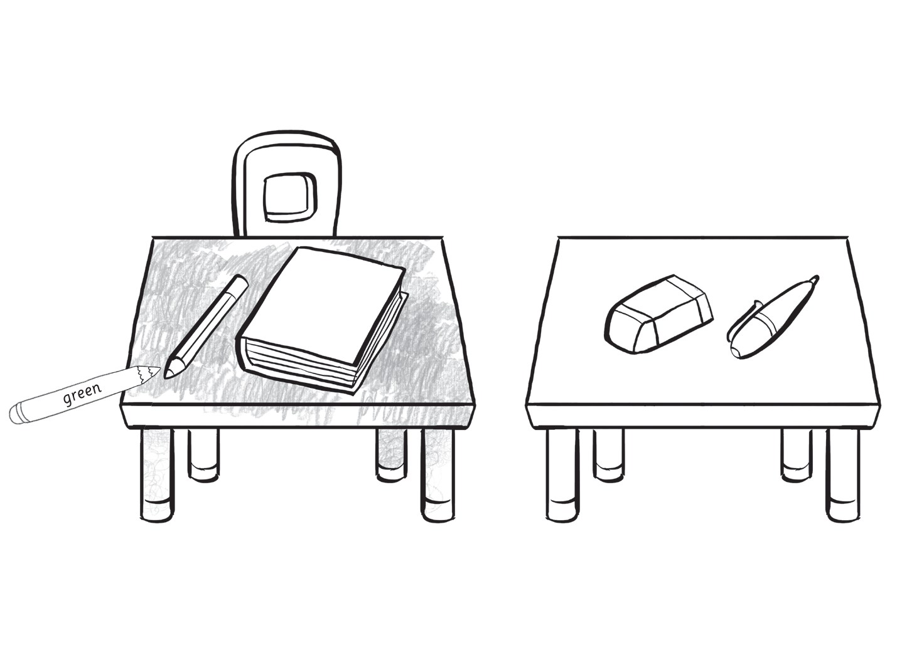

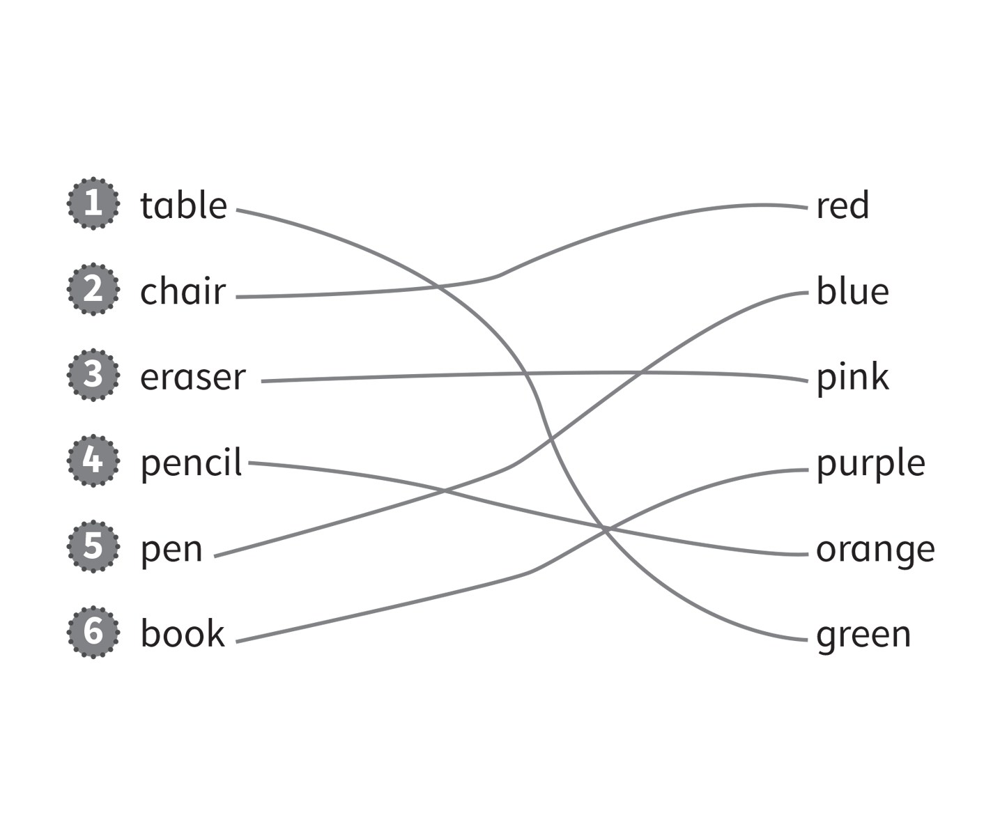

**8. Look and circle.   (one point each)**

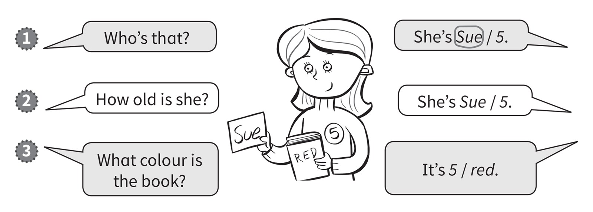

