**[Vocabulary]{.underline}**

**1. Complete the words. There is one example.   (one point each)**

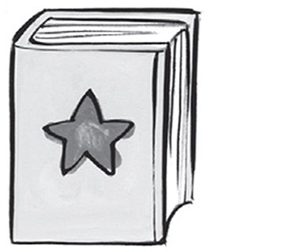

1\. b *[o]{.underline}* *[o]{.underline}* *[k]{.underline}*

2\. t \_ \_ \_ \_

*table*

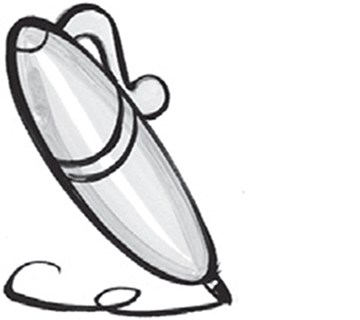

3\. p \_ \_

*pen*

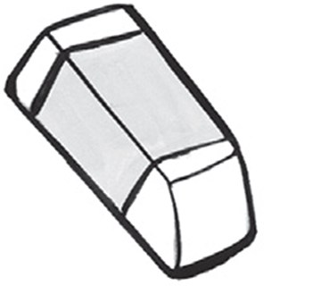

4\. e \_ \_ \_ \_ \_

*eraser*

5\. c \_ \_ \_ \_

*chair*

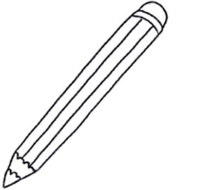

6\. p \_ \_ \_ \_ \_

*pencil*

**2. Count and write the number. There is one example.   (one point
each)**

  ------------------------------------------------------------------------------------------------------------------------------------------------------------------------------------------------------------------- -- ---------------------------------------------------------------------------------------------------------------------------------------------------------------------------------------------------------------- -- ----------------------------------------------------------------------------------------------------------------------------------------------------------------------------------------------------------------
  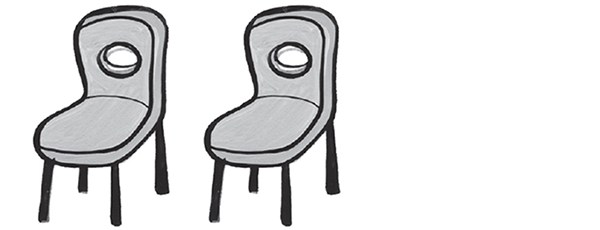 1.      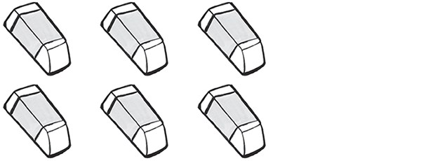      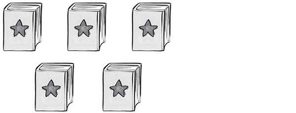
  *[two]{.underline}*                                                                                                                                                                                                    2. *six (erasers)*                                                                                                                                                                                                  3. *five (books)*

  ------------------------------------------------------------------------------------------------------------------------------------------------------------------------------------------------------------------- -- ---------------------------------------------------------------------------------------------------------------------------------------------------------------------------------------------------------------- -- ----------------------------------------------------------------------------------------------------------------------------------------------------------------------------------------------------------------

  ----------------------------------------------------------------------------------------------------------------------------------------------------------------------------------------------------------------- -- -----------------------------------------------------------------------------------------------------------------------------------------------------------------------------------------------------------------
        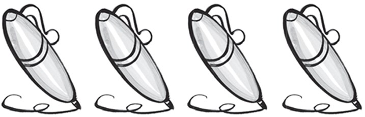
  4. *three (tables)*                                                                                                                                                                                                  5. *four (pens)*

  ----------------------------------------------------------------------------------------------------------------------------------------------------------------------------------------------------------------- -- -----------------------------------------------------------------------------------------------------------------------------------------------------------------------------------------------------------------

  -----------------------------------------------------------------------------------------------------------------------------------------------------------------------------------------------------------------
  
  6. *(one)*

  -----------------------------------------------------------------------------------------------------------------------------------------------------------------------------------------------------------------

**[Grammar]{.underline}**

**3. Read and write *He's* or *She's*. There is one example.   (one
point each)**

  -------------------------------------------------------------------------------------------------------------------------------------------------------------------------------------------------------------------- -- ----------------------------------------------------------------------------------------------------------------------------------------------------------------------------------------------------------------- -- -----------------------------------------------------------------------------------------------------------------------------------------------------------------------------------------------------------------
   1.      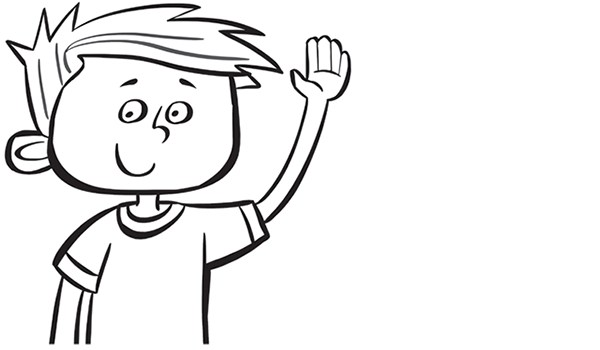      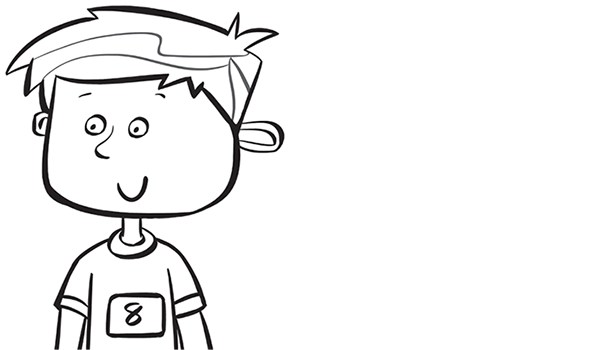
  *[She's]{.underline}* Anna.                                                                                                                                                                                             2. *He's* Dan.                                                                                                                                                                                                       3. *He's* eight.

  -------------------------------------------------------------------------------------------------------------------------------------------------------------------------------------------------------------------- -- ----------------------------------------------------------------------------------------------------------------------------------------------------------------------------------------------------------------- -- -----------------------------------------------------------------------------------------------------------------------------------------------------------------------------------------------------------------

  -----------------------------------------------------------------------------------------------------------------------------------------------------------------------------------------------------------------
  
  4. *She's* seven.

  -----------------------------------------------------------------------------------------------------------------------------------------------------------------------------------------------------------------

**4. Read and complete the sentences. There is one example.   (one point
each)**

I'm \| She's \| ~~He's~~ \| He's

*2. He's*

*3. He's*

*4. She's*

**[Listening]{.underline}**

**5. Listen and write the number. Draw lines. There is one
example.   (one point each)**

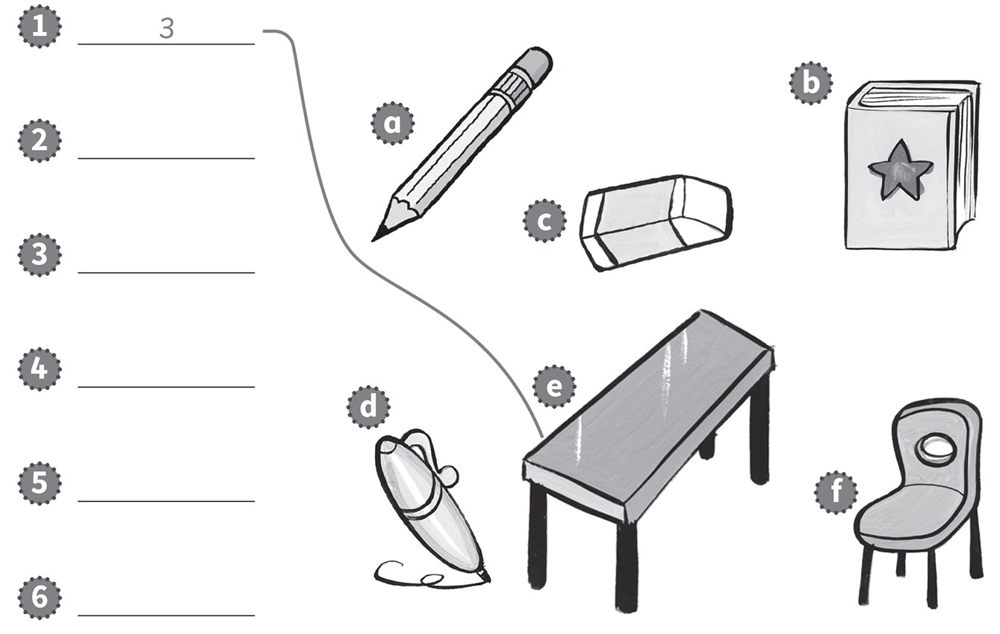

*2. two chairs f*

*3. one book b*

*4. five erasers c*

*5. six pencils a*

*6. two pens d*

**Audio script**

1\. three tables

2\. two chairs

3\. one book

4\. five erasers

5\. six pencils

6\. four pens

**6. Listen and draw lines. Circle the correct word. There is one
example.   (one point each)**

*2. What's your name? I'm Sarah.*

*3. Who's that? That's Ben.*

*4. Goodbye. Goobye.*

*5. How old are you? I'm eight.*

*6. How are you? I'm fine, thank you.*

**Audio script**

1\. **Boy:** Hello. Girl: Hello.

2\. **Boy:** What's your name? Girl: I'm Sarah.

3\. **Boy:** Who's that? Girl: That's Ben.

4\. **Boy:** Goodbye. Girl: Goodbye.

5\. **Boy:** How old are you? Girl: I'm eight.

6\. **Boy:** How are you? Girl: I'm fine, thank you.

**[Reading]{.underline}**

**7. Read and colour. Put the letters in order. There is one
example.   (one point each)**

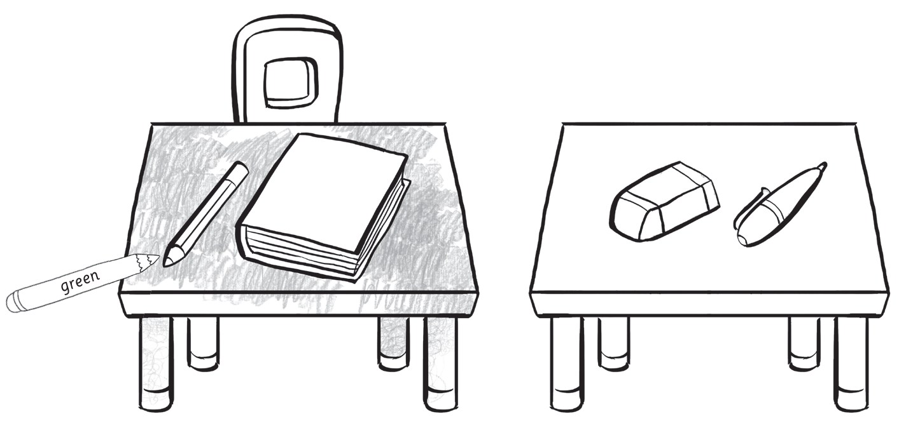

1\. The (bteal) *[table]{.underline}* is green.

2\. The (iachr) *chair (red)* is red.

3\. The (aeerrs) *eraser (pink)* is pink.

4\. The (ncpiel) *pencil (orange)* is orange.

5\. The (okob) *book (purple)* is purple.

6\. The (npe) *pen (blue)* is blue.

**8. Look and write. There is one example.   (one point each)**

1\. Who's that?

    *[She's Sue.]{.underline}*

2\. How old is she?

    \_\_\_\_\_\_\_\_\_\_\_\_

*She's five*

3\. What colour is her book?

    \_\_\_\_\_\_\_\_\_\_\_\_

*It's red*

