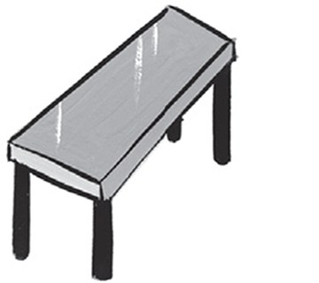
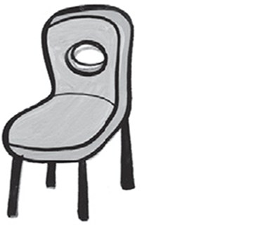
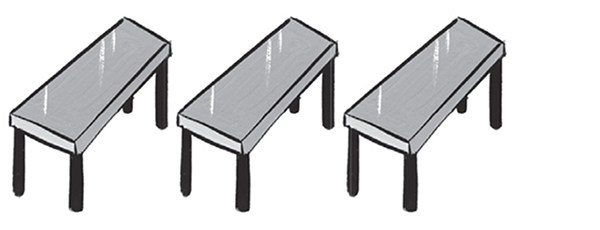
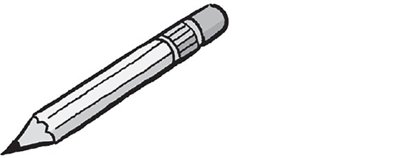
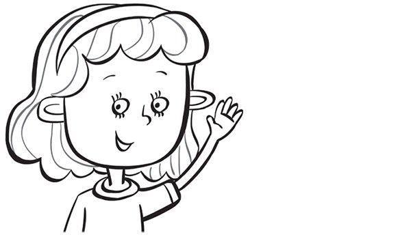
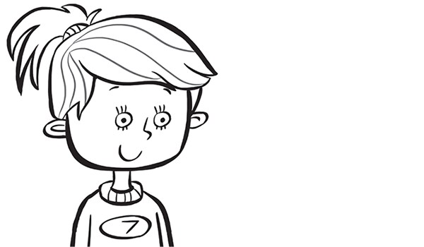
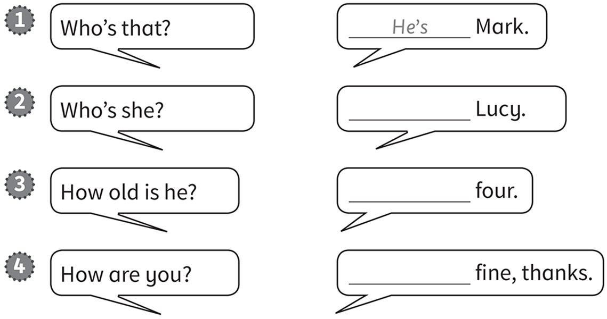
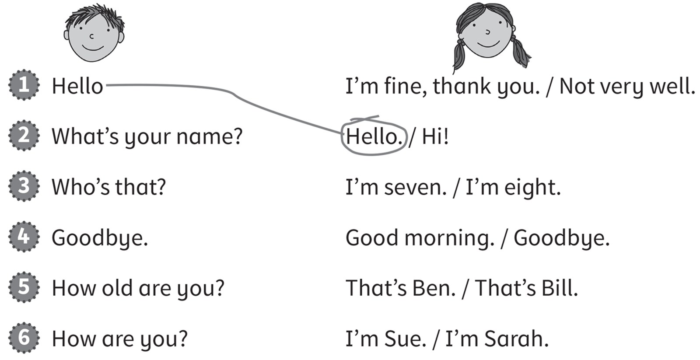
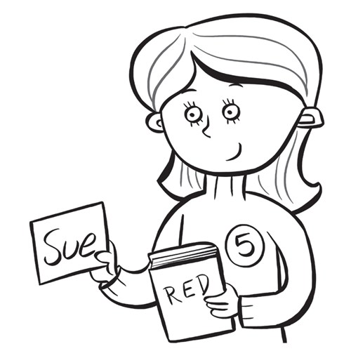

**[Vocabulary]{.underline}**

**1. Complete the words. There is one example.   (one point each)**

1\. b *[o]{.underline}* *[o]{.underline}* *[k]{.underline}*

2\. t \_ \_ \_ \_

3\. p \_ \_

4\. e \_ \_ \_ \_ \_

5\. c \_ \_ \_ \_

6\. p \_ \_ \_ \_ \_

**2. Count and write the number. There is one example.   (one point
each)**

  ---------------------------------------------------------------------------------------------------------------------------------------------------------------------------------------------------------------------- -- ------------------------------------------------------------------------------------------------------------------------------------------------------------------------------------------------------------------- -- -------------------------------------------------------------------------------------------------------------------------------------------------------------------------------------------------------------------
   1.            
  *[two]{.underline}*                                                                                                                                                                                                       2. \_\_\_\_\_\_\_\_\_\_\_\_\_\_                                                                                                                                                                                        3. \_\_\_\_\_\_\_\_\_\_\_\_\_\_

  ---------------------------------------------------------------------------------------------------------------------------------------------------------------------------------------------------------------------- -- ------------------------------------------------------------------------------------------------------------------------------------------------------------------------------------------------------------------- -- -------------------------------------------------------------------------------------------------------------------------------------------------------------------------------------------------------------------

  -------------------------------------------------------------------------------------------------------------------------------------------------------------------------------------------------------------------- -- --------------------------------------------------------------------------------------------------------------------------------------------------------------------------------------------------------------------
        
  4. \_\_\_\_\_\_\_\_\_\_\_\_\_\_                                                                                                                                                                                         5. \_\_\_\_\_\_\_\_\_\_\_\_\_\_

  -------------------------------------------------------------------------------------------------------------------------------------------------------------------------------------------------------------------- -- --------------------------------------------------------------------------------------------------------------------------------------------------------------------------------------------------------------------

  --------------------------------------------------------------------------------------------------------------------------------------------------------------------------------------------------------------------
  
  6. \_\_\_\_\_\_\_\_\_\_\_\_\_\_

  --------------------------------------------------------------------------------------------------------------------------------------------------------------------------------------------------------------------

**[Grammar]{.underline}**

**3. Read and write *He's* or *She's*. There is one example.   (one
point each)**

  ----------------------------------------------------------------------------------------------------------------------------------------------------------------------------------------------------------------------- -- -------------------------------------------------------------------------------------------------------------------------------------------------------------------------------------------------------------------- -- --------------------------------------------------------------------------------------------------------------------------------------------------------------------------------------------------------------------
   1.            
  *[She's]{.underline}* Anna.                                                                                                                                                                                                2. \_\_\_\_\_ Dan.                                                                                                                                                                                                      3. \_\_\_\_\_ eight.

  ----------------------------------------------------------------------------------------------------------------------------------------------------------------------------------------------------------------------- -- -------------------------------------------------------------------------------------------------------------------------------------------------------------------------------------------------------------------- -- --------------------------------------------------------------------------------------------------------------------------------------------------------------------------------------------------------------------

  --------------------------------------------------------------------------------------------------------------------------------------------------------------------------------------------------------------------
  
  4. \_\_\_\_\_ seven.

  --------------------------------------------------------------------------------------------------------------------------------------------------------------------------------------------------------------------

**4. Read and complete the sentences. There is one example.   (one point
each)**

I'm \| She's \| ~~He's~~ \| He's

**[Listening]{.underline}**

**5. Listen and write the number. Draw lines. There is one
example.   (one point each)**

**6. Listen and draw lines. Circle the correct word. There is one
example.   (one point each)**

**[Reading]{.underline}**

**7. Read and colour. Put the letters in order. There is one
example.   (one point each)**

1\. The (bteal) *[table]{.underline}* is green.

2\. The (iachr) \_\_\_\_\_\_\_\_\_\_\_\_\_\_\_\_\_\_\_\_\_\_ is red.

3\. The (aeerrs) \_\_\_\_\_\_\_\_\_\_\_\_\_\_\_\_\_\_\_\_\_\_ is pink.

4\. The (ncpiel) \_\_\_\_\_\_\_\_\_\_\_\_\_\_\_\_\_\_\_\_\_\_ is orange.

5\. The (okob) \_\_\_\_\_\_\_\_\_\_\_\_\_\_\_\_\_\_\_\_\_\_ is purple.

6\. The (npe) \_\_\_\_\_\_\_\_\_\_\_\_\_\_\_\_\_\_\_\_\_\_ is blue.

**8. Look and write. There is one example.   (one point each)**

1\. Who's that?

    *[She's Sue.]{.underline}*

2\. How old is she?

    \_\_\_\_\_\_\_\_\_\_\_\_

3\. What colour is her book?

    \_\_\_\_\_\_\_\_\_\_\_\_

