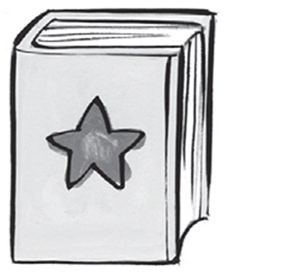
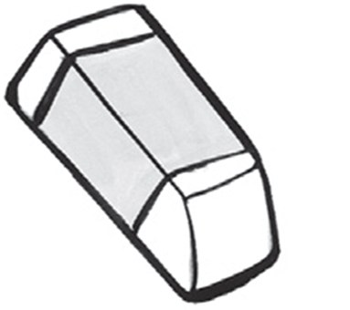
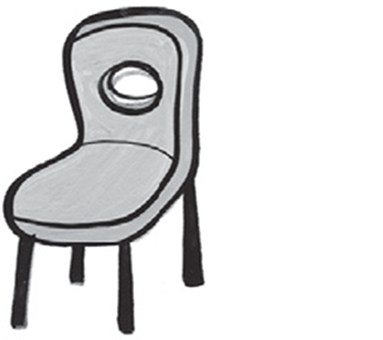
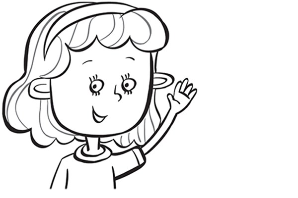
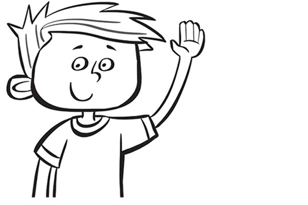
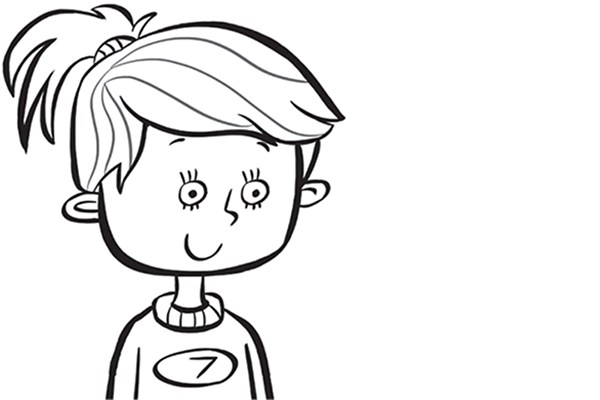
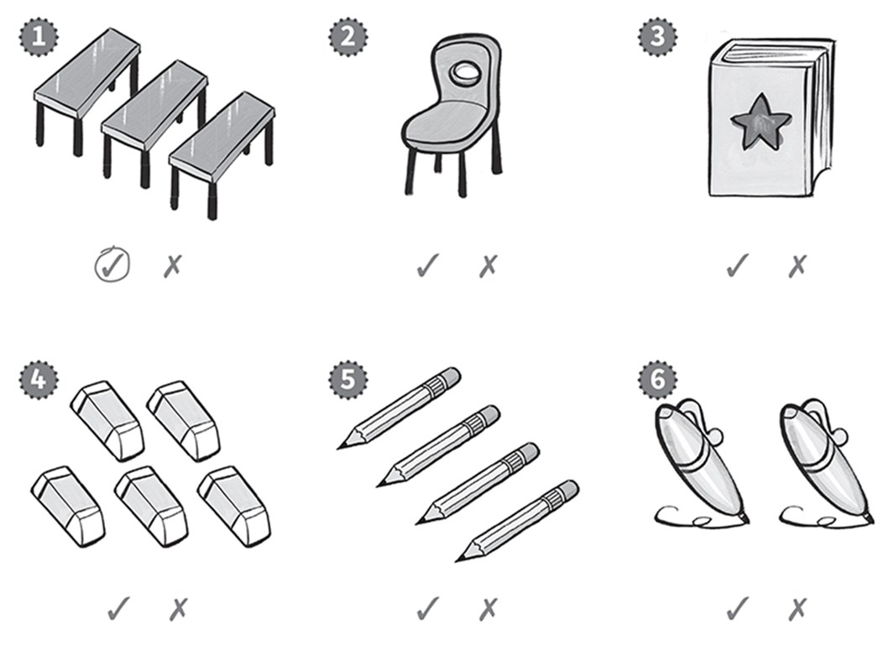

**[Vocabulary]{.underline}**

**1. Complete the words. There is one example.   (one point each)**

1\. *[b]{.underline}*ook

2\. t_ble

*table*

3\. \_en

*pen*

4\. era_er

*eraser*

5\. cha_r

*chair*

6\. p_encil

*pencil*

**2. Count and draw lines. There is one example.   (one point each)**

*three tables*

*two chairs*

*five books*

*one pen*

*four pencils*

**[Grammar]{.underline}**

**3. Look and write the words. There is one example.   (one point
each)**

eight \| He's \| ~~Anna~~ \| She's

  ------------------------------------------------------------------------------------------------------------------------------------------------------------------------------------------------------------------- -- ---------------------------------------------------------------------------------------------------------------------------------------------------------------------------------------------------------------- -- -----------------------------------------------------------------------------------------------------------------------------------------------------------------------------------------------------------------
   1.            
  She's *[Anna]{.underline}*.                                                                                                                                                                                            2. *He's* Dan.                                                                                                                                                                                                      3. He's *eight*.

  ------------------------------------------------------------------------------------------------------------------------------------------------------------------------------------------------------------------- -- ---------------------------------------------------------------------------------------------------------------------------------------------------------------------------------------------------------------- -- -----------------------------------------------------------------------------------------------------------------------------------------------------------------------------------------------------------------

  -----------------------------------------------------------------------------------------------------------------------------------------------------------------------------------------------------------------
  
  4. *She's* seven.

  -----------------------------------------------------------------------------------------------------------------------------------------------------------------------------------------------------------------

**4. Read and write.   (one point each)**

He's four. \| I'm fine, thanks. \| ~~She's Lucy~~. \| He's Mark.

1\. Who's that? *[She's Lucy]{.underline}*.

2\. Who's he? *He's Mark*

3\. How old is he? *He's four*

4\. How are you? *I'm fine, thanks.*

**[Listening]{.underline}**

**5. Listen and circle the tick or cross. There is one example.   (one
point each)**

*2. ✗*

*3. ✓*

*4. ✓*

*5. ✗*

*6. ✗*

**Audio script**

1\. three tables

2\. two chairs

3\. one book

4\. five erasers

5\. six pencils

6\. four pens.

**6. Listen and draw lines. There is one example.   (one point each)**

*2. What's your name? I'm Sarah.*

*3. Who's that? That's Ben.*

*4. Goodbye. Goobye.*

*5. How old are you? I'm eight.*

*6. How are you? I'm fine, thank you.*

**Audio script**

1\. **Boy:** Hello. Girl: Hello.

2\. **Boy:** What's your name? Girl: I'm Sarah.

3\. **Boy:** Who's that? Girl: That's Ben.

4\. **Boy:** Goodbye. Girl: Goodbye.

5\. **Boy:** How old are you? Girl: I'm eight.

6\. **Boy:** How are you? Girl: I'm fine, thank you.

**[Reading]{.underline}**

**7. Read and colour. There is one example.   (one point each)**

1\. The *[table]{.underline}* is green.

2\. The chair is red.

*chair (red)*

3\. The eraser is pink.

*erasers (pink)*

4\. The pencil is orange.

*pencil (orange)*

5\. The pen is blue.

*pen (blue)*

6\. The book is purple.

*book (purple)*

**8. Look. Read and write.   (one point each)**

1\. Who's that?

    She's *[Sue]{.underline}*.

2\. How old is she?

    She's \_\_\_\_\_\_\_\_\_.

*five*

3\. What colour is the book?

    It's \_\_\_\_\_\_\_\_\_.

*red*

