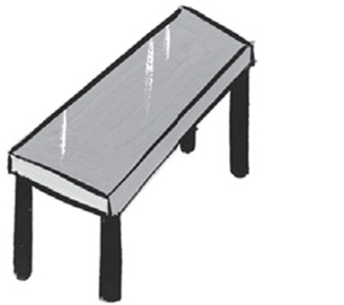
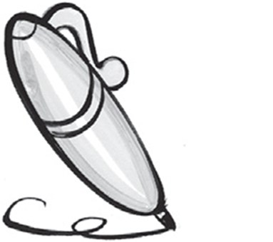
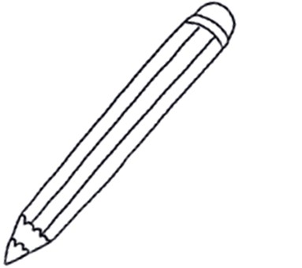
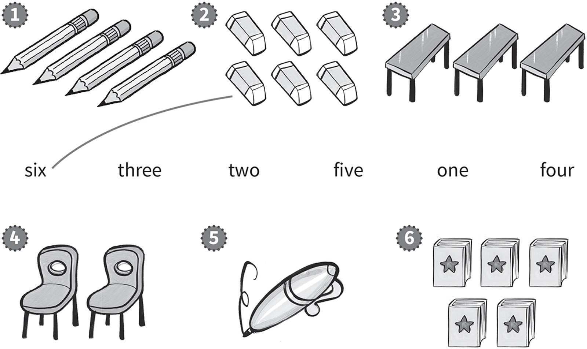
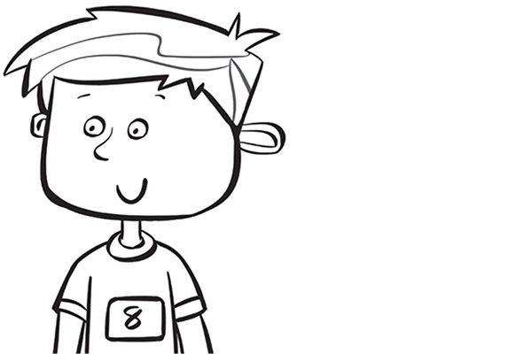
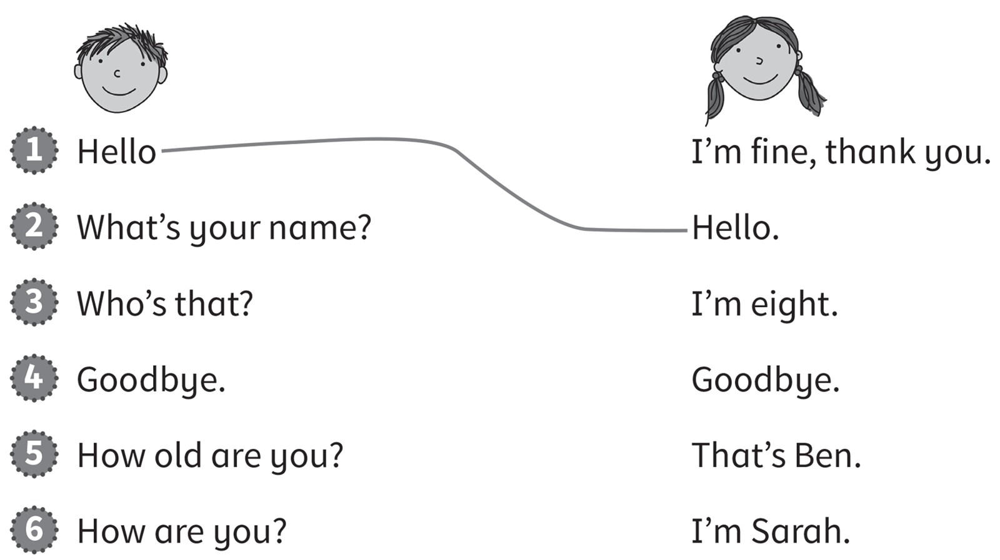
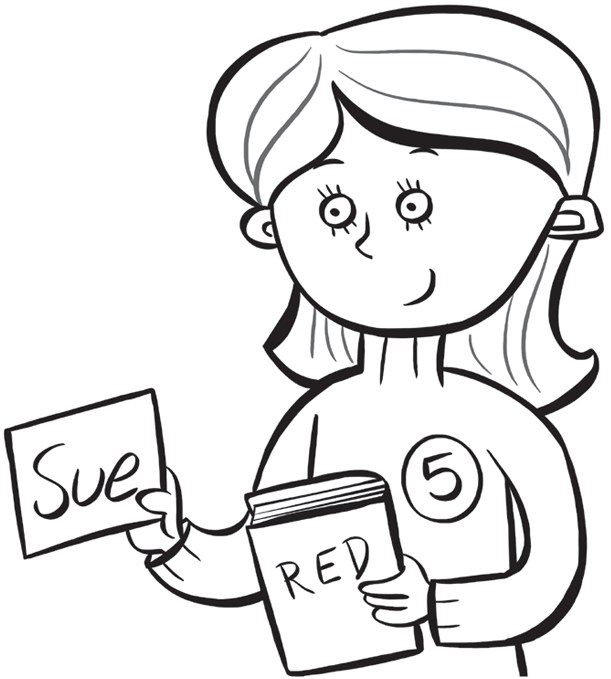

**[Vocabulary]{.underline}**

**1. Complete the words. There is one example.   (one point each)**

1\. *[b]{.underline}*ook

2\. t_ble

3\. \_en

4\. era_er

5\. cha_r

6\. p_encil

**2. Count and draw lines. There is one example.   (one point each)**

**[Grammar]{.underline}**

**3. Look and write the words. There is one example.   (one point
each)**

eight \| He's \| ~~Anna~~ \| She's

  ---------------------------------------------------------------------------------------------------------------------------------------------------------------------------------------------------------------------- -- ------------------------------------------------------------------------------------------------------------------------------------------------------------------------------------------------------------------- -- --------------------------------------------------------------------------------------------------------------------------------------------------------------------------------------------------------------------
   1.            
  She's *[Anna]{.underline}*.                                                                                                                                                                                               2. \_\_\_\_\_ Dan.                                                                                                                                                                                                     3. He's \_\_\_\_\_.

  ---------------------------------------------------------------------------------------------------------------------------------------------------------------------------------------------------------------------- -- ------------------------------------------------------------------------------------------------------------------------------------------------------------------------------------------------------------------- -- --------------------------------------------------------------------------------------------------------------------------------------------------------------------------------------------------------------------

  --------------------------------------------------------------------------------------------------------------------------------------------------------------------------------------------------------------------
  
  4. \_\_\_\_\_ seven.

  --------------------------------------------------------------------------------------------------------------------------------------------------------------------------------------------------------------------

**4. Read and write.   (one point each)**

He's four. \| I'm fine, thanks. \| ~~She's Lucy~~. \| He's Mark.

1\. Who's that? *[She's Lucy]{.underline}*.

2\. Who's he? \_\_\_\_\_\_\_\_\_\_\_\_\_\_\_\_\_\_\_\_\_\_\_\_

3\. How old is he? \_\_\_\_\_\_\_\_\_\_\_\_\_\_\_\_\_\_\_\_\_\_\_\_

4\. How are you? \_\_\_\_\_\_\_\_\_\_\_\_\_\_\_\_\_\_\_\_\_\_\_\_

**[Listening]{.underline}**

**5. Listen and circle the tick or cross. There is one example.   (one
point each)**

**6. Listen and draw lines. There is one example.   (one point each)**

**[Reading]{.underline}**

**7. Read and colour. There is one example.   (one point each)**

1\. The *[table]{.underline}* is green.

2\. The chair is red.

3\. The eraser is pink.

4\. The pencil is orange.

5\. The pen is blue.

6\. The book is purple.

**8. Look. Read and write.   (one point each)**

1\. Who's that?

    She's *[Sue]{.underline}*.

2\. How old is she?

    She's \_\_\_\_\_\_\_\_\_.

3\. What colour is the book?

    It's \_\_\_\_\_\_\_\_\_.

